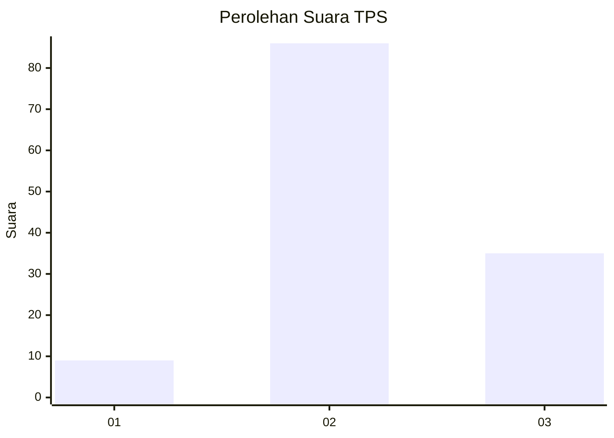
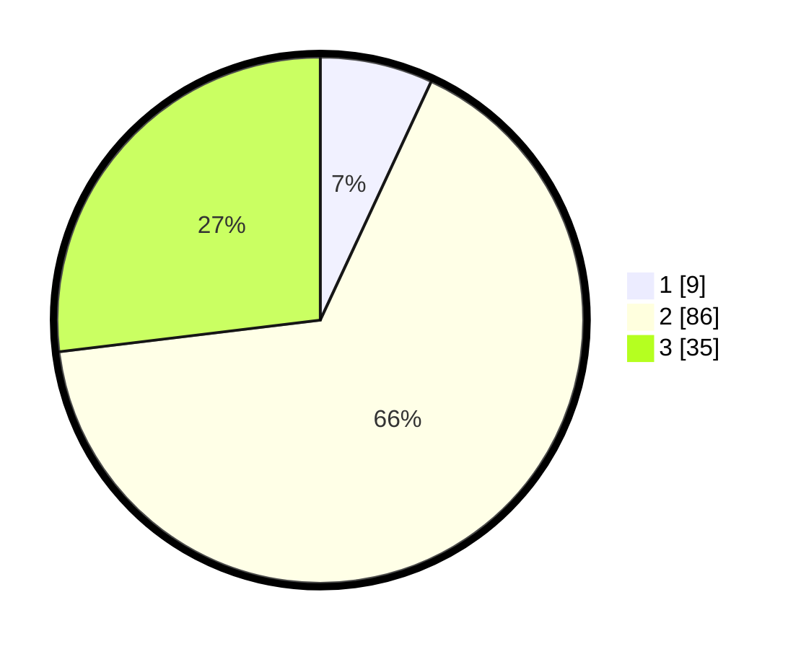

# Hasil

## Grafik

## Tabel

| No. | Nama Paslon    | Suara | Suara (raw) | Persentase |
|:--- |:-------------- | -----:| -----------:| ----------:|
| 1   | ANIES MUHAIMIN | 9     | [9][p-1]    | 6,92       |
| 2   | PRABOWO GIBRAN | 86    | [86][p-2]   | 66,15      |
| 3   | GANJAR MAHFUD  | 35    | [35][p-3]   | 26,92      |

[p-1]: https://github.com/gigit-pemilu/pemilu-2024-33-jawa-tengah/blob/main/pilpres/hitung-suara/sub/33-jawa-tengah/sub/12-wonogiri/sub/08-eromoko/sub/2014-pasekan/sub/009-tps/sub/paslon-1.txt
[p-2]: https://github.com/gigit-pemilu/pemilu-2024-33-jawa-tengah/blob/main/pilpres/hitung-suara/sub/33-jawa-tengah/sub/12-wonogiri/sub/08-eromoko/sub/2014-pasekan/sub/009-tps/sub/paslon-2.txt
[p-3]: https://github.com/gigit-pemilu/pemilu-2024-33-jawa-tengah/blob/main/pilpres/hitung-suara/sub/33-jawa-tengah/sub/12-wonogiri/sub/08-eromoko/sub/2014-pasekan/sub/009-tps/sub/paslon-3.txt

## Foto C Plano

https://sirekap-obj-formc.kpu.go.id/953a/pemilu/ppwp/33/12/08/20/14/3312082014009-20240214-141645--fcc1157c-f405-4589-aebd-cd28cc75ca2e.jpg

https://sirekap-obj-formc.kpu.go.id/953a/pemilu/ppwp/33/12/08/20/14/3312082014009-20240214-141753--27232219-0ff5-48e5-bb5f-9fa1e4f5bb69.jpg

https://sirekap-obj-formc.kpu.go.id/953a/pemilu/ppwp/33/12/08/20/14/3312082014009-20240214-141832--6ff215d2-0d1f-40a6-8cc7-cd4ce2b898c3.jpg

## Metadata

| Key        | Value               |
| ---------- | ------------------- |
| Time Stamp | 2024-02-15 00:41:44 |

