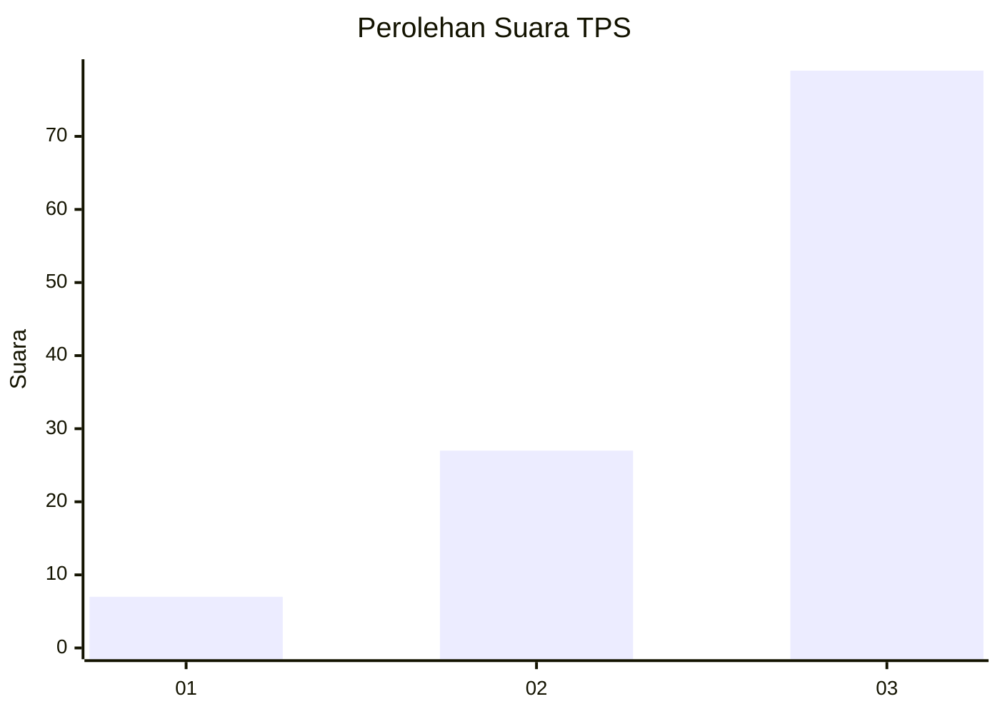
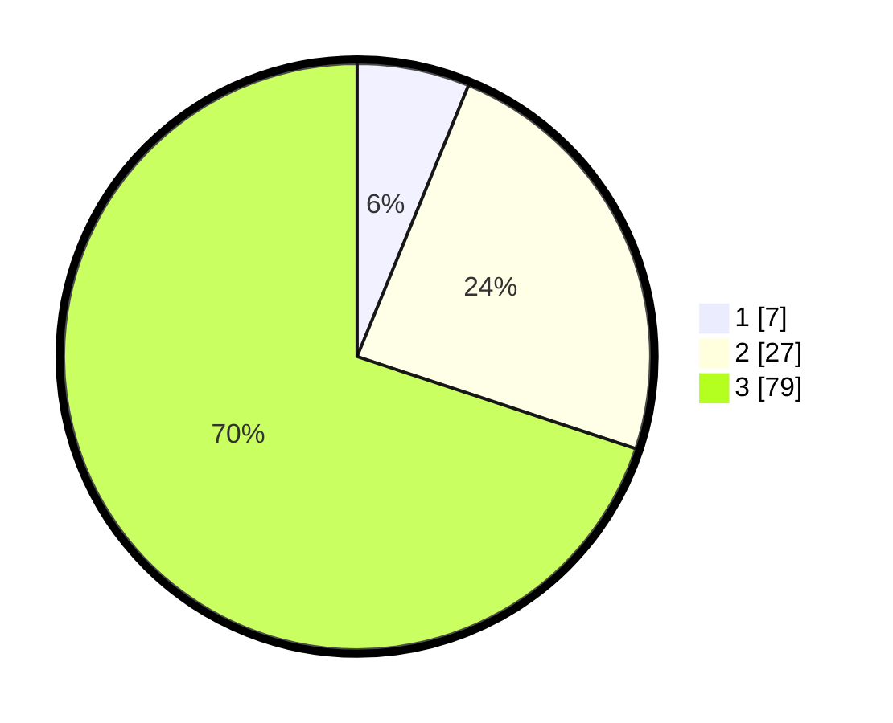

# Hasil

## Grafik

## Tabel

| No. | Nama Paslon    | Suara | Suara (raw) | Persentase |
|:--- |:-------------- | -----:| -----------:| ----------:|
| 1   | ANIES MUHAIMIN | 7     | [7][p-1]    | 6,19       |
| 2   | PRABOWO GIBRAN | 27    | [27][p-2]   | 23,89      |
| 3   | GANJAR MAHFUD  | 79    | [79][p-3]   | 69,91      |

[p-1]: https://github.com/gigit-pemilu/pemilu-2024-33-jawa-tengah/blob/main/pilpres/hitung-suara/sub/33-jawa-tengah/sub/12-wonogiri/sub/09-wuryantoro/sub/1003-mojopuro/sub/001-tps/sub/paslon-1.txt
[p-2]: https://github.com/gigit-pemilu/pemilu-2024-33-jawa-tengah/blob/main/pilpres/hitung-suara/sub/33-jawa-tengah/sub/12-wonogiri/sub/09-wuryantoro/sub/1003-mojopuro/sub/001-tps/sub/paslon-2.txt
[p-3]: https://github.com/gigit-pemilu/pemilu-2024-33-jawa-tengah/blob/main/pilpres/hitung-suara/sub/33-jawa-tengah/sub/12-wonogiri/sub/09-wuryantoro/sub/1003-mojopuro/sub/001-tps/sub/paslon-3.txt

## Foto C Plano

https://sirekap-obj-formc.kpu.go.id/490d/pemilu/ppwp/33/12/09/10/03/3312091003001-20240215-035425--98abacdd-f67b-4728-8e93-71ebf76ec361.jpg

https://sirekap-obj-formc.kpu.go.id/490d/pemilu/ppwp/33/12/09/10/03/3312091003001-20240214-141554--e34cbd0a-132c-43ba-a086-8d62657c3b4a.jpg

https://sirekap-obj-formc.kpu.go.id/490d/pemilu/ppwp/33/12/09/10/03/3312091003001-20240214-141649--19472ce2-8b78-437f-8a09-b5eec1816e22.jpg

## Metadata

| Key        | Value               |
| ---------- | ------------------- |
| Time Stamp | 2024-02-15 04:00:24 |

