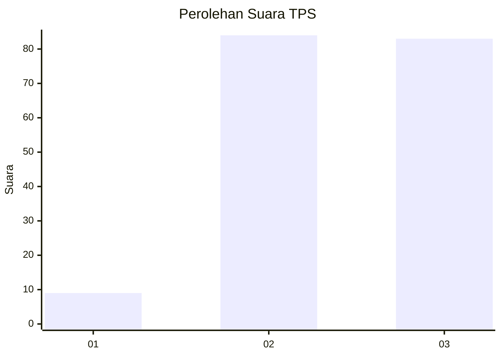
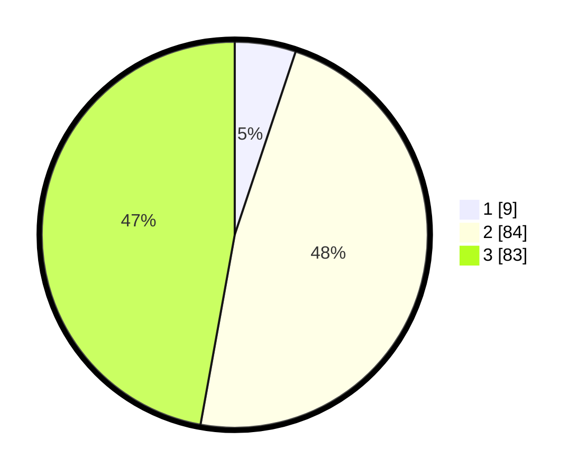

# Hasil

## Grafik

## Tabel

| No. | Nama Paslon    | Suara | Suara (raw) | Persentase |
|:--- |:-------------- | -----:| -----------:| ----------:|
| 1   | ANIES MUHAIMIN | 9     | [9][p-1]    | 5,11       |
| 2   | PRABOWO GIBRAN | 84    | [84][p-2]   | 47,73      |
| 3   | GANJAR MAHFUD  | 83    | [83][p-3]   | 47,16      |

[p-1]: https://github.com/gigit-pemilu/pemilu-2024/blob/main/pilpres/hitung-suara/sub/33-jawa-tengah/sub/12-wonogiri/sub/09-wuryantoro/sub/2001-genukharjo/sub/003-tps/sub/paslon-1.txt
[p-2]: https://github.com/gigit-pemilu/pemilu-2024/blob/main/pilpres/hitung-suara/sub/33-jawa-tengah/sub/12-wonogiri/sub/09-wuryantoro/sub/2001-genukharjo/sub/003-tps/sub/paslon-2.txt
[p-3]: https://github.com/gigit-pemilu/pemilu-2024/blob/main/pilpres/hitung-suara/sub/33-jawa-tengah/sub/12-wonogiri/sub/09-wuryantoro/sub/2001-genukharjo/sub/003-tps/sub/paslon-3.txt

## Foto C Plano

https://sirekap-obj-formc.kpu.go.id/49fe/pemilu/ppwp/33/12/09/20/01/3312092001003-20240215-000611--48e4f63f-77de-4505-b426-06c59a1e1750.jpg

https://sirekap-obj-formc.kpu.go.id/49fe/pemilu/ppwp/33/12/09/20/01/3312092001003-20240215-001310--f989aae8-dcea-4b4f-9524-70f5f958fbb0.jpg

https://sirekap-obj-formc.kpu.go.id/49fe/pemilu/ppwp/33/12/09/20/01/3312092001003-20240214-220438--ef24ac46-83a4-42de-be2a-2de0a9e8098e.jpg

## Metadata

| Key        | Value               |
| ---------- | ------------------- |
| Time Stamp | 2024-02-15 22:30:27 |

