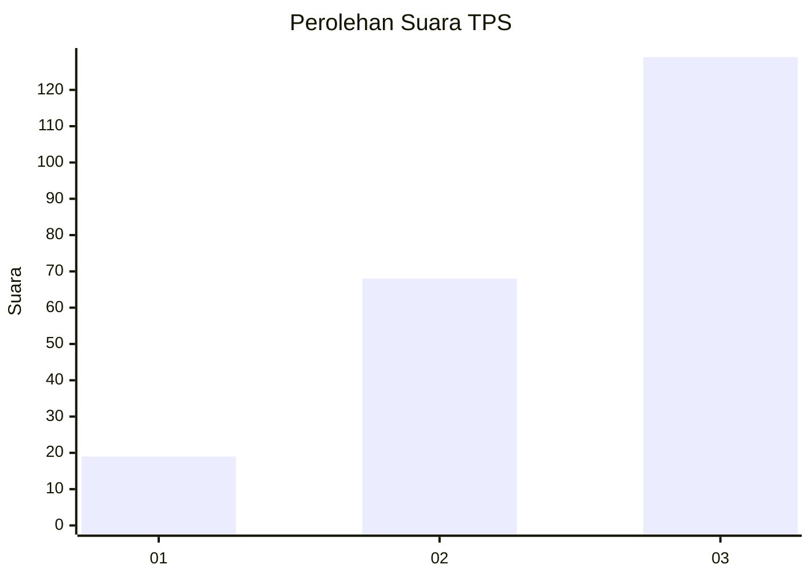
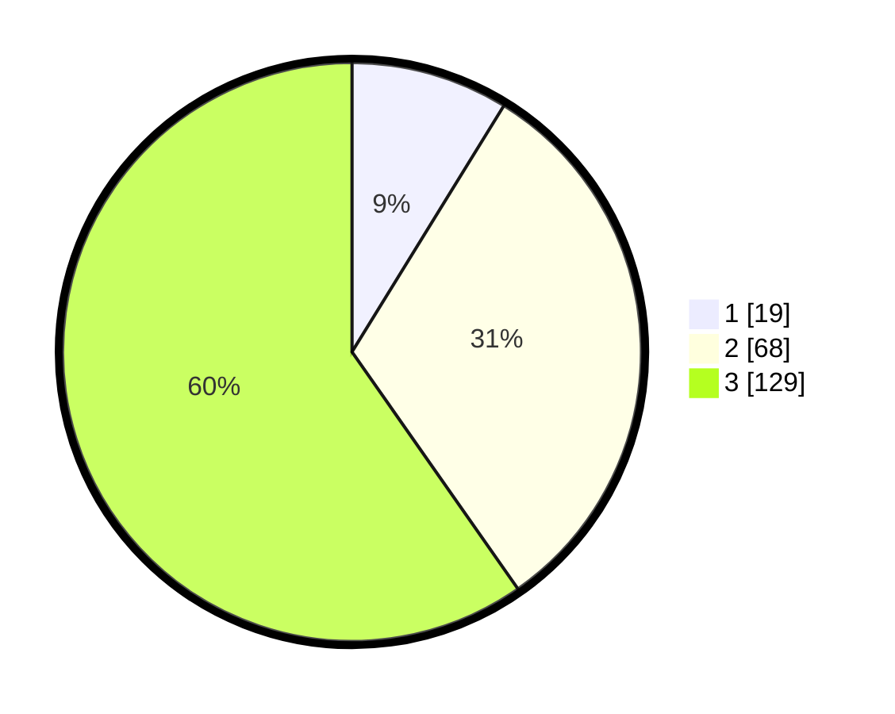

# Hasil

## Grafik

## Tabel

| No. | Nama Paslon    | Suara | Suara (raw) | Persentase |
|:--- |:-------------- | -----:| -----------:| ----------:|
| 1   | ANIES MUHAIMIN | 19    | [19][p-1]   | 8,80       |
| 2   | PRABOWO GIBRAN | 68    | [68][p-2]   | 31,48      |
| 3   | GANJAR MAHFUD  | 129   | [129][p-3]  | 59,72      |

[p-1]: https://github.com/gigit-pemilu/pemilu-2024-33-jawa-tengah/blob/main/pilpres/hitung-suara/sub/33-jawa-tengah/sub/12-wonogiri/sub/09-wuryantoro/sub/2001-genukharjo/sub/013-tps/sub/paslon-1.txt
[p-2]: https://github.com/gigit-pemilu/pemilu-2024-33-jawa-tengah/blob/main/pilpres/hitung-suara/sub/33-jawa-tengah/sub/12-wonogiri/sub/09-wuryantoro/sub/2001-genukharjo/sub/013-tps/sub/paslon-2.txt
[p-3]: https://github.com/gigit-pemilu/pemilu-2024-33-jawa-tengah/blob/main/pilpres/hitung-suara/sub/33-jawa-tengah/sub/12-wonogiri/sub/09-wuryantoro/sub/2001-genukharjo/sub/013-tps/sub/paslon-3.txt

## Foto C Plano

https://sirekap-obj-formc.kpu.go.id/6f03/pemilu/ppwp/33/12/09/20/01/3312092001013-20240214-225039--be028651-5e84-4925-b44c-a98281d5ad43.jpg

https://sirekap-obj-formc.kpu.go.id/6f03/pemilu/ppwp/33/12/09/20/01/3312092001013-20240214-225217--f43553db-5e72-4424-98c8-8f002942bf67.jpg

https://sirekap-obj-formc.kpu.go.id/6f03/pemilu/ppwp/33/12/09/20/01/3312092001013-20240214-225328--e34276d2-c948-483b-80c1-a5f6285ef0ec.jpg

## Metadata

| Key        | Value               |
| ---------- | ------------------- |
| Time Stamp | 2024-02-25 21:00:00 |

