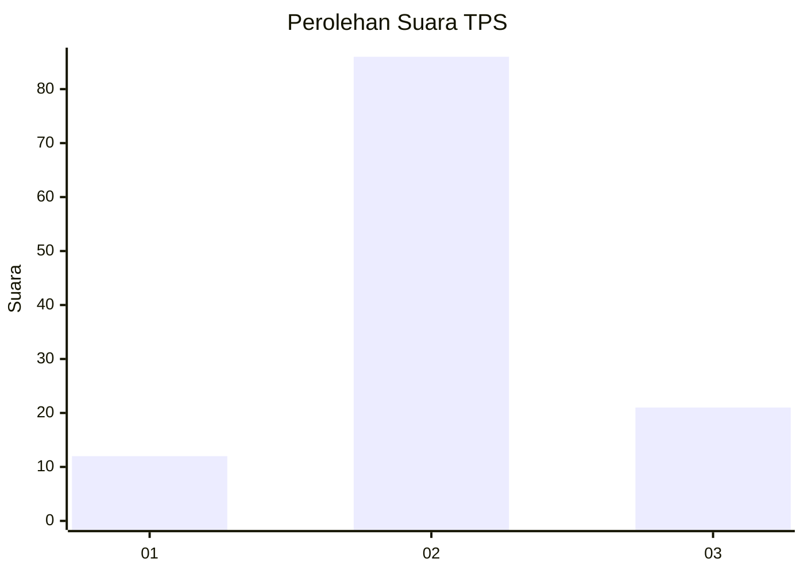
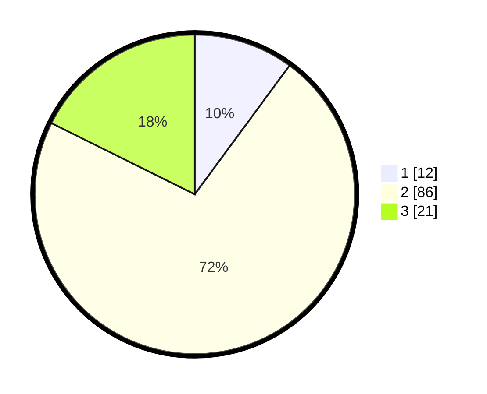

# Hasil

## Grafik

## Tabel

| No. | Nama Paslon    | Suara | Suara (raw) | Persentase |
|:--- |:-------------- | -----:| -----------:| ----------:|
| 1   | ANIES MUHAIMIN | 12    | [12][p-1]   | 10,08      |
| 2   | PRABOWO GIBRAN | 86    | [86][p-2]   | 72,27      |
| 3   | GANJAR MAHFUD  | 21    | [21][p-3]   | 17,65      |

[p-1]: https://github.com/gigit-pemilu/pemilu-2024/blob/main/pilpres/hitung-suara/sub/33-jawa-tengah/sub/12-wonogiri/sub/09-wuryantoro/sub/2004-mlopoharjo/sub/002-tps/sub/paslon-1.txt
[p-2]: https://github.com/gigit-pemilu/pemilu-2024/blob/main/pilpres/hitung-suara/sub/33-jawa-tengah/sub/12-wonogiri/sub/09-wuryantoro/sub/2004-mlopoharjo/sub/002-tps/sub/paslon-2.txt
[p-3]: https://github.com/gigit-pemilu/pemilu-2024/blob/main/pilpres/hitung-suara/sub/33-jawa-tengah/sub/12-wonogiri/sub/09-wuryantoro/sub/2004-mlopoharjo/sub/002-tps/sub/paslon-3.txt

## Foto C Plano

https://sirekap-obj-formc.kpu.go.id/4e69/pemilu/ppwp/33/12/09/20/04/3312092004002-20240216-081440--a72d415f-9f8b-49ea-ad78-756592ab5019.jpg

https://sirekap-obj-formc.kpu.go.id/4e69/pemilu/ppwp/33/12/09/20/04/3312092004002-20240216-081449--bd76d755-16fb-4598-b2bb-9f502225a2a0.jpg

https://sirekap-obj-formc.kpu.go.id/4e69/pemilu/ppwp/33/12/09/20/04/3312092004002-20240214-141122--3a448404-c3a9-4fc8-b51e-630ed7781fef.jpg

## Metadata

| Key        | Value               |
| ---------- | ------------------- |
| Time Stamp | 2024-02-25 11:00:00 |

