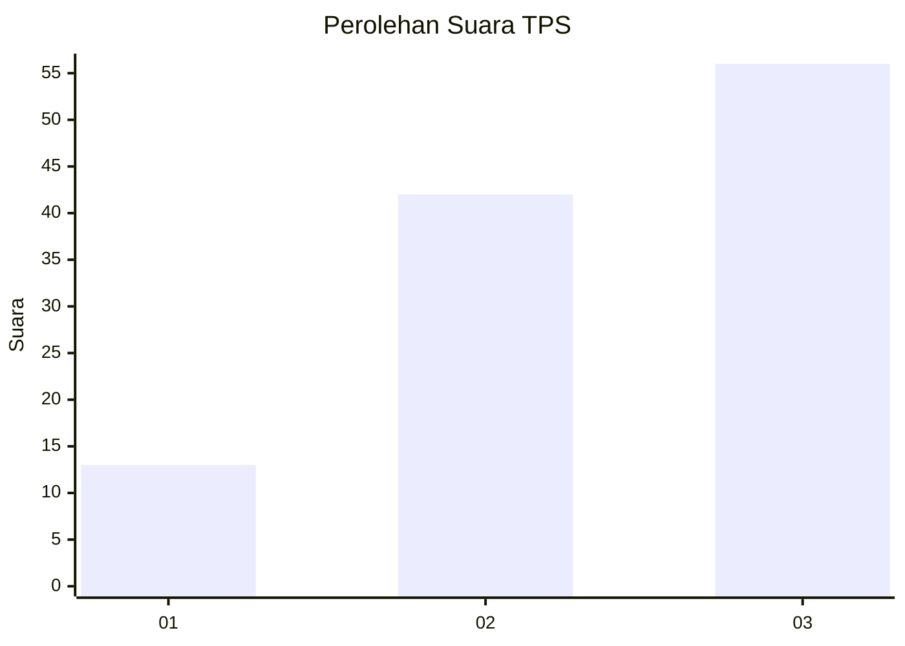
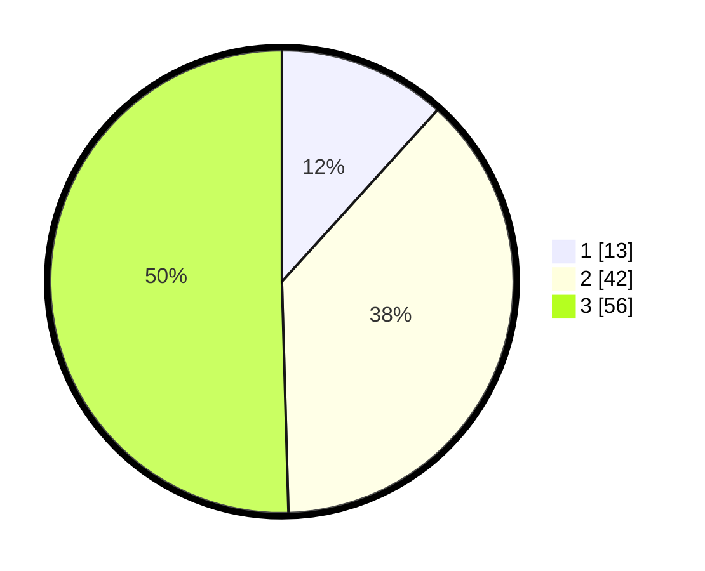

# Hasil

## Grafik

## Tabel

| No. | Nama Paslon    | Suara | Suara (raw) | Persentase |
|:--- |:-------------- | -----:| -----------:| ----------:|
| 1   | ANIES MUHAIMIN | 13    | [13][p-1]   | 11,71      |
| 2   | PRABOWO GIBRAN | 42    | [42][p-2]   | 37,84      |
| 3   | GANJAR MAHFUD  | 56    | [56][p-3]   | 50,45      |

[p-1]: https://github.com/gigit-pemilu/pemilu-2024-33-jawa-tengah/blob/main/pilpres/hitung-suara/sub/33-jawa-tengah/sub/12-wonogiri/sub/09-wuryantoro/sub/2004-mlopoharjo/sub/009-tps/sub/paslon-1.txt
[p-2]: https://github.com/gigit-pemilu/pemilu-2024-33-jawa-tengah/blob/main/pilpres/hitung-suara/sub/33-jawa-tengah/sub/12-wonogiri/sub/09-wuryantoro/sub/2004-mlopoharjo/sub/009-tps/sub/paslon-2.txt
[p-3]: https://github.com/gigit-pemilu/pemilu-2024-33-jawa-tengah/blob/main/pilpres/hitung-suara/sub/33-jawa-tengah/sub/12-wonogiri/sub/09-wuryantoro/sub/2004-mlopoharjo/sub/009-tps/sub/paslon-3.txt

## Foto C Plano

https://sirekap-obj-formc.kpu.go.id/bef1/pemilu/ppwp/33/12/09/20/04/3312092004009-20240214-141336--89294b6c-b877-4603-a307-6f14dd958d36.jpg

https://sirekap-obj-formc.kpu.go.id/bef1/pemilu/ppwp/33/12/09/20/04/3312092004009-20240214-141422--9376445d-cc64-42bb-9e04-78f68e7deac6.jpg

https://sirekap-obj-formc.kpu.go.id/bef1/pemilu/ppwp/33/12/09/20/04/3312092004009-20240214-141632--3579f5d9-757d-4c9b-85e4-f1a1bfb5abdf.jpg

## Metadata

| Key        | Value               |
| ---------- | ------------------- |
| Time Stamp | 2024-02-15 22:30:27 |

