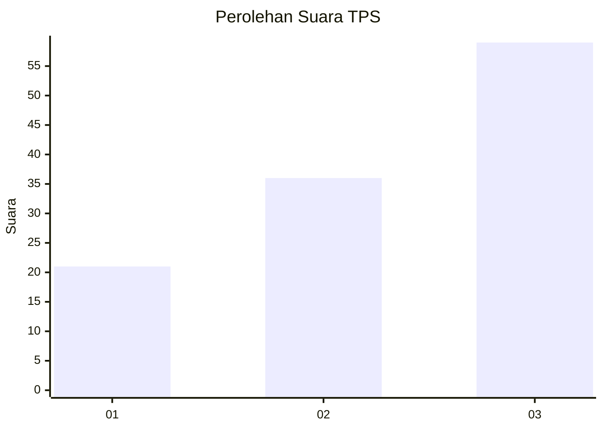
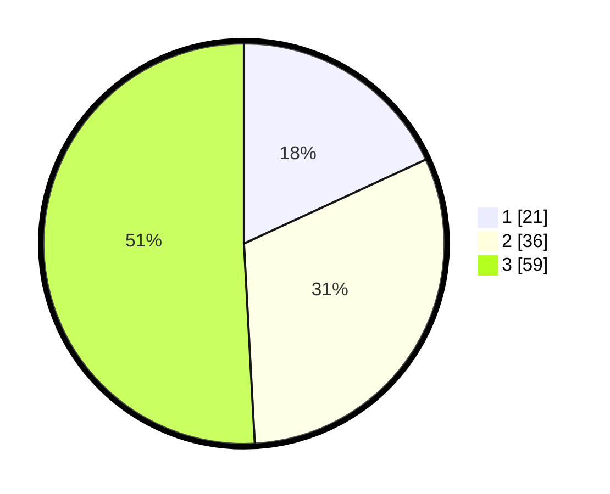

# Hasil

## Grafik

## Tabel

| No. | Nama Paslon    | Suara | Suara (raw) | Persentase |
|:--- |:-------------- | -----:| -----------:| ----------:|
| 1   | ANIES MUHAIMIN | 21    | [21][p-1]   | 18,10      |
| 2   | PRABOWO GIBRAN | 36    | [36][p-2]   | 31,03      |
| 3   | GANJAR MAHFUD  | 59    | [59][p-3]   | 50,86      |

[p-1]: https://github.com/gigit-pemilu/pemilu-2024/blob/main/pilpres/hitung-suara/sub/33-jawa-tengah/sub/12-wonogiri/sub/09-wuryantoro/sub/2005-pulutan-kulon/sub/008-tps/sub/paslon-1.txt
[p-2]: https://github.com/gigit-pemilu/pemilu-2024/blob/main/pilpres/hitung-suara/sub/33-jawa-tengah/sub/12-wonogiri/sub/09-wuryantoro/sub/2005-pulutan-kulon/sub/008-tps/sub/paslon-2.txt
[p-3]: https://github.com/gigit-pemilu/pemilu-2024/blob/main/pilpres/hitung-suara/sub/33-jawa-tengah/sub/12-wonogiri/sub/09-wuryantoro/sub/2005-pulutan-kulon/sub/008-tps/sub/paslon-3.txt

## Foto C Plano

https://sirekap-obj-formc.kpu.go.id/d28b/pemilu/ppwp/33/12/09/20/05/3312092005008-20240214-141249--f1325b7f-430a-4f96-8bbd-0aa1217bc93d.jpg

https://sirekap-obj-formc.kpu.go.id/d28b/pemilu/ppwp/33/12/09/20/05/3312092005008-20240214-141151--6ce526a0-f009-4fae-8d60-737600f28d56.jpg

https://sirekap-obj-formc.kpu.go.id/d28b/pemilu/ppwp/33/12/09/20/05/3312092005008-20240214-215439--c4cc5967-f552-423c-8a56-a353adf50d4d.jpg

## Metadata

| Key        | Value               |
| ---------- | ------------------- |
| Time Stamp | 2024-02-15 00:41:44 |

