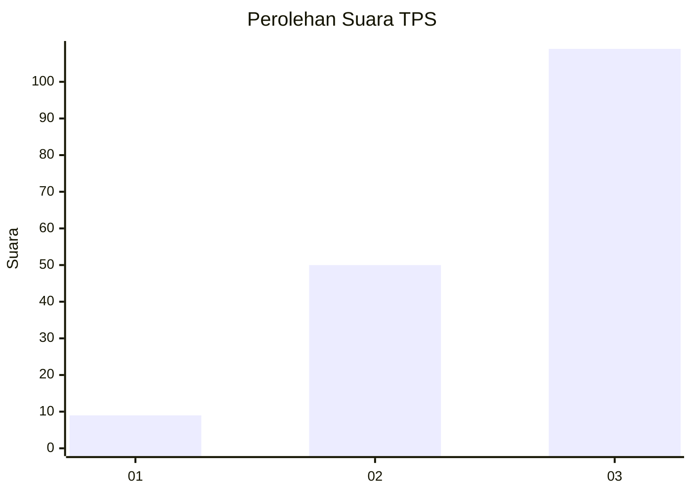
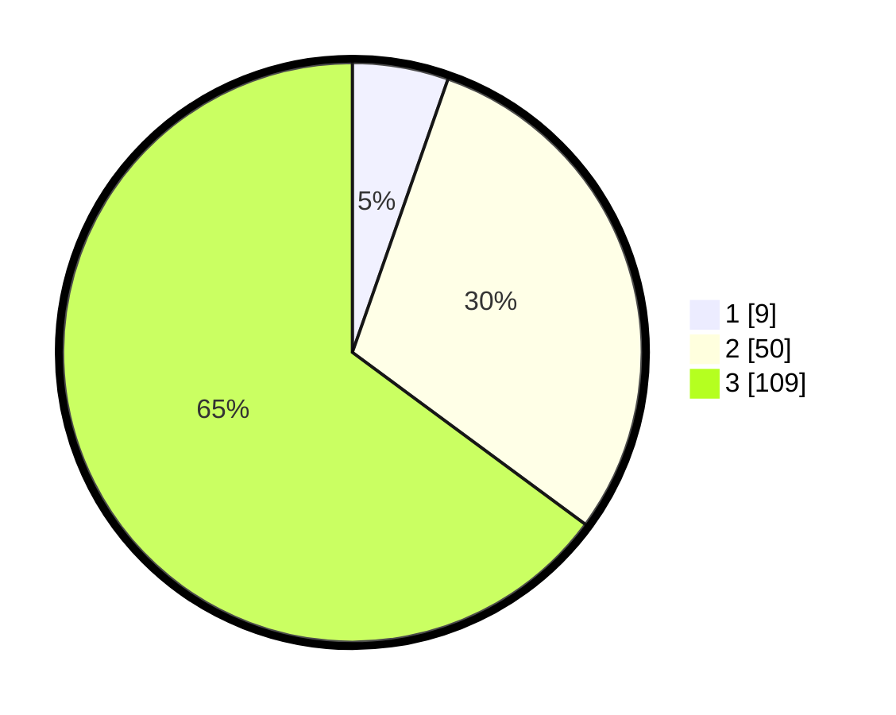

# Hasil

## Grafik

## Tabel

| No. | Nama Paslon    | Suara | Suara (raw) | Persentase |
|:--- |:-------------- | -----:| -----------:| ----------:|
| 1   | ANIES MUHAIMIN | 9     | [9][p-1]    | 5,36       |
| 2   | PRABOWO GIBRAN | 50    | [50][p-2]   | 29,76      |
| 3   | GANJAR MAHFUD  | 109   | [109][p-3]  | 64,88      |

[p-1]: https://github.com/gigit-pemilu/pemilu-2024-33-jawa-tengah/blob/main/pilpres/hitung-suara/sub/33-jawa-tengah/sub/12-wonogiri/sub/09-wuryantoro/sub/2008-gumiwang-lor/sub/007-tps/sub/paslon-1.txt
[p-2]: https://github.com/gigit-pemilu/pemilu-2024-33-jawa-tengah/blob/main/pilpres/hitung-suara/sub/33-jawa-tengah/sub/12-wonogiri/sub/09-wuryantoro/sub/2008-gumiwang-lor/sub/007-tps/sub/paslon-2.txt
[p-3]: https://github.com/gigit-pemilu/pemilu-2024-33-jawa-tengah/blob/main/pilpres/hitung-suara/sub/33-jawa-tengah/sub/12-wonogiri/sub/09-wuryantoro/sub/2008-gumiwang-lor/sub/007-tps/sub/paslon-3.txt

## Foto C Plano

https://sirekap-obj-formc.kpu.go.id/77fa/pemilu/ppwp/33/12/09/20/08/3312092008007-20240215-031934--07a69768-5975-40f0-a24f-b6bfc49f3a46.jpg

https://sirekap-obj-formc.kpu.go.id/77fa/pemilu/ppwp/33/12/09/20/08/3312092008007-20240215-031713--9cfc3406-454d-4813-a2f6-a10843da07d8.jpg

https://sirekap-obj-formc.kpu.go.id/77fa/pemilu/ppwp/33/12/09/20/08/3312092008007-20240214-201117--b9900df4-6a24-436f-b423-b0beb3586871.jpg

## Metadata

| Key        | Value               |
| ---------- | ------------------- |
| Time Stamp | 2024-02-15 22:30:27 |

