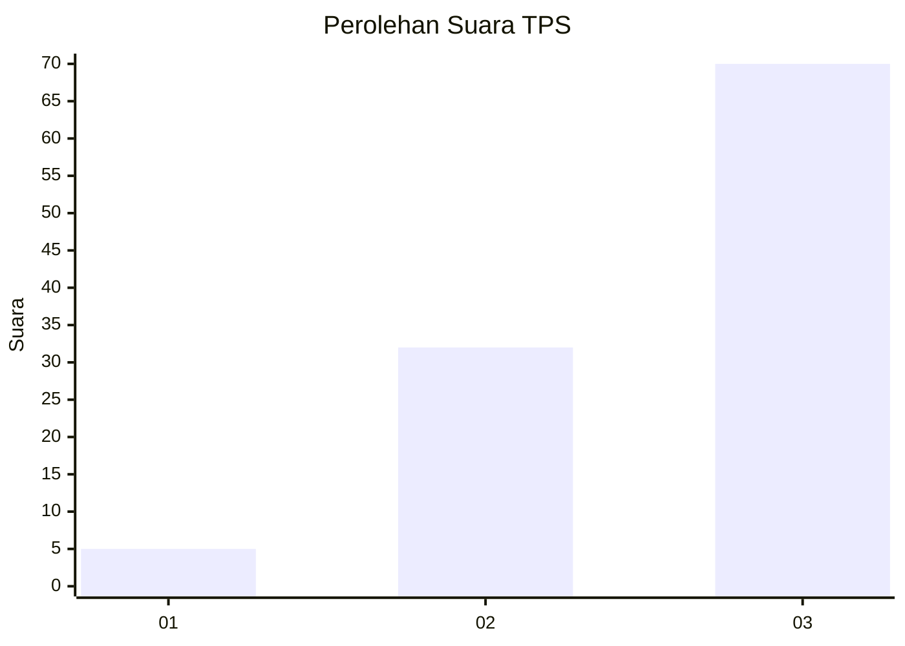
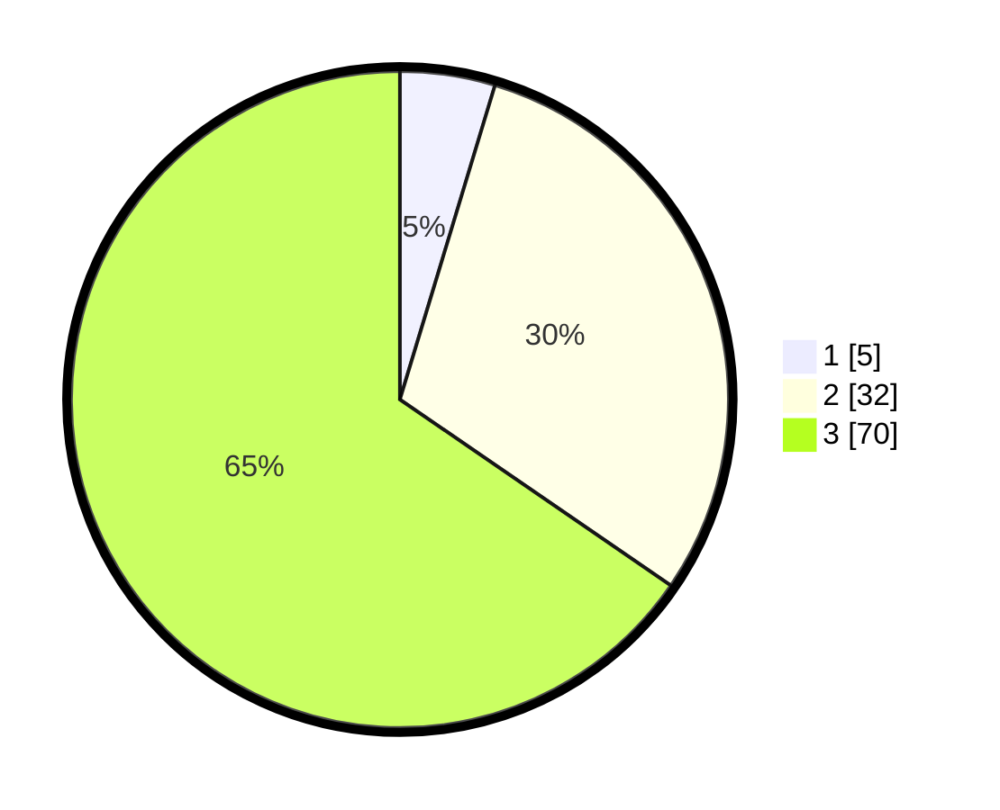

# Hasil

## Grafik

## Tabel

| No. | Nama Paslon    | Suara | Suara (raw) | Persentase |
|:--- |:-------------- | -----:| -----------:| ----------:|
| 1   | ANIES MUHAIMIN | 5     | [5][p-1]    | 4,67       |
| 2   | PRABOWO GIBRAN | 32    | [32][p-2]   | 29,91      |
| 3   | GANJAR MAHFUD  | 70    | [70][p-3]   | 65,42      |

[p-1]: https://github.com/gigit-pemilu/pemilu-2024-33-jawa-tengah/blob/main/pilpres/hitung-suara/sub/33-jawa-tengah/sub/12-wonogiri/sub/09-wuryantoro/sub/2008-gumiwang-lor/sub/008-tps/sub/paslon-1.txt
[p-2]: https://github.com/gigit-pemilu/pemilu-2024-33-jawa-tengah/blob/main/pilpres/hitung-suara/sub/33-jawa-tengah/sub/12-wonogiri/sub/09-wuryantoro/sub/2008-gumiwang-lor/sub/008-tps/sub/paslon-2.txt
[p-3]: https://github.com/gigit-pemilu/pemilu-2024-33-jawa-tengah/blob/main/pilpres/hitung-suara/sub/33-jawa-tengah/sub/12-wonogiri/sub/09-wuryantoro/sub/2008-gumiwang-lor/sub/008-tps/sub/paslon-3.txt

## Foto C Plano

https://sirekap-obj-formc.kpu.go.id/5c3a/pemilu/ppwp/33/12/09/20/08/3312092008008-20240215-013812--59b0fe5f-3c2c-473d-a30b-985894e829e1.jpg

https://sirekap-obj-formc.kpu.go.id/5c3a/pemilu/ppwp/33/12/09/20/08/3312092008008-20240215-013741--f8b28beb-ef46-4fe6-afbb-517e0cb8522a.jpg

https://sirekap-obj-formc.kpu.go.id/5c3a/pemilu/ppwp/33/12/09/20/08/3312092008008-20240215-013908--4f3dd2fd-121d-45c8-93a8-e573df119389.jpg

## Metadata

| Key        | Value               |
| ---------- | ------------------- |
| Time Stamp | 2024-02-25 12:00:00 |

