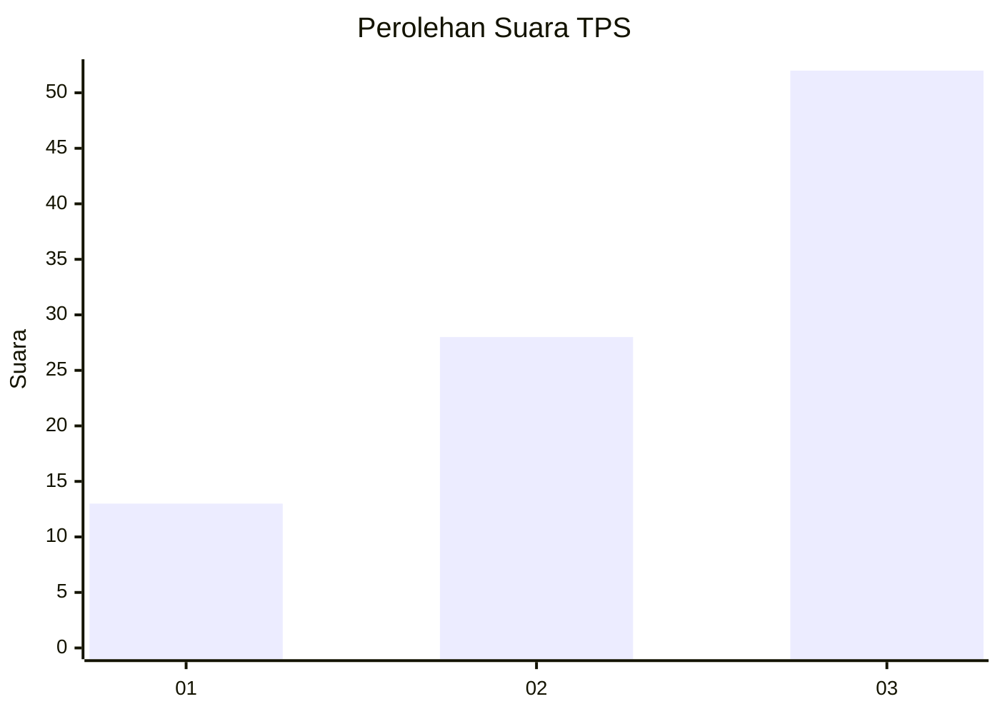
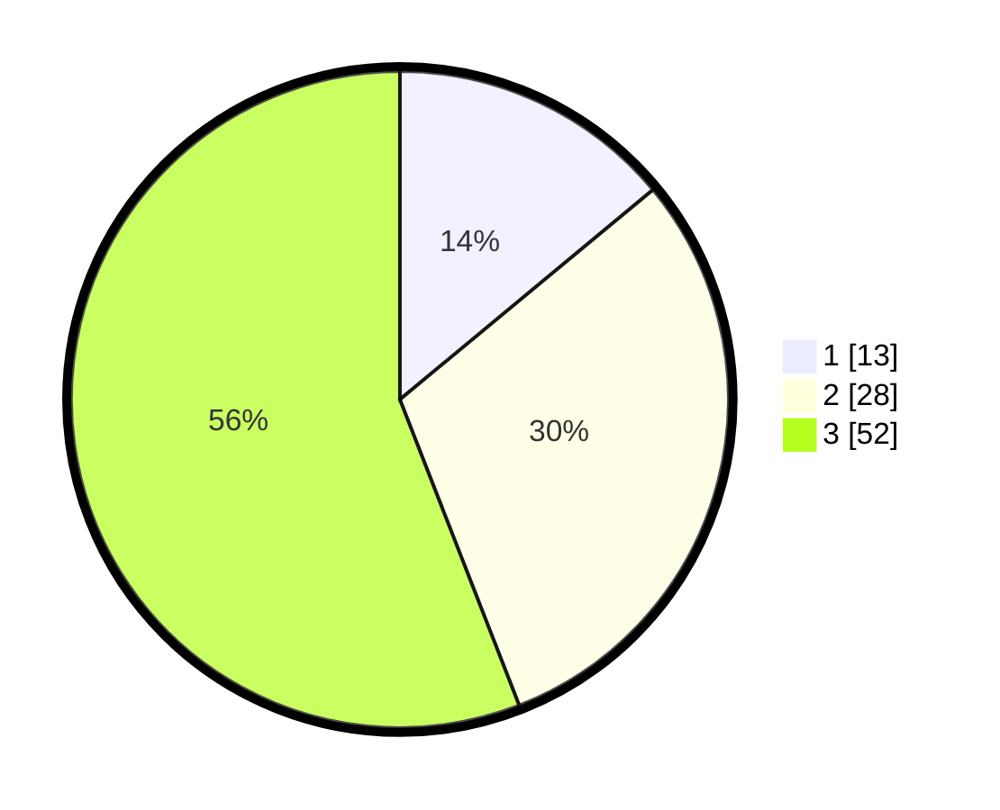

# Hasil

## Grafik

## Tabel

| No. | Nama Paslon    | Suara | Suara (raw) | Persentase |
|:--- |:-------------- | -----:| -----------:| ----------:|
| 1   | ANIES MUHAIMIN | 13    | [13][p-1]   | 13,98      |
| 2   | PRABOWO GIBRAN | 28    | [28][p-2]   | 30,11      |
| 3   | GANJAR MAHFUD  | 52    | [52][p-3]   | 55,91      |

[p-1]: https://github.com/gigit-pemilu/pemilu-2024/blob/main/pilpres/hitung-suara/sub/33-jawa-tengah/sub/12-wonogiri/sub/09-wuryantoro/sub/2008-gumiwang-lor/sub/013-tps/sub/paslon-1.txt
[p-2]: https://github.com/gigit-pemilu/pemilu-2024/blob/main/pilpres/hitung-suara/sub/33-jawa-tengah/sub/12-wonogiri/sub/09-wuryantoro/sub/2008-gumiwang-lor/sub/013-tps/sub/paslon-2.txt
[p-3]: https://github.com/gigit-pemilu/pemilu-2024/blob/main/pilpres/hitung-suara/sub/33-jawa-tengah/sub/12-wonogiri/sub/09-wuryantoro/sub/2008-gumiwang-lor/sub/013-tps/sub/paslon-3.txt

## Foto C Plano

https://sirekap-obj-formc.kpu.go.id/328f/pemilu/ppwp/33/12/09/20/08/3312092008013-20240214-204754--e955e0c8-390b-4051-8184-ba8035ff7632.jpg

https://sirekap-obj-formc.kpu.go.id/328f/pemilu/ppwp/33/12/09/20/08/3312092008013-20240214-205506--a2d91b26-3eb3-4e40-b9c0-8999cd190aeb.jpg

https://sirekap-obj-formc.kpu.go.id/328f/pemilu/ppwp/33/12/09/20/08/3312092008013-20240214-205529--1f3cc058-866d-45cc-94b7-6e26acf4454f.jpg

## Metadata

| Key        | Value               |
| ---------- | ------------------- |
| Time Stamp | 2024-02-15 00:46:45 |

