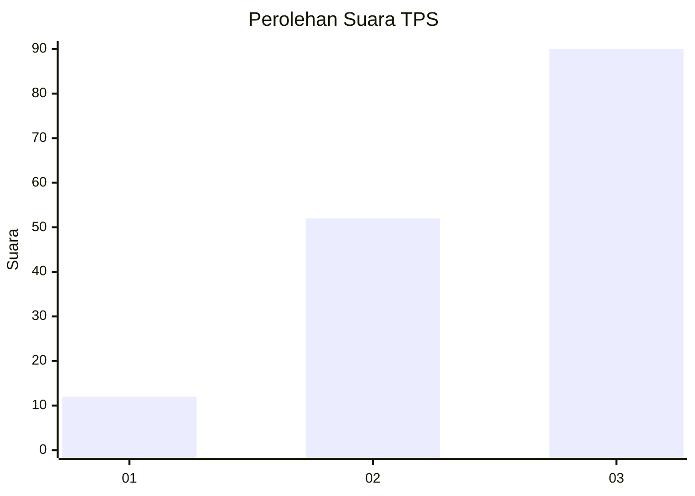
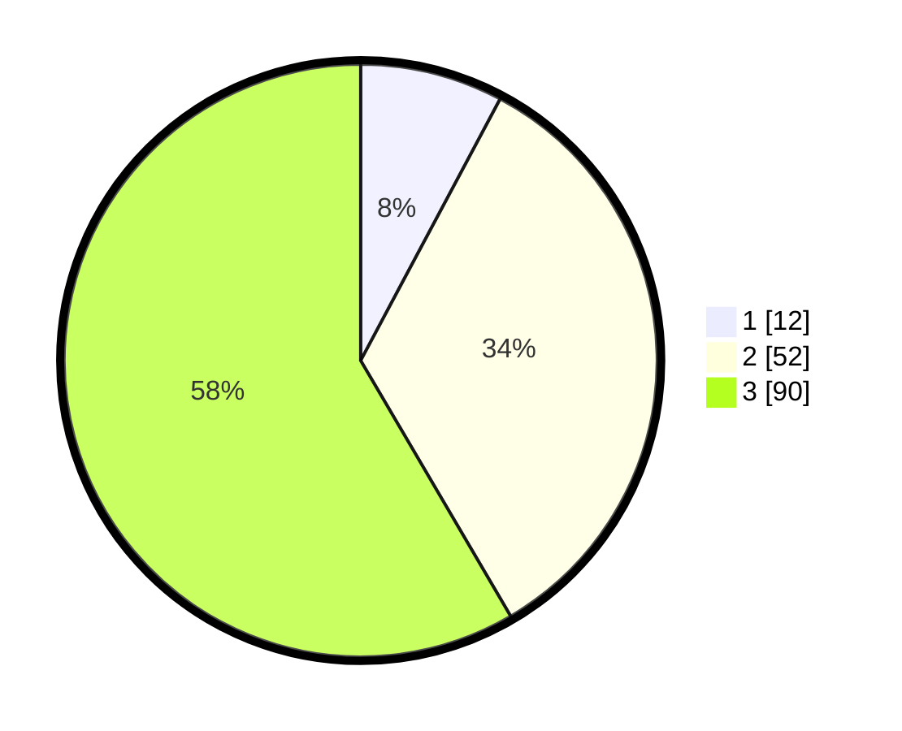

# Hasil

## Grafik

## Tabel

| No. | Nama Paslon    | Suara | Suara (raw) | Persentase |
|:--- |:-------------- | -----:| -----------:| ----------:|
| 1   | ANIES MUHAIMIN | 12    | [12][p-1]   | 7,79       |
| 2   | PRABOWO GIBRAN | 52    | [52][p-2]   | 33,77      |
| 3   | GANJAR MAHFUD  | 90    | [90][p-3]   | 58,44      |

[p-1]: https://github.com/gigit-pemilu/pemilu-2024-33-jawa-tengah/blob/main/pilpres/hitung-suara/sub/33-jawa-tengah/sub/12-wonogiri/sub/09-wuryantoro/sub/2008-gumiwang-lor/sub/014-tps/sub/paslon-1.txt
[p-2]: https://github.com/gigit-pemilu/pemilu-2024-33-jawa-tengah/blob/main/pilpres/hitung-suara/sub/33-jawa-tengah/sub/12-wonogiri/sub/09-wuryantoro/sub/2008-gumiwang-lor/sub/014-tps/sub/paslon-2.txt
[p-3]: https://github.com/gigit-pemilu/pemilu-2024-33-jawa-tengah/blob/main/pilpres/hitung-suara/sub/33-jawa-tengah/sub/12-wonogiri/sub/09-wuryantoro/sub/2008-gumiwang-lor/sub/014-tps/sub/paslon-3.txt

## Foto C Plano

https://sirekap-obj-formc.kpu.go.id/a9cf/pemilu/ppwp/33/12/09/20/08/3312092008014-20240214-193121--9eedd39e-7ae8-42fb-942f-10afe7de2be0.jpg

https://sirekap-obj-formc.kpu.go.id/a9cf/pemilu/ppwp/33/12/09/20/08/3312092008014-20240214-193106--3ffc585d-44d1-4abc-a1e1-c32e838fee77.jpg

https://sirekap-obj-formc.kpu.go.id/a9cf/pemilu/ppwp/33/12/09/20/08/3312092008014-20240214-223457--03bfc7ae-6fa0-4301-9692-e390f2a22d70.jpg

## Metadata

| Key        | Value               |
| ---------- | ------------------- |
| Time Stamp | 2024-02-15 07:00:44 |

