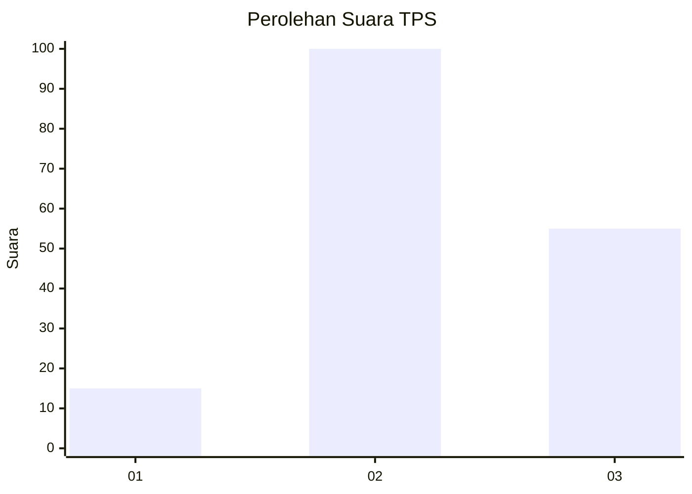
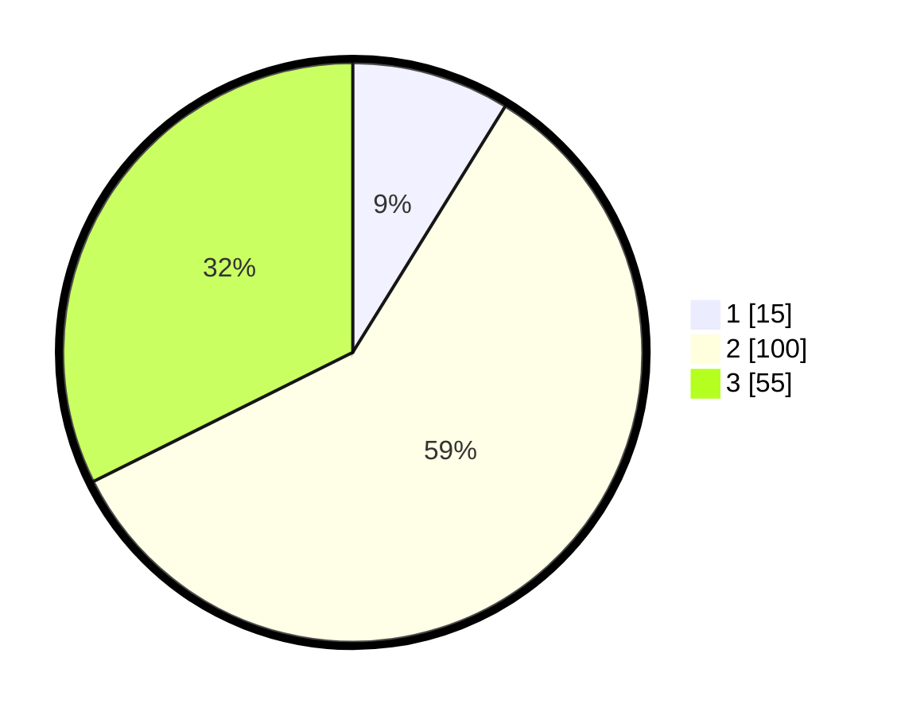

# Hasil

## Grafik

## Tabel

| No. | Nama Paslon    | Suara | Suara (raw) | Persentase |
|:--- |:-------------- | -----:| -----------:| ----------:|
| 1   | ANIES MUHAIMIN | 15    | [15][p-1]   | 8,82       |
| 2   | PRABOWO GIBRAN | 100   | [100][p-2]  | 58,82      |
| 3   | GANJAR MAHFUD  | 55    | [55][p-3]   | 32,35      |

[p-1]: https://github.com/gigit-pemilu/pemilu-2024/blob/main/pilpres/hitung-suara/sub/33-jawa-tengah/sub/12-wonogiri/sub/10-manyaran/sub/1006-pagutan/sub/004-tps/sub/paslon-1.txt
[p-2]: https://github.com/gigit-pemilu/pemilu-2024/blob/main/pilpres/hitung-suara/sub/33-jawa-tengah/sub/12-wonogiri/sub/10-manyaran/sub/1006-pagutan/sub/004-tps/sub/paslon-2.txt
[p-3]: https://github.com/gigit-pemilu/pemilu-2024/blob/main/pilpres/hitung-suara/sub/33-jawa-tengah/sub/12-wonogiri/sub/10-manyaran/sub/1006-pagutan/sub/004-tps/sub/paslon-3.txt

## Foto C Plano

https://sirekap-obj-formc.kpu.go.id/315d/pemilu/ppwp/33/12/10/10/06/3312101006004-20240214-140940--d1cb951d-3b90-40db-abe2-236495fb83af.jpg

https://sirekap-obj-formc.kpu.go.id/315d/pemilu/ppwp/33/12/10/10/06/3312101006004-20240214-141052--b68f4740-21c0-441b-9da4-2bc514b734c2.jpg

https://sirekap-obj-formc.kpu.go.id/315d/pemilu/ppwp/33/12/10/10/06/3312101006004-20240214-141150--82925de7-ba4a-47f3-9ddd-fdc48f14b300.jpg

## Metadata

| Key        | Value               |
| ---------- | ------------------- |
| Time Stamp | 2024-02-15 18:00:26 |

