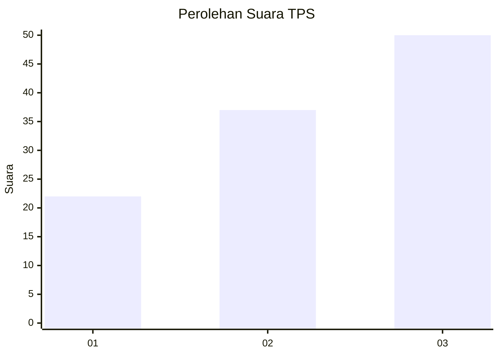
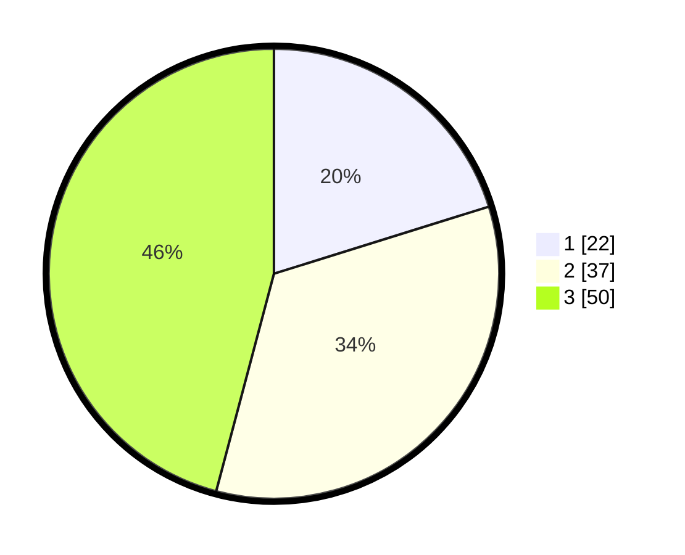

# Hasil

## Grafik

## Tabel

| No. | Nama Paslon    | Suara | Suara (raw) | Persentase |
|:--- |:-------------- | -----:| -----------:| ----------:|
| 1   | ANIES MUHAIMIN | 22    | [22][p-1]   | 20,18      |
| 2   | PRABOWO GIBRAN | 37    | [37][p-2]   | 33,94      |
| 3   | GANJAR MAHFUD  | 50    | [50][p-3]   | 45,87      |

[p-1]: https://github.com/gigit-pemilu/pemilu-2024/blob/main/pilpres/hitung-suara/sub/33-jawa-tengah/sub/12-wonogiri/sub/10-manyaran/sub/1006-pagutan/sub/006-tps/sub/paslon-1.txt
[p-2]: https://github.com/gigit-pemilu/pemilu-2024/blob/main/pilpres/hitung-suara/sub/33-jawa-tengah/sub/12-wonogiri/sub/10-manyaran/sub/1006-pagutan/sub/006-tps/sub/paslon-2.txt
[p-3]: https://github.com/gigit-pemilu/pemilu-2024/blob/main/pilpres/hitung-suara/sub/33-jawa-tengah/sub/12-wonogiri/sub/10-manyaran/sub/1006-pagutan/sub/006-tps/sub/paslon-3.txt

## Foto C Plano

https://sirekap-obj-formc.kpu.go.id/3428/pemilu/ppwp/33/12/10/10/06/3312101006006-20240214-140933--cb1fe3d9-4070-4cef-8e5d-1a450feb0a0f.jpg

https://sirekap-obj-formc.kpu.go.id/3428/pemilu/ppwp/33/12/10/10/06/3312101006006-20240214-141115--ed7ce7db-e47e-422c-b28e-7986075b6999.jpg

https://sirekap-obj-formc.kpu.go.id/3428/pemilu/ppwp/33/12/10/10/06/3312101006006-20240214-141226--5bdbefcf-4437-4603-8a37-3e9d7c5a06fc.jpg

## Metadata

| Key        | Value               |
| ---------- | ------------------- |
| Time Stamp | 2024-02-14 21:46:01 |

## DATA PEMILIH TETAP

Jumlah pemilih dalam DPT: **129**.
 * L: **63**.
 * P: **66**.

## DATA PENGGUNA HAK PILIH

Jumlah pengguna hak pilih dalam DPT: **111**.
 * L: **52**.
 * P: **59**.

Jumlah pengguna hak pilih dalam DPTb: **0**.
 * L: **0**.
 * P: **0**.

Jumlah pengguna hak pilih dalam DPK: **0**.
 * L: **0**.
 * P: **0**.

Jumlah pengguna hak pilih: **111**.
 * L: **52**.
 * P: **59**.

## JUMLAH SUARA SAH DAN TIDAK SAH

JUMLAH SELURUH SUARA SAH: **109**.

JUMLAH SUARA TIDAK SAH: **2**.

JUMLAH SELURUH SUARA SAH DAN SUARA TIDAK SAH: **111**.

