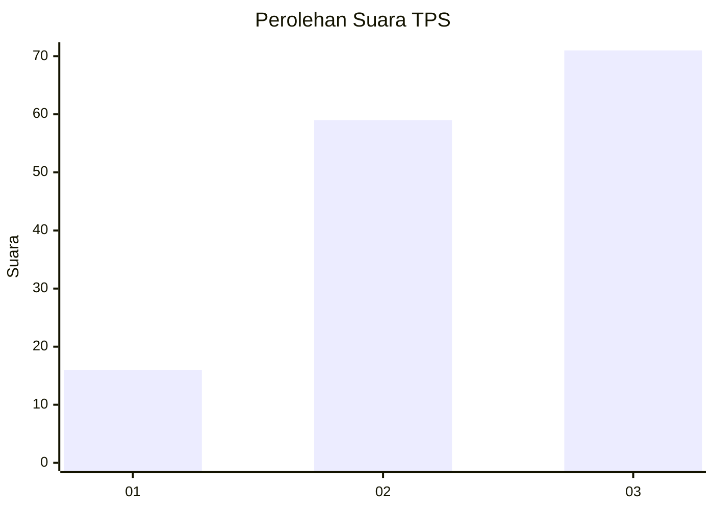
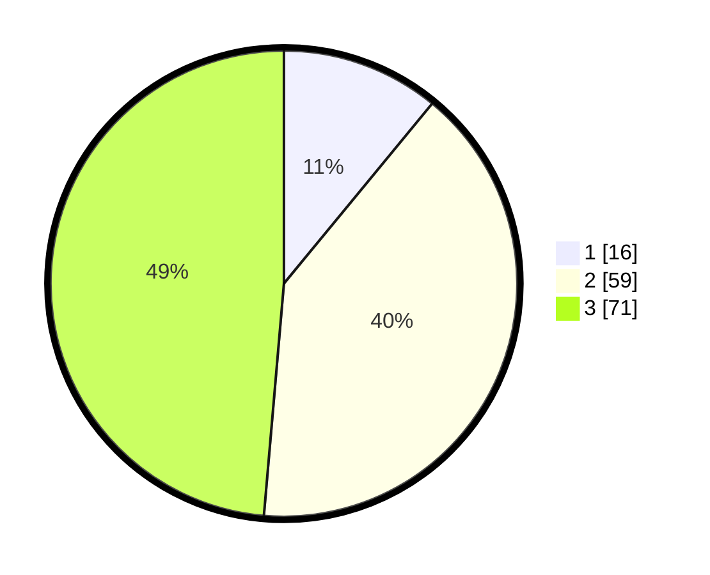

# Hasil

## Grafik

## Tabel

| No. | Nama Paslon    | Suara | Suara (raw) | Persentase |
|:--- |:-------------- | -----:| -----------:| ----------:|
| 1   | ANIES MUHAIMIN | 16    | [16][p-1]   | 10,96      |
| 2   | PRABOWO GIBRAN | 59    | [59][p-2]   | 40,41      |
| 3   | GANJAR MAHFUD  | 71    | [71][p-3]   | 48,63      |

[p-1]: https://github.com/gigit-pemilu/pemilu-2024-33-jawa-tengah/blob/main/pilpres/hitung-suara/sub/33-jawa-tengah/sub/12-wonogiri/sub/10-manyaran/sub/1007-punduhsari/sub/019-tps/sub/paslon-1.txt
[p-2]: https://github.com/gigit-pemilu/pemilu-2024-33-jawa-tengah/blob/main/pilpres/hitung-suara/sub/33-jawa-tengah/sub/12-wonogiri/sub/10-manyaran/sub/1007-punduhsari/sub/019-tps/sub/paslon-2.txt
[p-3]: https://github.com/gigit-pemilu/pemilu-2024-33-jawa-tengah/blob/main/pilpres/hitung-suara/sub/33-jawa-tengah/sub/12-wonogiri/sub/10-manyaran/sub/1007-punduhsari/sub/019-tps/sub/paslon-3.txt

## Foto C Plano

https://sirekap-obj-formc.kpu.go.id/9dac/pemilu/ppwp/33/12/10/10/07/3312101007019-20240214-212850--65c317e7-0552-41ee-a723-8e4a03941a7d.jpg

https://sirekap-obj-formc.kpu.go.id/9dac/pemilu/ppwp/33/12/10/10/07/3312101007019-20240214-141156--9c99e001-860c-4260-b979-95b9155d840f.jpg

https://sirekap-obj-formc.kpu.go.id/9dac/pemilu/ppwp/33/12/10/10/07/3312101007019-20240216-150659--e928059c-c349-4d0b-8252-a5a81db5fca0.jpg

## Metadata

| Key        | Value               |
| ---------- | ------------------- |
| Time Stamp | 2024-02-16 16:25:10 |

