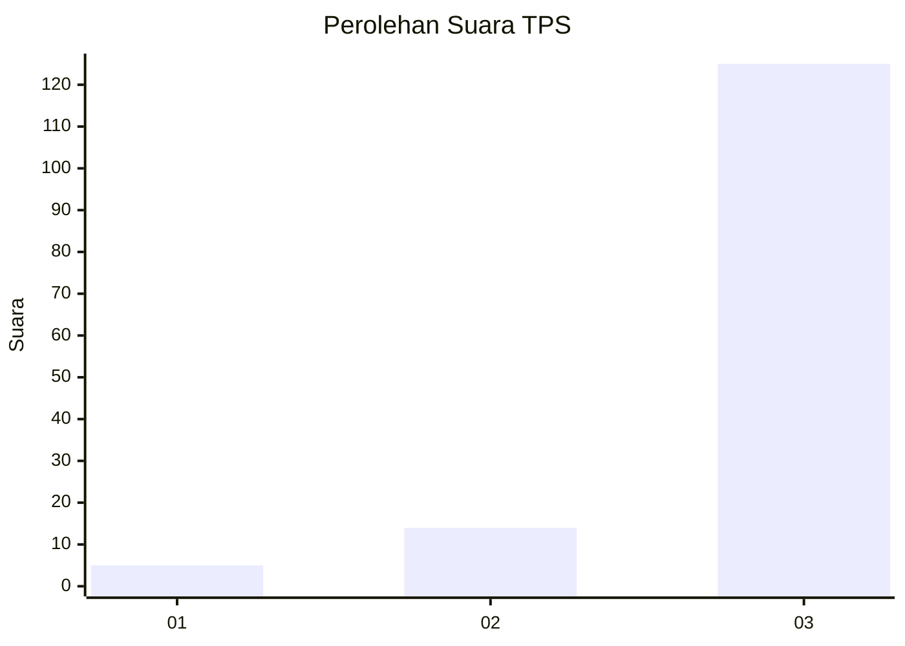
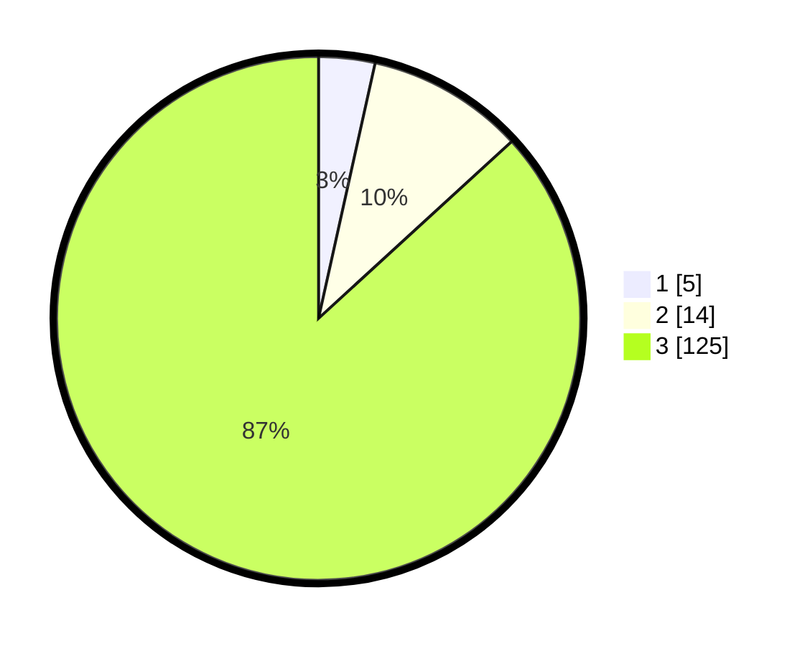

# Hasil

## Grafik

## Tabel

| No. | Nama Paslon    | Suara | Suara (raw) | Persentase |
|:--- |:-------------- | -----:| -----------:| ----------:|
| 1   | ANIES MUHAIMIN | 5     | [5][p-1]    | 3,47       |
| 2   | PRABOWO GIBRAN | 14    | [14][p-2]   | 9,72       |
| 3   | GANJAR MAHFUD  | 125   | [125][p-3]  | 86,81      |

[p-1]: https://github.com/gigit-pemilu/pemilu-2024-33-jawa-tengah/blob/main/pilpres/hitung-suara/sub/33-jawa-tengah/sub/12-wonogiri/sub/10-manyaran/sub/2001-kepuhsari/sub/017-tps/sub/paslon-1.txt
[p-2]: https://github.com/gigit-pemilu/pemilu-2024-33-jawa-tengah/blob/main/pilpres/hitung-suara/sub/33-jawa-tengah/sub/12-wonogiri/sub/10-manyaran/sub/2001-kepuhsari/sub/017-tps/sub/paslon-2.txt
[p-3]: https://github.com/gigit-pemilu/pemilu-2024-33-jawa-tengah/blob/main/pilpres/hitung-suara/sub/33-jawa-tengah/sub/12-wonogiri/sub/10-manyaran/sub/2001-kepuhsari/sub/017-tps/sub/paslon-3.txt

## Foto C Plano

https://sirekap-obj-formc.kpu.go.id/d863/pemilu/ppwp/33/12/10/20/01/3312102001017-20240214-203132--ce125b7f-8dfa-4fda-bf72-3d2dd7b86747.jpg

https://sirekap-obj-formc.kpu.go.id/d863/pemilu/ppwp/33/12/10/20/01/3312102001017-20240214-203306--2107e82f-816c-4685-8770-37e5e8545c84.jpg

https://sirekap-obj-formc.kpu.go.id/d863/pemilu/ppwp/33/12/10/20/01/3312102001017-20240214-205213--1a284e87-4f3b-4c14-83cd-2839a7ab8279.jpg

## Metadata

| Key        | Value               |
| ---------- | ------------------- |
| Time Stamp | 2024-02-24 22:31:28 |

