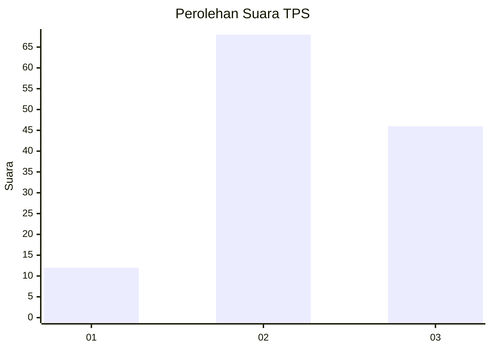
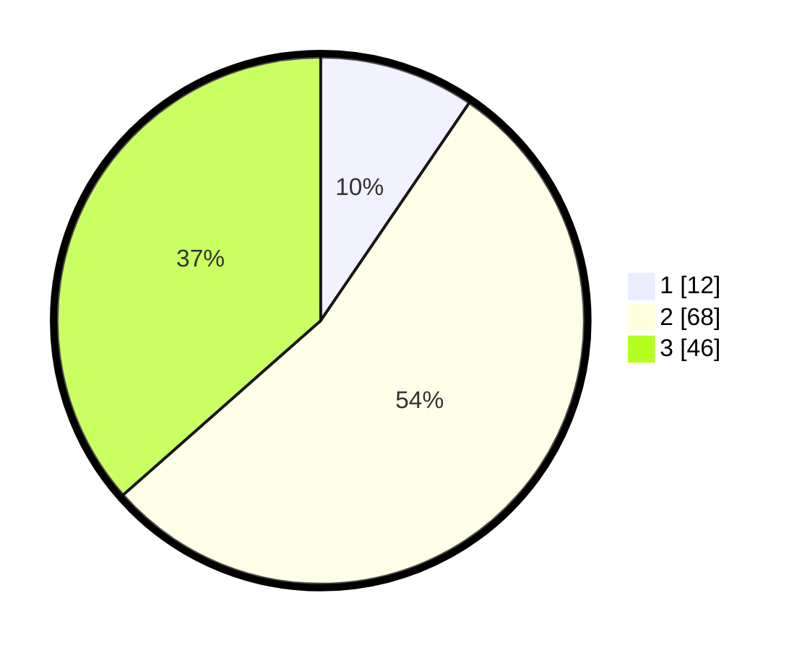

# Hasil

## Grafik

## Tabel

| No. | Nama Paslon    | Suara | Suara (raw) | Persentase |
|:--- |:-------------- | -----:| -----------:| ----------:|
| 1   | ANIES MUHAIMIN | 12    | [12][p-1]   | 9,52       |
| 2   | PRABOWO GIBRAN | 68    | [68][p-2]   | 53,97      |
| 3   | GANJAR MAHFUD  | 46    | [46][p-3]   | 36,51      |

[p-1]: https://github.com/gigit-pemilu/pemilu-2024/blob/main/pilpres/hitung-suara/sub/33-jawa-tengah/sub/12-wonogiri/sub/10-manyaran/sub/2002-pijiharjo/sub/001-tps/sub/paslon-1.txt
[p-2]: https://github.com/gigit-pemilu/pemilu-2024/blob/main/pilpres/hitung-suara/sub/33-jawa-tengah/sub/12-wonogiri/sub/10-manyaran/sub/2002-pijiharjo/sub/001-tps/sub/paslon-2.txt
[p-3]: https://github.com/gigit-pemilu/pemilu-2024/blob/main/pilpres/hitung-suara/sub/33-jawa-tengah/sub/12-wonogiri/sub/10-manyaran/sub/2002-pijiharjo/sub/001-tps/sub/paslon-3.txt

## Foto C Plano

https://sirekap-obj-formc.kpu.go.id/56ca/pemilu/ppwp/33/12/10/20/02/3312102002001-20240215-003127--381af6ee-4b37-415f-8a3b-b1539ccea98b.jpg

https://sirekap-obj-formc.kpu.go.id/56ca/pemilu/ppwp/33/12/10/20/02/3312102002001-20240215-003207--91074fda-beb4-4bea-9575-4cf40420ed44.jpg

https://sirekap-obj-formc.kpu.go.id/56ca/pemilu/ppwp/33/12/10/20/02/3312102002001-20240215-003326--7b219d3a-b36e-445a-b45f-c8ea19a93cac.jpg

## Metadata

| Key        | Value               |
| ---------- | ------------------- |
| Time Stamp | 2024-02-19 06:16:00 |

