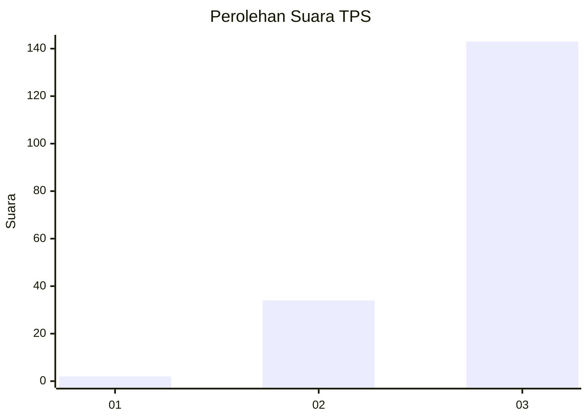
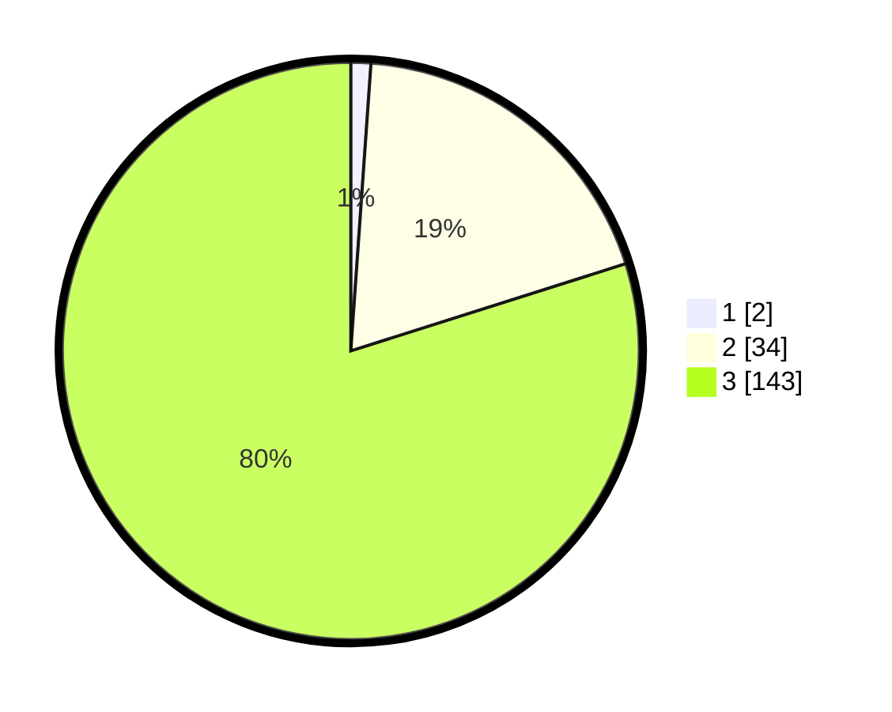

# Hasil

## Grafik

## Tabel

| No. | Nama Paslon    | Suara | Suara (raw) | Persentase |
|:--- |:-------------- | -----:| -----------:| ----------:|
| 1   | ANIES MUHAIMIN | 2     | [2][p-1]    | 1,12       |
| 2   | PRABOWO GIBRAN | 34    | [34][p-2]   | 18,99      |
| 3   | GANJAR MAHFUD  | 143   | [143][p-3]  | 79,89      |

[p-1]: https://github.com/gigit-pemilu/pemilu-2024/blob/main/pilpres/hitung-suara/sub/33-jawa-tengah/sub/12-wonogiri/sub/10-manyaran/sub/2002-pijiharjo/sub/007-tps/sub/paslon-1.txt
[p-2]: https://github.com/gigit-pemilu/pemilu-2024/blob/main/pilpres/hitung-suara/sub/33-jawa-tengah/sub/12-wonogiri/sub/10-manyaran/sub/2002-pijiharjo/sub/007-tps/sub/paslon-2.txt
[p-3]: https://github.com/gigit-pemilu/pemilu-2024/blob/main/pilpres/hitung-suara/sub/33-jawa-tengah/sub/12-wonogiri/sub/10-manyaran/sub/2002-pijiharjo/sub/007-tps/sub/paslon-3.txt

## Foto C Plano

https://sirekap-obj-formc.kpu.go.id/5d26/pemilu/ppwp/33/12/10/20/02/3312102002007-20240214-193141--dc7878aa-bc99-4a52-a789-9a9afd9fcc65.jpg

https://sirekap-obj-formc.kpu.go.id/5d26/pemilu/ppwp/33/12/10/20/02/3312102002007-20240214-191709--7f9f9a6c-ac56-4176-a9d1-00cd9653eed1.jpg

https://sirekap-obj-formc.kpu.go.id/5d26/pemilu/ppwp/33/12/10/20/02/3312102002007-20240214-193423--a75195a8-b907-425a-b88e-37c3ac694051.jpg

## Metadata

| Key        | Value               |
| ---------- | ------------------- |
| Time Stamp | 2024-02-19 06:16:00 |

