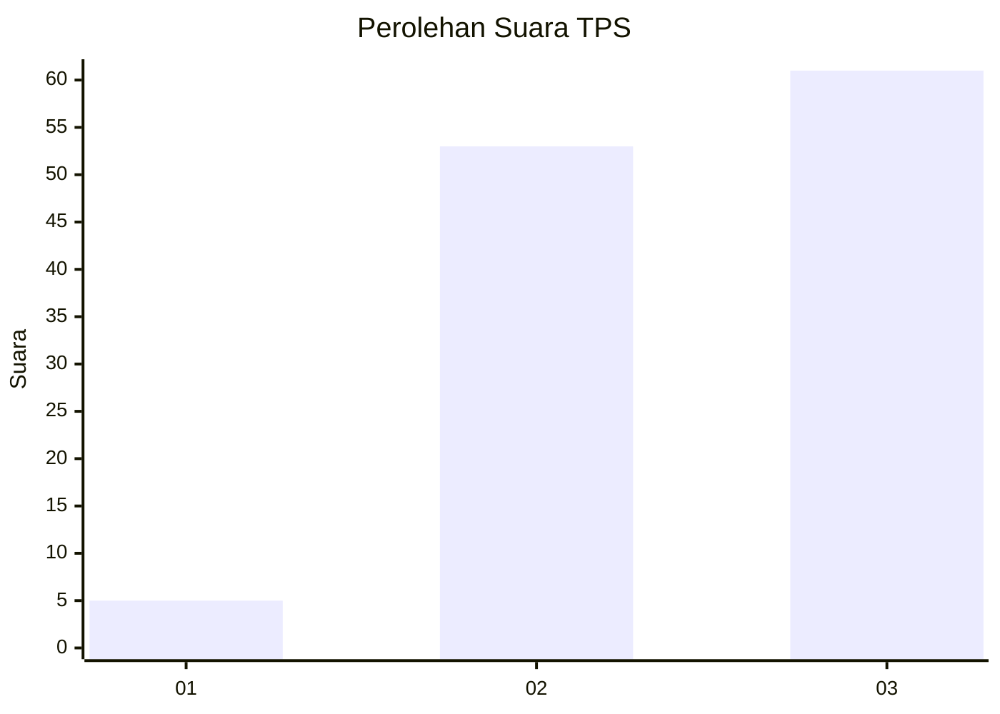
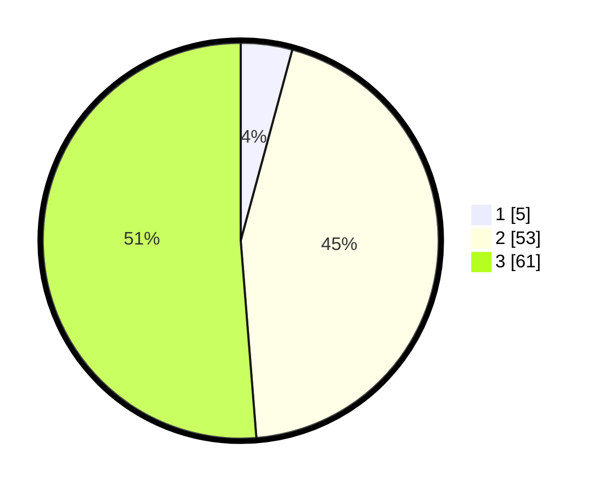

# Hasil

## Grafik

## Tabel

| No. | Nama Paslon    | Suara | Suara (raw) | Persentase |
|:--- |:-------------- | -----:| -----------:| ----------:|
| 1   | ANIES MUHAIMIN | 5     | [5][p-1]    | 4,20       |
| 2   | PRABOWO GIBRAN | 53    | [53][p-2]   | 44,54      |
| 3   | GANJAR MAHFUD  | 61    | [61][p-3]   | 51,26      |

[p-1]: https://github.com/gigit-pemilu/pemilu-2024-33-jawa-tengah/blob/main/pilpres/hitung-suara/sub/33-jawa-tengah/sub/12-wonogiri/sub/10-manyaran/sub/2002-pijiharjo/sub/010-tps/sub/paslon-1.txt
[p-2]: https://github.com/gigit-pemilu/pemilu-2024-33-jawa-tengah/blob/main/pilpres/hitung-suara/sub/33-jawa-tengah/sub/12-wonogiri/sub/10-manyaran/sub/2002-pijiharjo/sub/010-tps/sub/paslon-2.txt
[p-3]: https://github.com/gigit-pemilu/pemilu-2024-33-jawa-tengah/blob/main/pilpres/hitung-suara/sub/33-jawa-tengah/sub/12-wonogiri/sub/10-manyaran/sub/2002-pijiharjo/sub/010-tps/sub/paslon-3.txt

## Foto C Plano

https://sirekap-obj-formc.kpu.go.id/ad9d/pemilu/ppwp/33/12/10/20/02/3312102002010-20240215-000809--26573d59-f10e-41aa-a1ec-80bd09e21fec.jpg

https://sirekap-obj-formc.kpu.go.id/ad9d/pemilu/ppwp/33/12/10/20/02/3312102002010-20240215-001037--d2747b5b-9cb8-4209-b094-10997396e4b9.jpg

https://sirekap-obj-formc.kpu.go.id/ad9d/pemilu/ppwp/33/12/10/20/02/3312102002010-20240215-001621--3c4f276d-f825-4c74-af80-cafc36a765ab.jpg

## Metadata

| Key        | Value               |
| ---------- | ------------------- |
| Time Stamp | 2024-02-19 06:16:00 |

