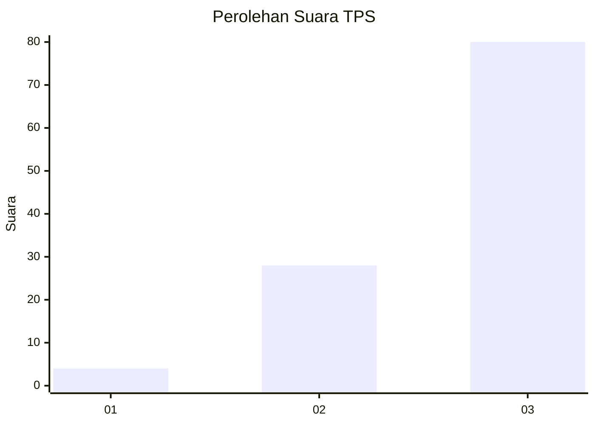
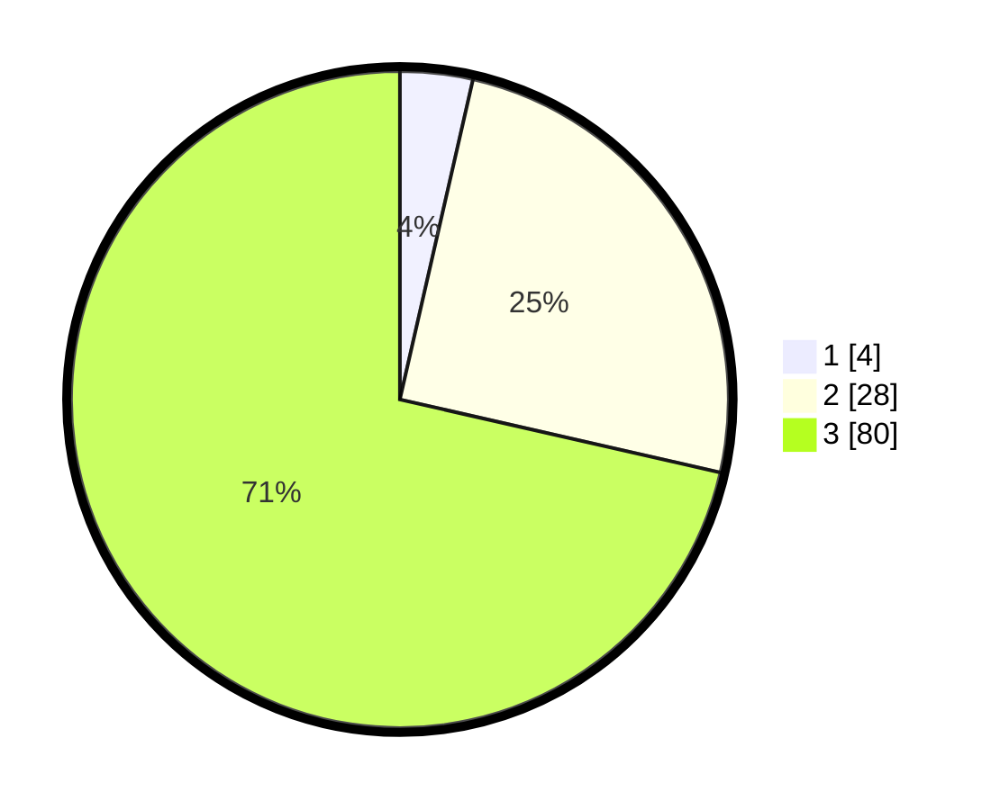

# Hasil

## Grafik

## Tabel

| No. | Nama Paslon    | Suara | Suara (raw) | Persentase |
|:--- |:-------------- | -----:| -----------:| ----------:|
| 1   | ANIES MUHAIMIN | 4     | [4][p-1]    | 3,57       |
| 2   | PRABOWO GIBRAN | 28    | [28][p-2]   | 25,00      |
| 3   | GANJAR MAHFUD  | 80    | [80][p-3]   | 71,43      |

[p-1]: https://github.com/gigit-pemilu/pemilu-2024/blob/main/pilpres/hitung-suara/sub/33-jawa-tengah/sub/12-wonogiri/sub/10-manyaran/sub/2003-bero/sub/010-tps/sub/paslon-1.txt
[p-2]: https://github.com/gigit-pemilu/pemilu-2024/blob/main/pilpres/hitung-suara/sub/33-jawa-tengah/sub/12-wonogiri/sub/10-manyaran/sub/2003-bero/sub/010-tps/sub/paslon-2.txt
[p-3]: https://github.com/gigit-pemilu/pemilu-2024/blob/main/pilpres/hitung-suara/sub/33-jawa-tengah/sub/12-wonogiri/sub/10-manyaran/sub/2003-bero/sub/010-tps/sub/paslon-3.txt

## Foto C Plano

https://sirekap-obj-formc.kpu.go.id/253d/pemilu/ppwp/33/12/10/20/03/3312102003010-20240214-141458--150420b3-f8ef-4610-a475-b229e17f93e2.jpg

https://sirekap-obj-formc.kpu.go.id/253d/pemilu/ppwp/33/12/10/20/03/3312102003010-20240214-141545--0c9a8e27-058b-4858-bab3-6c110f648caa.jpg

https://sirekap-obj-formc.kpu.go.id/253d/pemilu/ppwp/33/12/10/20/03/3312102003010-20240214-141626--84f51940-bea1-4ed9-b670-730f393318c2.jpg

## Metadata

| Key        | Value               |
| ---------- | ------------------- |
| Time Stamp | 2024-02-14 21:46:01 |

