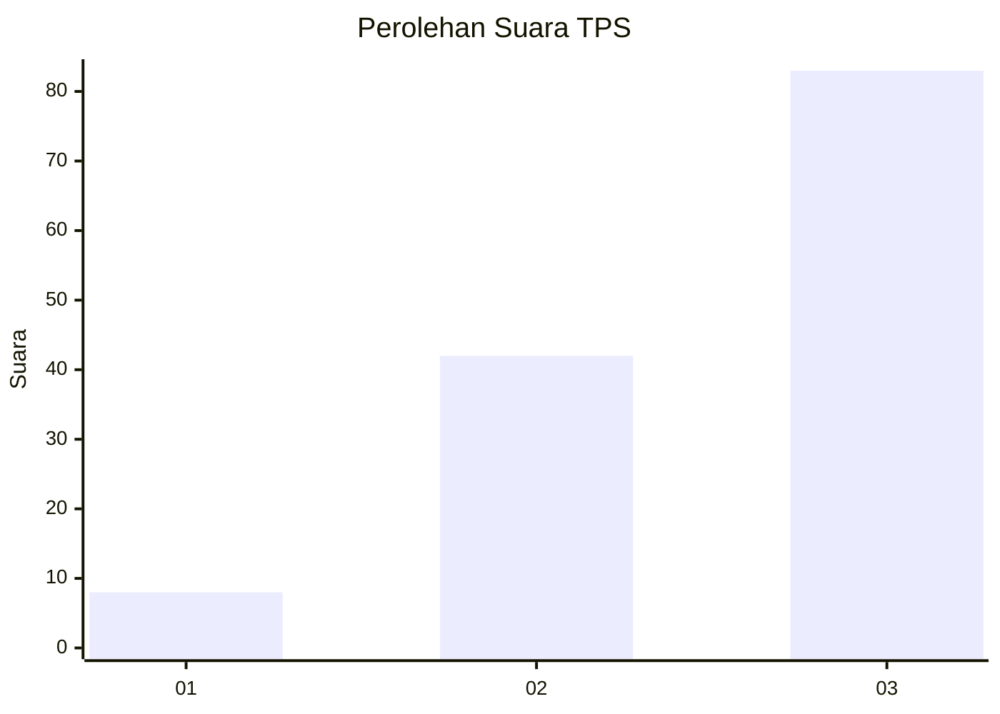
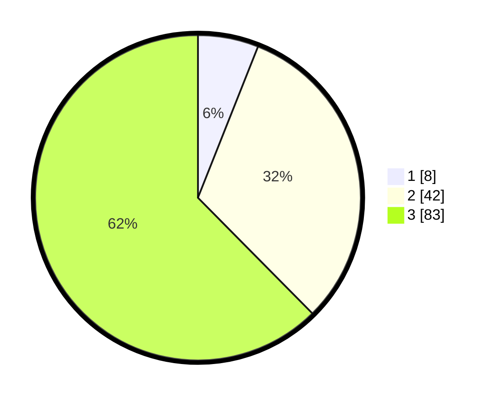

# Hasil

## Grafik

## Tabel

| No. | Nama Paslon    | Suara | Suara (raw) | Persentase |
|:--- |:-------------- | -----:| -----------:| ----------:|
| 1   | ANIES MUHAIMIN | 8     | [8][p-1]    | 6,02       |
| 2   | PRABOWO GIBRAN | 42    | [42][p-2]   | 31,58      |
| 3   | GANJAR MAHFUD  | 83    | [83][p-3]   | 62,41      |

[p-1]: https://github.com/gigit-pemilu/pemilu-2024/blob/main/pilpres/hitung-suara/sub/33-jawa-tengah/sub/12-wonogiri/sub/11-selogiri/sub/2002-keloran/sub/003-tps/sub/paslon-1.txt
[p-2]: https://github.com/gigit-pemilu/pemilu-2024/blob/main/pilpres/hitung-suara/sub/33-jawa-tengah/sub/12-wonogiri/sub/11-selogiri/sub/2002-keloran/sub/003-tps/sub/paslon-2.txt
[p-3]: https://github.com/gigit-pemilu/pemilu-2024/blob/main/pilpres/hitung-suara/sub/33-jawa-tengah/sub/12-wonogiri/sub/11-selogiri/sub/2002-keloran/sub/003-tps/sub/paslon-3.txt

## Foto C Plano

https://sirekap-obj-formc.kpu.go.id/7162/pemilu/ppwp/33/12/11/20/02/3312112002003-20240217-074403--a5c9659b-2700-409a-86b5-961cb68d3da3.jpg

https://sirekap-obj-formc.kpu.go.id/7162/pemilu/ppwp/33/12/11/20/02/3312112002003-20240214-215513--4d437a9d-7f55-4afa-afb7-a698cd82ce16.jpg

https://sirekap-obj-formc.kpu.go.id/7162/pemilu/ppwp/33/12/11/20/02/3312112002003-20240216-203246--132496d1-93af-4bc5-90f0-831892e9bcfb.jpg

## Metadata

| Key        | Value               |
| ---------- | ------------------- |
| Time Stamp | 2024-02-17 08:00:02 |

