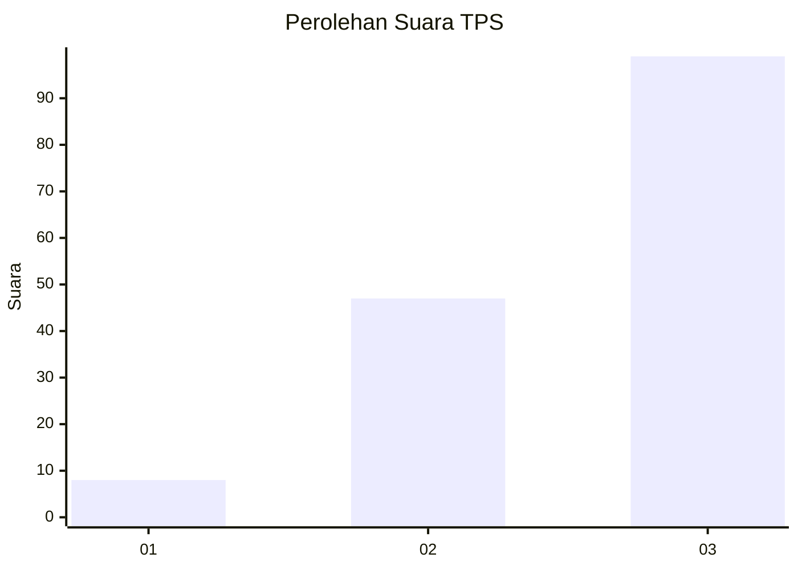
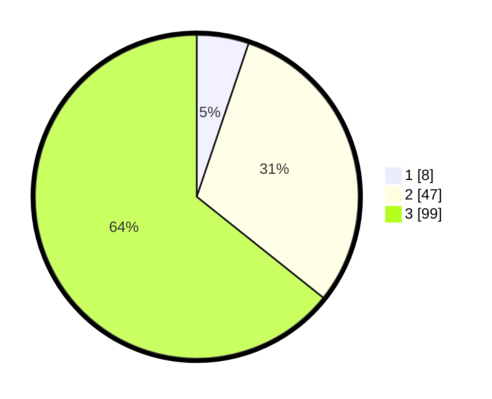

# Hasil

## Grafik

## Tabel

| No. | Nama Paslon    | Suara | Suara (raw) | Persentase |
|:--- |:-------------- | -----:| -----------:| ----------:|
| 1   | ANIES MUHAIMIN | 8     | [8][p-1]    | 5,19       |
| 2   | PRABOWO GIBRAN | 47    | [47][p-2]   | 30,52      |
| 3   | GANJAR MAHFUD  | 99    | [99][p-3]   | 64,29      |

[p-1]: https://github.com/gigit-pemilu/pemilu-2024/blob/main/pilpres/hitung-suara/sub/33-jawa-tengah/sub/12-wonogiri/sub/11-selogiri/sub/2002-keloran/sub/005-tps/sub/paslon-1.txt
[p-2]: https://github.com/gigit-pemilu/pemilu-2024/blob/main/pilpres/hitung-suara/sub/33-jawa-tengah/sub/12-wonogiri/sub/11-selogiri/sub/2002-keloran/sub/005-tps/sub/paslon-2.txt
[p-3]: https://github.com/gigit-pemilu/pemilu-2024/blob/main/pilpres/hitung-suara/sub/33-jawa-tengah/sub/12-wonogiri/sub/11-selogiri/sub/2002-keloran/sub/005-tps/sub/paslon-3.txt

## Foto C Plano

https://sirekap-obj-formc.kpu.go.id/c798/pemilu/ppwp/33/12/11/20/02/3312112002005-20240214-230556--a8ccc6f4-98aa-49eb-b3f8-c518e9438401.jpg

https://sirekap-obj-formc.kpu.go.id/c798/pemilu/ppwp/33/12/11/20/02/3312112002005-20240214-230732--1570ccf7-0327-40eb-8c8d-79c941e92d4e.jpg

https://sirekap-obj-formc.kpu.go.id/c798/pemilu/ppwp/33/12/11/20/02/3312112002005-20240218-142336--89a12e29-975c-47fb-9abc-6cb773020b98.jpg

## Metadata

| Key        | Value               |
| ---------- | ------------------- |
| Time Stamp | 2024-02-24 22:31:28 |

