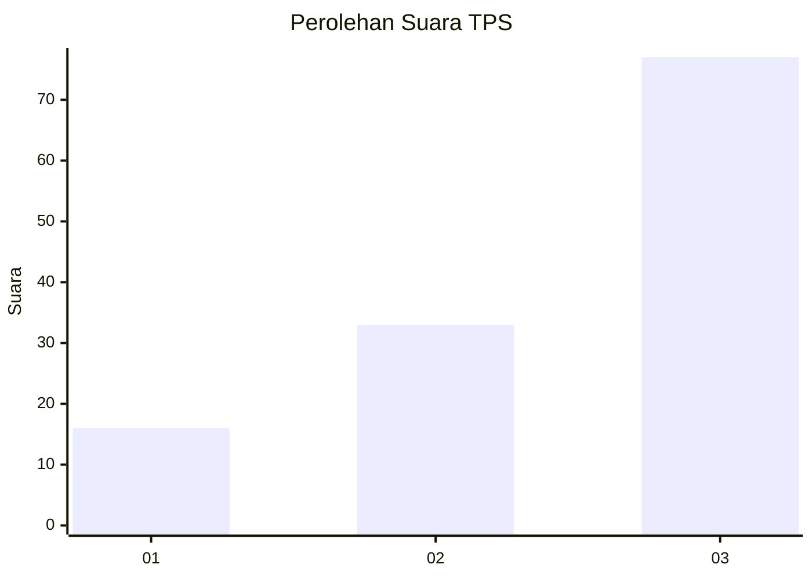
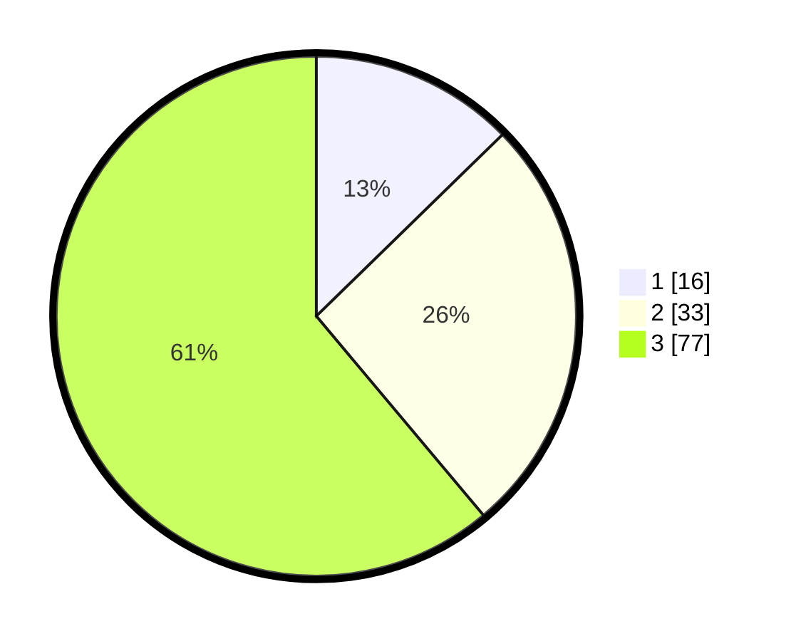

# Hasil

## Grafik

## Tabel

| No. | Nama Paslon    | Suara | Suara (raw) | Persentase |
|:--- |:-------------- | -----:| -----------:| ----------:|
| 1   | ANIES MUHAIMIN | 16    | [16][p-1]   | 12,70      |
| 2   | PRABOWO GIBRAN | 33    | [33][p-2]   | 26,19      |
| 3   | GANJAR MAHFUD  | 77    | [77][p-3]   | 61,11      |

[p-1]: https://github.com/gigit-pemilu/pemilu-2024-33-jawa-tengah/blob/main/pilpres/hitung-suara/sub/33-jawa-tengah/sub/12-wonogiri/sub/11-selogiri/sub/2004-pule/sub/001-tps/sub/paslon-1.txt
[p-2]: https://github.com/gigit-pemilu/pemilu-2024-33-jawa-tengah/blob/main/pilpres/hitung-suara/sub/33-jawa-tengah/sub/12-wonogiri/sub/11-selogiri/sub/2004-pule/sub/001-tps/sub/paslon-2.txt
[p-3]: https://github.com/gigit-pemilu/pemilu-2024-33-jawa-tengah/blob/main/pilpres/hitung-suara/sub/33-jawa-tengah/sub/12-wonogiri/sub/11-selogiri/sub/2004-pule/sub/001-tps/sub/paslon-3.txt

## Foto C Plano

https://sirekap-obj-formc.kpu.go.id/edb6/pemilu/ppwp/33/12/11/20/04/3312112004001-20240214-224701--30c97fb4-e0f5-4756-92f7-6b96c970f80a.jpg

https://sirekap-obj-formc.kpu.go.id/edb6/pemilu/ppwp/33/12/11/20/04/3312112004001-20240214-224259--7a35e6d6-2048-4adf-9755-4235220a67ff.jpg

https://sirekap-obj-formc.kpu.go.id/edb6/pemilu/ppwp/33/12/11/20/04/3312112004001-20240214-224525--cef2985d-3b1d-4aaa-89b6-eaab294edd1a.jpg

## Metadata

| Key        | Value               |
| ---------- | ------------------- |
| Time Stamp | 2024-02-19 06:16:00 |

