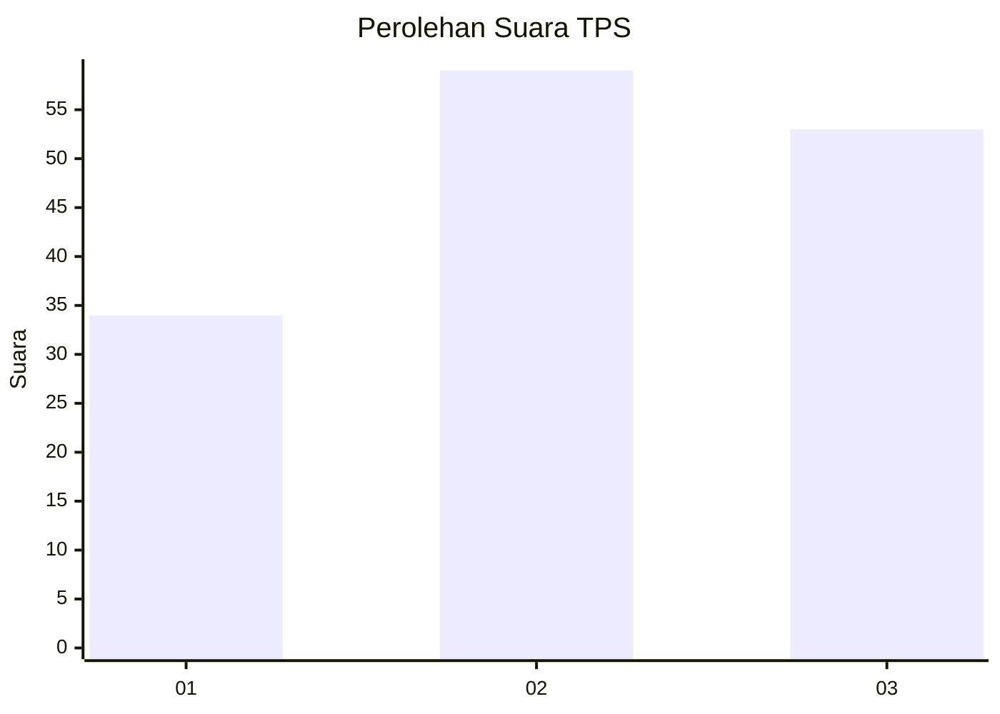
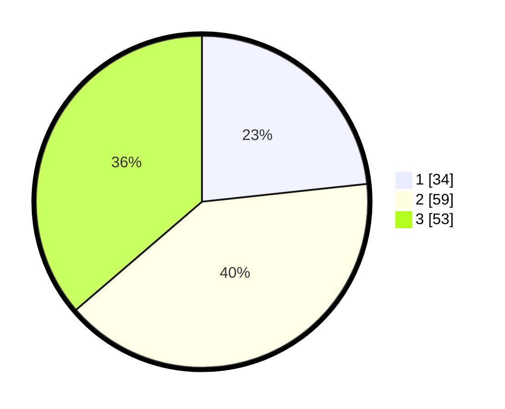

# Hasil

## Grafik

## Tabel

| No. | Nama Paslon    | Suara | Suara (raw) | Persentase |
|:--- |:-------------- | -----:| -----------:| ----------:|
| 1   | ANIES MUHAIMIN | 34    | [34][p-1]   | 23,29      |
| 2   | PRABOWO GIBRAN | 59    | [59][p-2]   | 40,41      |
| 3   | GANJAR MAHFUD  | 53    | [53][p-3]   | 36,30      |

[p-1]: https://github.com/gigit-pemilu/pemilu-2024/blob/main/pilpres/hitung-suara/sub/33-jawa-tengah/sub/12-wonogiri/sub/11-selogiri/sub/2005-jendi/sub/017-tps/sub/paslon-1.txt
[p-2]: https://github.com/gigit-pemilu/pemilu-2024/blob/main/pilpres/hitung-suara/sub/33-jawa-tengah/sub/12-wonogiri/sub/11-selogiri/sub/2005-jendi/sub/017-tps/sub/paslon-2.txt
[p-3]: https://github.com/gigit-pemilu/pemilu-2024/blob/main/pilpres/hitung-suara/sub/33-jawa-tengah/sub/12-wonogiri/sub/11-selogiri/sub/2005-jendi/sub/017-tps/sub/paslon-3.txt

## Foto C Plano

https://sirekap-obj-formc.kpu.go.id/f649/pemilu/ppwp/33/12/11/20/05/3312112005017-20240219-100126--caff7da9-885b-422b-b274-f5bbe3d92cba.jpg

https://sirekap-obj-formc.kpu.go.id/f649/pemilu/ppwp/33/12/11/20/05/3312112005017-20240219-095116--2e208f7e-b7a6-4348-befc-f51a3f7a9cfb.jpg

https://sirekap-obj-formc.kpu.go.id/f649/pemilu/ppwp/33/12/11/20/05/3312112005017-20240219-095230--865ef9dd-5222-4671-b8ba-bad4d1467a5a.jpg

## Metadata

| Key        | Value               |
| ---------- | ------------------- |
| Time Stamp | 2024-02-25 19:00:00 |

