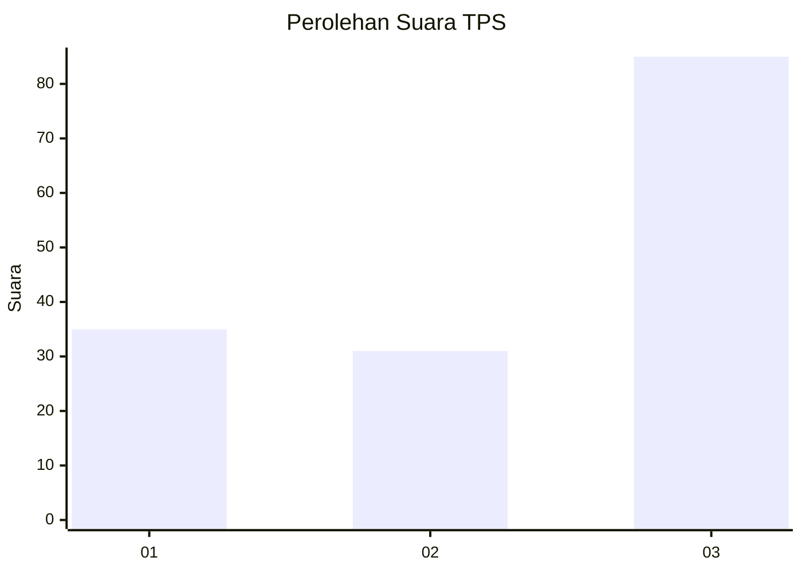
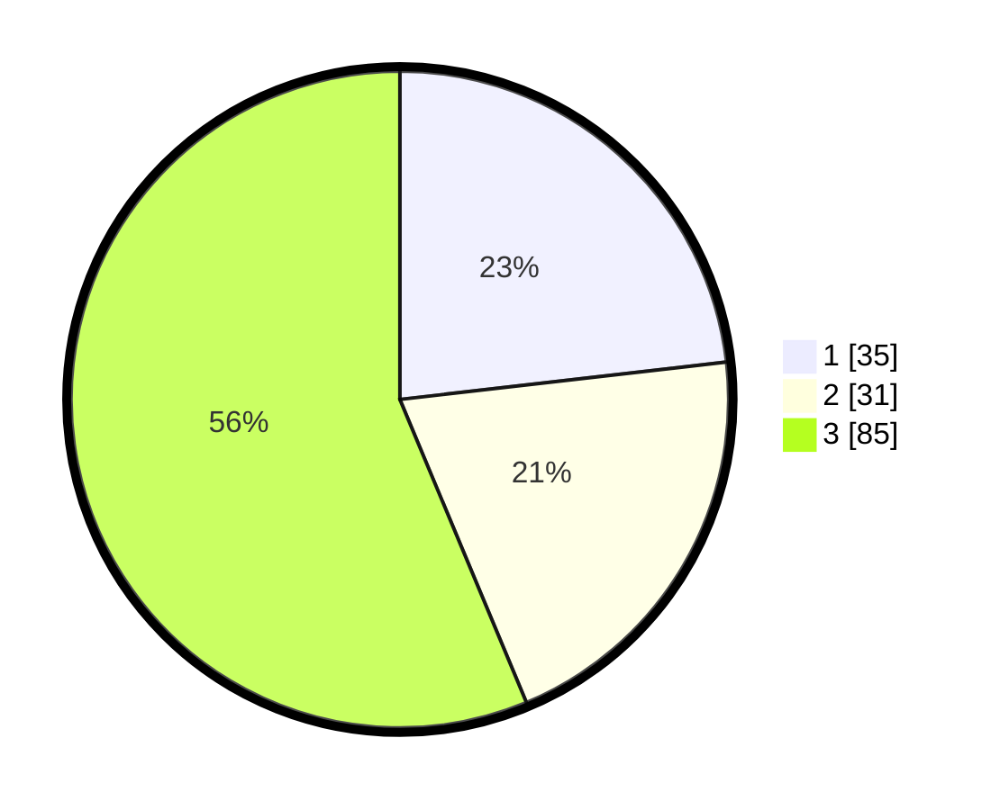

# Hasil

## Grafik

## Tabel

| No. | Nama Paslon    | Suara | Suara (raw) | Persentase |
|:--- |:-------------- | -----:| -----------:| ----------:|
| 1   | ANIES MUHAIMIN | 35    | [35][p-1]   | 23,18      |
| 2   | PRABOWO GIBRAN | 31    | [31][p-2]   | 20,53      |
| 3   | GANJAR MAHFUD  | 85    | [85][p-3]   | 56,29      |

[p-1]: https://github.com/gigit-pemilu/pemilu-2024-33-jawa-tengah/blob/main/pilpres/hitung-suara/sub/33-jawa-tengah/sub/12-wonogiri/sub/11-selogiri/sub/2009-jaten/sub/012-tps/sub/paslon-1.txt
[p-2]: https://github.com/gigit-pemilu/pemilu-2024-33-jawa-tengah/blob/main/pilpres/hitung-suara/sub/33-jawa-tengah/sub/12-wonogiri/sub/11-selogiri/sub/2009-jaten/sub/012-tps/sub/paslon-2.txt
[p-3]: https://github.com/gigit-pemilu/pemilu-2024-33-jawa-tengah/blob/main/pilpres/hitung-suara/sub/33-jawa-tengah/sub/12-wonogiri/sub/11-selogiri/sub/2009-jaten/sub/012-tps/sub/paslon-3.txt

## Foto C Plano

https://sirekap-obj-formc.kpu.go.id/e764/pemilu/ppwp/33/12/11/20/09/3312112009012-20240214-201035--5f400ce1-2b4e-4779-aa31-8bd309b76a7e.jpg

https://sirekap-obj-formc.kpu.go.id/e764/pemilu/ppwp/33/12/11/20/09/3312112009012-20240214-202534--0a906597-3736-4031-bb4a-b2b082b161f4.jpg

https://sirekap-obj-formc.kpu.go.id/e764/pemilu/ppwp/33/12/11/20/09/3312112009012-20240214-201049--6e163c5a-0315-43fe-979b-a38be3616aee.jpg

## Metadata

| Key        | Value               |
| ---------- | ------------------- |
| Time Stamp | 2024-02-19 06:16:00 |

