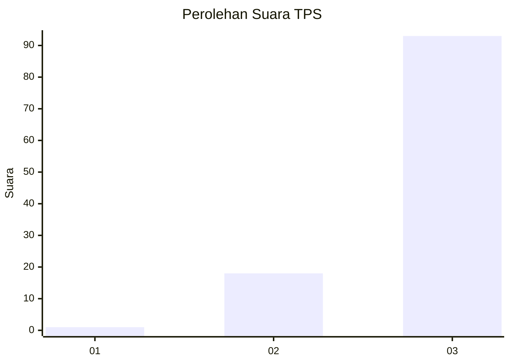
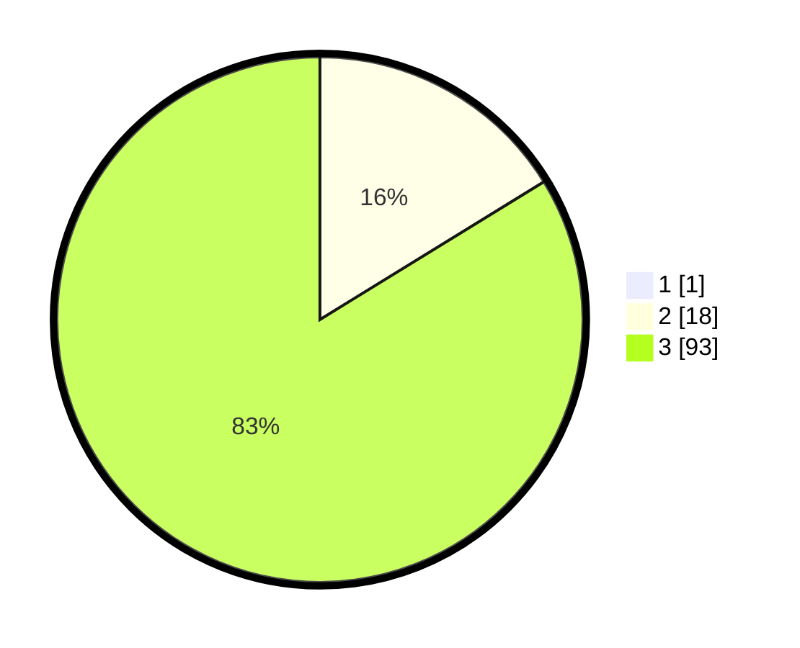

# Hasil

## Grafik

## Tabel

| No. | Nama Paslon    | Suara | Suara (raw) | Persentase |
|:--- |:-------------- | -----:| -----------:| ----------:|
| 1   | ANIES MUHAIMIN | 1     | [1][p-1]    | 0,89       |
| 2   | PRABOWO GIBRAN | 18    | [18][p-2]   | 16,07      |
| 3   | GANJAR MAHFUD  | 93    | [93][p-3]   | 83,04      |

[p-1]: https://github.com/gigit-pemilu/pemilu-2024-33-jawa-tengah/blob/main/pilpres/hitung-suara/sub/33-jawa-tengah/sub/12-wonogiri/sub/11-selogiri/sub/2011-sendangijo/sub/001-tps/sub/paslon-1.txt
[p-2]: https://github.com/gigit-pemilu/pemilu-2024-33-jawa-tengah/blob/main/pilpres/hitung-suara/sub/33-jawa-tengah/sub/12-wonogiri/sub/11-selogiri/sub/2011-sendangijo/sub/001-tps/sub/paslon-2.txt
[p-3]: https://github.com/gigit-pemilu/pemilu-2024-33-jawa-tengah/blob/main/pilpres/hitung-suara/sub/33-jawa-tengah/sub/12-wonogiri/sub/11-selogiri/sub/2011-sendangijo/sub/001-tps/sub/paslon-3.txt

## Foto C Plano

https://sirekap-obj-formc.kpu.go.id/762b/pemilu/ppwp/33/12/11/20/11/3312112011001-20240214-192655--ec452be5-ca5a-4c0c-aff6-e5dcd03a3b41.jpg

https://sirekap-obj-formc.kpu.go.id/762b/pemilu/ppwp/33/12/11/20/11/3312112011001-20240214-190617--4c0e6856-db7a-4111-8d1a-169afc0fe9db.jpg

https://sirekap-obj-formc.kpu.go.id/762b/pemilu/ppwp/33/12/11/20/11/3312112011001-20240214-160110--2fc196d9-504f-42bc-b5ce-68380d7e4308.jpg

## Metadata

| Key        | Value               |
| ---------- | ------------------- |
| Time Stamp | 2024-02-25 15:00:00 |

