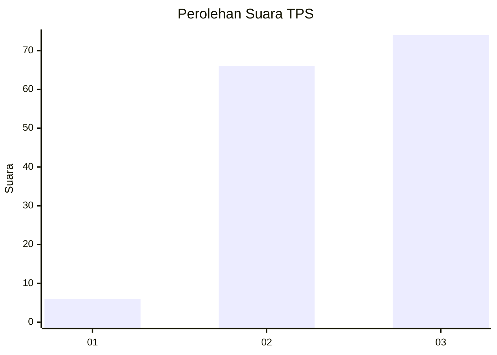
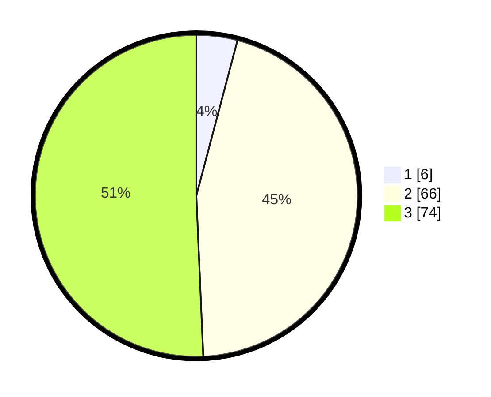

# Hasil

## Grafik

## Tabel

| No. | Nama Paslon    | Suara | Suara (raw) | Persentase |
|:--- |:-------------- | -----:| -----------:| ----------:|
| 1   | ANIES MUHAIMIN | 6     | [6][p-1]    | 4,11       |
| 2   | PRABOWO GIBRAN | 66    | [66][p-2]   | 45,21      |
| 3   | GANJAR MAHFUD  | 74    | [74][p-3]   | 50,68      |

[p-1]: https://github.com/gigit-pemilu/pemilu-2024/blob/main/pilpres/hitung-suara/sub/33-jawa-tengah/sub/12-wonogiri/sub/12-wonogiri/sub/1002-wuryorejo/sub/012-tps/sub/paslon-1.txt
[p-2]: https://github.com/gigit-pemilu/pemilu-2024/blob/main/pilpres/hitung-suara/sub/33-jawa-tengah/sub/12-wonogiri/sub/12-wonogiri/sub/1002-wuryorejo/sub/012-tps/sub/paslon-2.txt
[p-3]: https://github.com/gigit-pemilu/pemilu-2024/blob/main/pilpres/hitung-suara/sub/33-jawa-tengah/sub/12-wonogiri/sub/12-wonogiri/sub/1002-wuryorejo/sub/012-tps/sub/paslon-3.txt

## Foto C Plano

https://sirekap-obj-formc.kpu.go.id/52a8/pemilu/ppwp/33/12/12/10/02/3312121002012-20240216-202739--94236ac7-26cf-4f7a-ac7f-1dbb55fb52c9.jpg

https://sirekap-obj-formc.kpu.go.id/52a8/pemilu/ppwp/33/12/12/10/02/3312121002012-20240216-232046--16e3817e-a31e-4da4-9a76-741a48187f12.jpg

https://sirekap-obj-formc.kpu.go.id/52a8/pemilu/ppwp/33/12/12/10/02/3312121002012-20240216-202753--4fd70e40-f5c1-4706-ad19-244bea8ba1e2.jpg

## Metadata

| Key        | Value               |
| ---------- | ------------------- |
| Time Stamp | 2024-02-19 06:16:00 |

