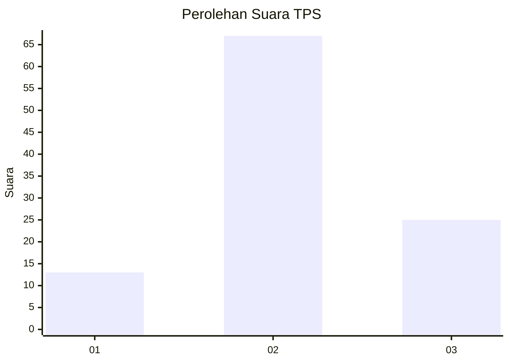
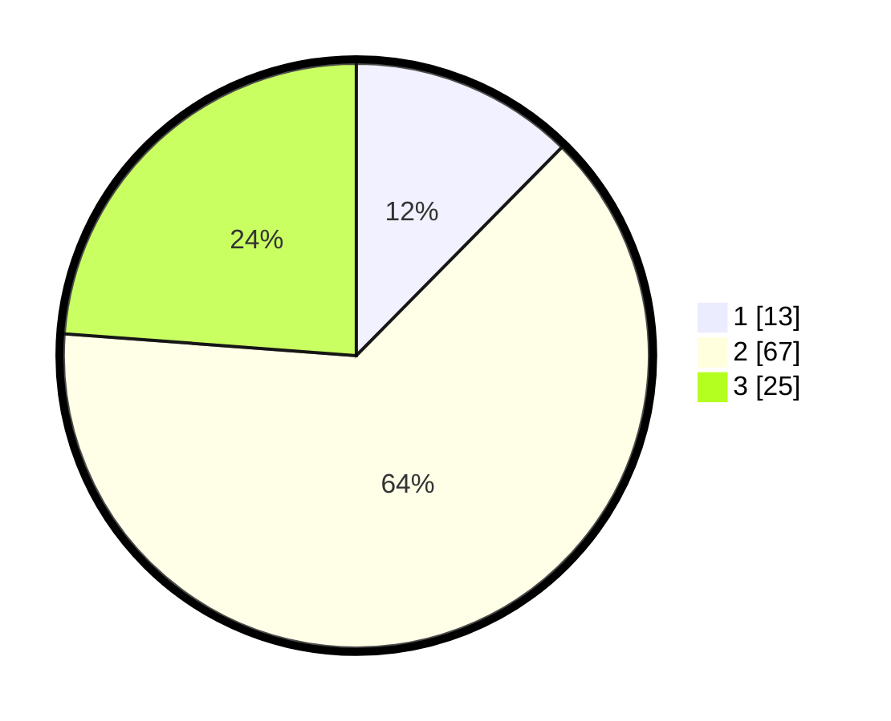

# Hasil

## Grafik

## Tabel

| No. | Nama Paslon    | Suara | Suara (raw) | Persentase |
|:--- |:-------------- | -----:| -----------:| ----------:|
| 1   | ANIES MUHAIMIN | 13    | [13][p-1]   | 12,38      |
| 2   | PRABOWO GIBRAN | 67    | [67][p-2]   | 63,81      |
| 3   | GANJAR MAHFUD  | 25    | [25][p-3]   | 23,81      |

[p-1]: https://github.com/gigit-pemilu/pemilu-2024-33-jawa-tengah/blob/main/pilpres/hitung-suara/sub/33-jawa-tengah/sub/12-wonogiri/sub/12-wonogiri/sub/1003-giritirto/sub/010-tps/sub/paslon-1.txt
[p-2]: https://github.com/gigit-pemilu/pemilu-2024-33-jawa-tengah/blob/main/pilpres/hitung-suara/sub/33-jawa-tengah/sub/12-wonogiri/sub/12-wonogiri/sub/1003-giritirto/sub/010-tps/sub/paslon-2.txt
[p-3]: https://github.com/gigit-pemilu/pemilu-2024-33-jawa-tengah/blob/main/pilpres/hitung-suara/sub/33-jawa-tengah/sub/12-wonogiri/sub/12-wonogiri/sub/1003-giritirto/sub/010-tps/sub/paslon-3.txt

## Foto C Plano

https://sirekap-obj-formc.kpu.go.id/36cc/pemilu/ppwp/33/12/12/10/03/3312121003010-20240214-221140--afb46195-8fbd-434b-a950-58a478b3292d.jpg

https://sirekap-obj-formc.kpu.go.id/36cc/pemilu/ppwp/33/12/12/10/03/3312121003010-20240214-221126--0730fe22-8a9a-4bee-9b54-2bc12d478cfc.jpg

https://sirekap-obj-formc.kpu.go.id/36cc/pemilu/ppwp/33/12/12/10/03/3312121003010-20240214-141937--b4716161-55c7-4bf1-9568-4bd83ec90b4b.jpg

## Metadata

| Key        | Value               |
| ---------- | ------------------- |
| Time Stamp | 2024-02-19 06:16:00 |

