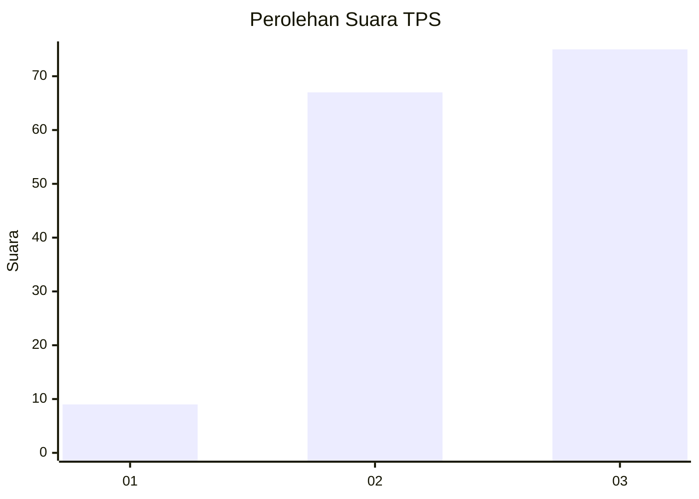
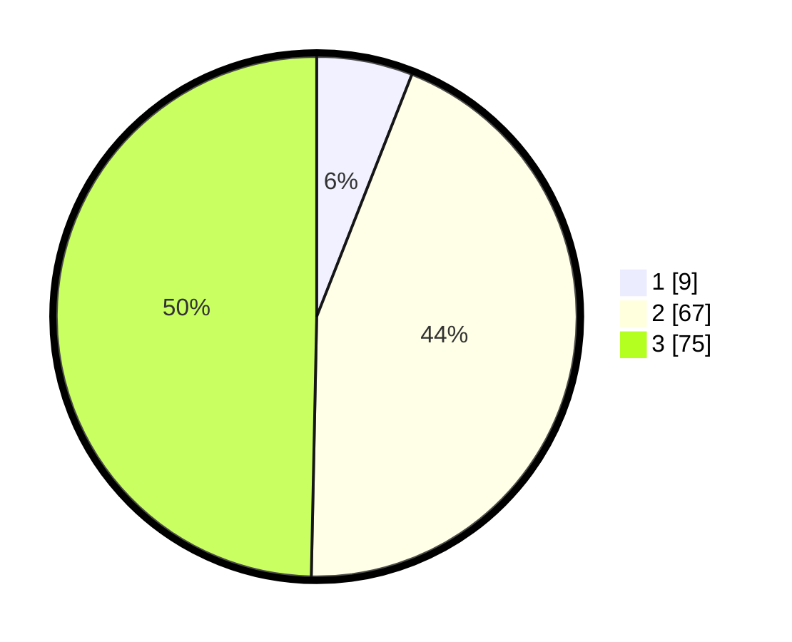

# Hasil

## Grafik

## Tabel

| No. | Nama Paslon    | Suara | Suara (raw) | Persentase |
|:--- |:-------------- | -----:| -----------:| ----------:|
| 1   | ANIES MUHAIMIN | 9     | [9][p-1]    | 5,96       |
| 2   | PRABOWO GIBRAN | 67    | [67][p-2]   | 44,37      |
| 3   | GANJAR MAHFUD  | 75    | [75][p-3]   | 49,67      |

[p-1]: https://github.com/gigit-pemilu/pemilu-2024/blob/main/pilpres/hitung-suara/sub/33-jawa-tengah/sub/12-wonogiri/sub/12-wonogiri/sub/1003-giritirto/sub/026-tps/sub/paslon-1.txt
[p-2]: https://github.com/gigit-pemilu/pemilu-2024/blob/main/pilpres/hitung-suara/sub/33-jawa-tengah/sub/12-wonogiri/sub/12-wonogiri/sub/1003-giritirto/sub/026-tps/sub/paslon-2.txt
[p-3]: https://github.com/gigit-pemilu/pemilu-2024/blob/main/pilpres/hitung-suara/sub/33-jawa-tengah/sub/12-wonogiri/sub/12-wonogiri/sub/1003-giritirto/sub/026-tps/sub/paslon-3.txt

## Foto C Plano

https://sirekap-obj-formc.kpu.go.id/34ba/pemilu/ppwp/33/12/12/10/03/3312121003026-20240214-234813--e2ae4a40-8214-4ff3-873a-f87d28019cd6.jpg

https://sirekap-obj-formc.kpu.go.id/34ba/pemilu/ppwp/33/12/12/10/03/3312121003026-20240214-234934--4ad845ec-76d3-43f3-b5be-796951b174c3.jpg

https://sirekap-obj-formc.kpu.go.id/34ba/pemilu/ppwp/33/12/12/10/03/3312121003026-20240214-235039--7133b66f-7d62-4349-811d-44a930244605.jpg

## Metadata

| Key        | Value               |
| ---------- | ------------------- |
| Time Stamp | 2024-02-19 06:16:00 |

