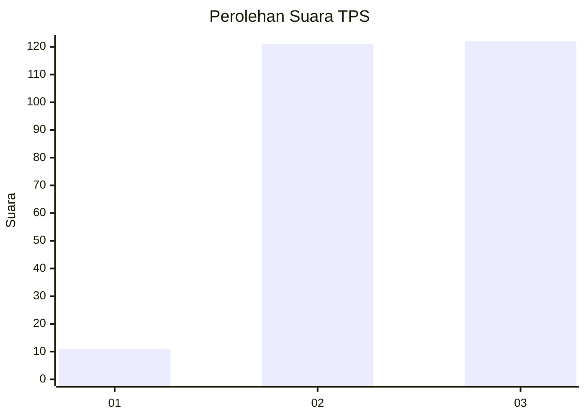
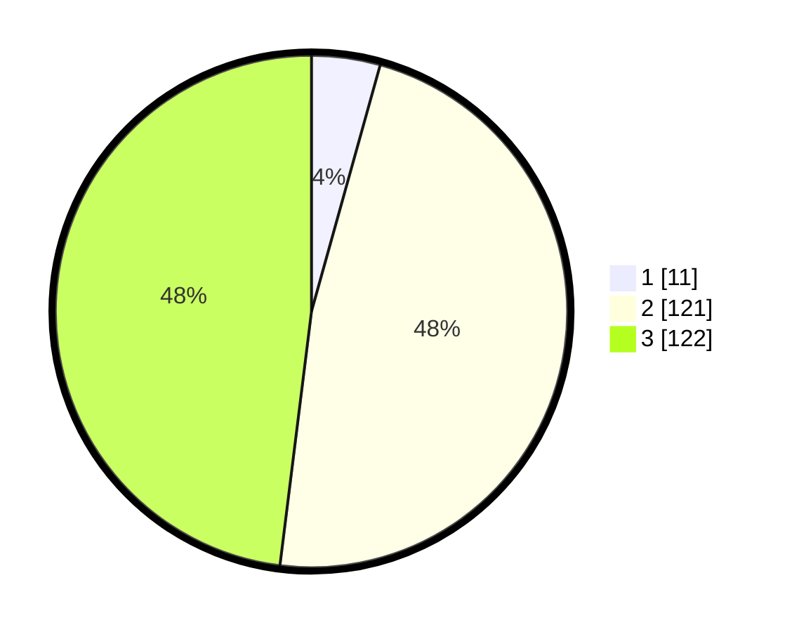

# Hasil

## Grafik

## Tabel

| No. | Nama Paslon    | Suara | Suara (raw) | Persentase |
|:--- |:-------------- | -----:| -----------:| ----------:|
| 1   | ANIES MUHAIMIN | 11    | [11][p-1]   | 4,33       |
| 2   | PRABOWO GIBRAN | 121   | [121][p-2]  | 47,64      |
| 3   | GANJAR MAHFUD  | 122   | [122][p-3]  | 48,03      |

[p-1]: https://github.com/gigit-pemilu/pemilu-2024-33-jawa-tengah/blob/main/pilpres/hitung-suara/sub/33-jawa-tengah/sub/12-wonogiri/sub/12-wonogiri/sub/2004-pokohkidul/sub/019-tps/sub/paslon-1.txt
[p-2]: https://github.com/gigit-pemilu/pemilu-2024-33-jawa-tengah/blob/main/pilpres/hitung-suara/sub/33-jawa-tengah/sub/12-wonogiri/sub/12-wonogiri/sub/2004-pokohkidul/sub/019-tps/sub/paslon-2.txt
[p-3]: https://github.com/gigit-pemilu/pemilu-2024-33-jawa-tengah/blob/main/pilpres/hitung-suara/sub/33-jawa-tengah/sub/12-wonogiri/sub/12-wonogiri/sub/2004-pokohkidul/sub/019-tps/sub/paslon-3.txt

## Foto C Plano

https://sirekap-obj-formc.kpu.go.id/08ee/pemilu/ppwp/33/12/12/20/04/3312122004019-20240218-112543--8e0cb597-0f1d-4481-b30f-5d76efbcca8f.jpg

https://sirekap-obj-formc.kpu.go.id/08ee/pemilu/ppwp/33/12/12/20/04/3312122004019-20240218-090920--62274dd3-321f-4ae6-8ca9-d697ea142abe.jpg

https://sirekap-obj-formc.kpu.go.id/08ee/pemilu/ppwp/33/12/12/20/04/3312122004019-20240218-091007--b582b767-5d52-42d9-a93f-4de3bbad2eb6.jpg

## Metadata

| Key        | Value               |
| ---------- | ------------------- |
| Time Stamp | 2024-02-25 12:00:00 |

