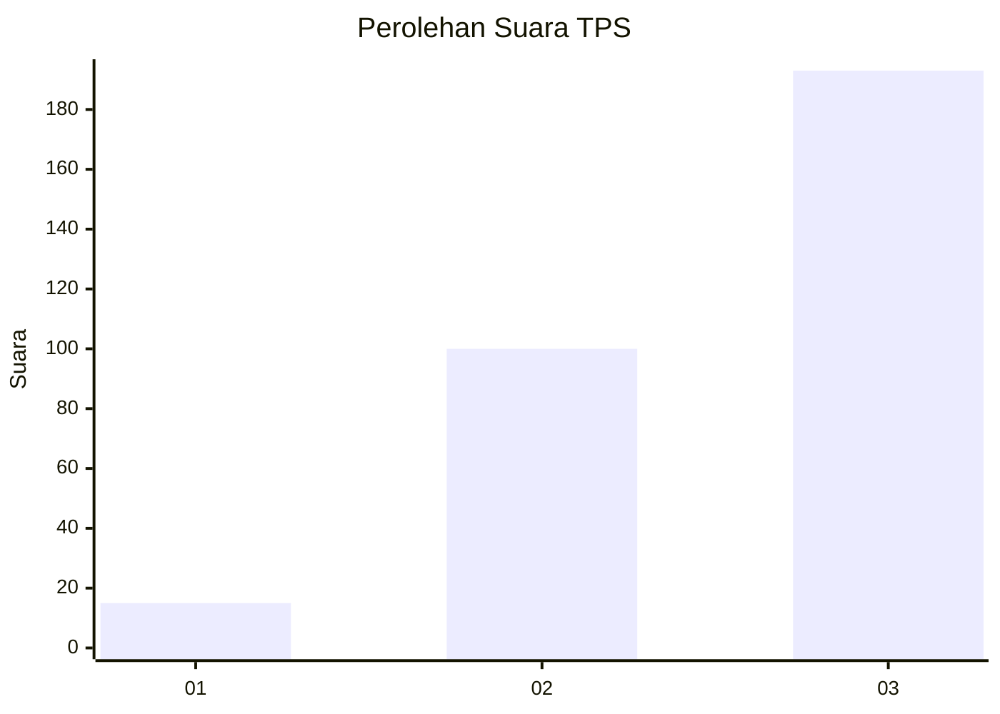
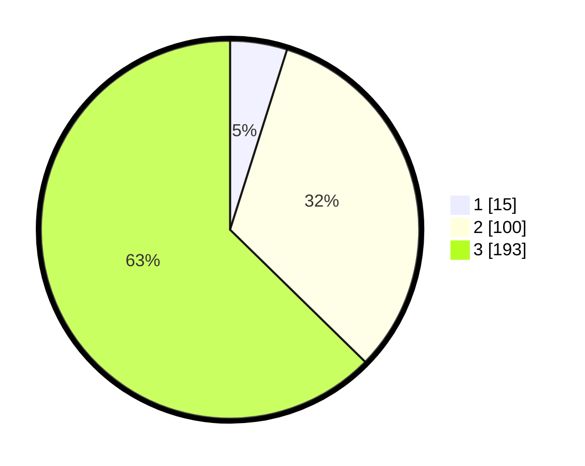

# Hasil

## Grafik

## Tabel

| No. | Nama Paslon    | Suara | Suara (raw) | Persentase |
|:--- |:-------------- | -----:| -----------:| ----------:|
| 1   | ANIES MUHAIMIN | 15    | [15][p-1]   | 4,87       |
| 2   | PRABOWO GIBRAN | 100   | [100][p-2]  | 32,47      |
| 3   | GANJAR MAHFUD  | 193   | [193][p-3]  | 62,66      |

[p-1]: https://github.com/gigit-pemilu/pemilu-2024-33-jawa-tengah/blob/main/pilpres/hitung-suara/sub/33-jawa-tengah/sub/12-wonogiri/sub/12-wonogiri/sub/2011-wonoharjo/sub/002-tps/sub/paslon-1.txt
[p-2]: https://github.com/gigit-pemilu/pemilu-2024-33-jawa-tengah/blob/main/pilpres/hitung-suara/sub/33-jawa-tengah/sub/12-wonogiri/sub/12-wonogiri/sub/2011-wonoharjo/sub/002-tps/sub/paslon-2.txt
[p-3]: https://github.com/gigit-pemilu/pemilu-2024-33-jawa-tengah/blob/main/pilpres/hitung-suara/sub/33-jawa-tengah/sub/12-wonogiri/sub/12-wonogiri/sub/2011-wonoharjo/sub/002-tps/sub/paslon-3.txt

## Foto C Plano

https://sirekap-obj-formc.kpu.go.id/67fc/pemilu/ppwp/33/12/12/20/11/3312122011002-20240214-184827--c8e7da75-3cc0-410d-8d0b-ad099fa1682e.jpg

https://sirekap-obj-formc.kpu.go.id/67fc/pemilu/ppwp/33/12/12/20/11/3312122011002-20240214-185009--b9d75066-f6c1-40f5-89d6-b7473a281c4c.jpg

https://sirekap-obj-formc.kpu.go.id/67fc/pemilu/ppwp/33/12/12/20/11/3312122011002-20240214-185205--b8a2e8c5-463e-42ca-9377-8e3b7a646fe1.jpg

## Metadata

| Key        | Value               |
| ---------- | ------------------- |
| Time Stamp | 2024-02-25 11:00:00 |

