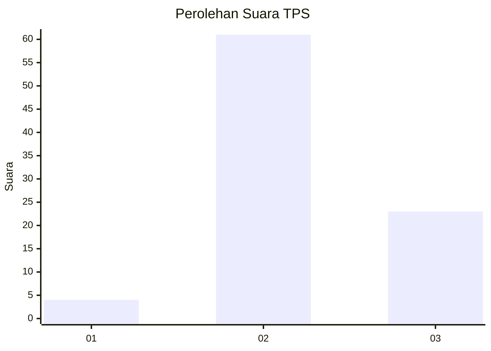
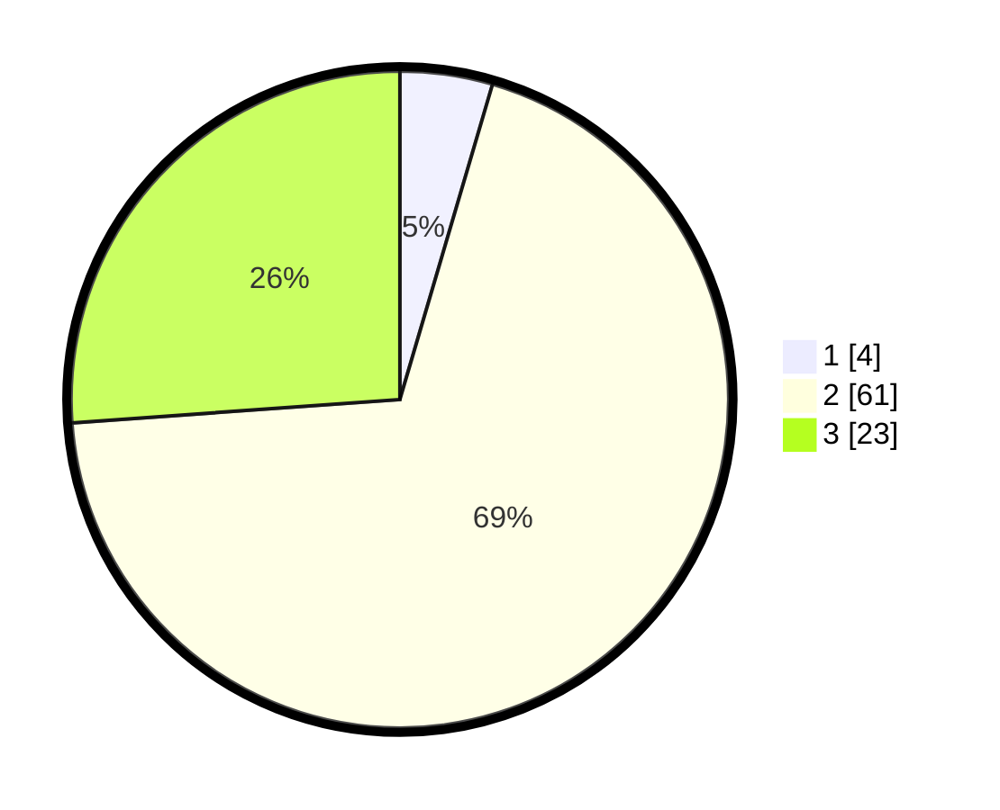

# Hasil

## Grafik

## Tabel

| No. | Nama Paslon    | Suara | Suara (raw) | Persentase |
|:--- |:-------------- | -----:| -----------:| ----------:|
| 1   | ANIES MUHAIMIN | 4     | [4][p-1]    | 4,55       |
| 2   | PRABOWO GIBRAN | 61    | [61][p-2]   | 69,32      |
| 3   | GANJAR MAHFUD  | 23    | [23][p-3]   | 26,14      |

[p-1]: https://github.com/gigit-pemilu/pemilu-2024-33-jawa-tengah/blob/main/pilpres/hitung-suara/sub/33-jawa-tengah/sub/12-wonogiri/sub/12-wonogiri/sub/2011-wonoharjo/sub/004-tps/sub/paslon-1.txt
[p-2]: https://github.com/gigit-pemilu/pemilu-2024-33-jawa-tengah/blob/main/pilpres/hitung-suara/sub/33-jawa-tengah/sub/12-wonogiri/sub/12-wonogiri/sub/2011-wonoharjo/sub/004-tps/sub/paslon-2.txt
[p-3]: https://github.com/gigit-pemilu/pemilu-2024-33-jawa-tengah/blob/main/pilpres/hitung-suara/sub/33-jawa-tengah/sub/12-wonogiri/sub/12-wonogiri/sub/2011-wonoharjo/sub/004-tps/sub/paslon-3.txt

## Foto C Plano

https://sirekap-obj-formc.kpu.go.id/4c84/pemilu/ppwp/33/12/12/20/11/3312122011004-20240214-141542--ade03ae7-454e-4e21-91ff-8808c9ef878a.jpg

https://sirekap-obj-formc.kpu.go.id/4c84/pemilu/ppwp/33/12/12/20/11/3312122011004-20240214-141640--31865b3c-f445-4303-9faf-97f9b6b1fc77.jpg

https://sirekap-obj-formc.kpu.go.id/4c84/pemilu/ppwp/33/12/12/20/11/3312122011004-20240214-141728--673065c5-92b3-47bd-aafd-d52799f1e320.jpg

## Metadata

| Key        | Value               |
| ---------- | ------------------- |
| Time Stamp | 2024-02-14 21:46:01 |

