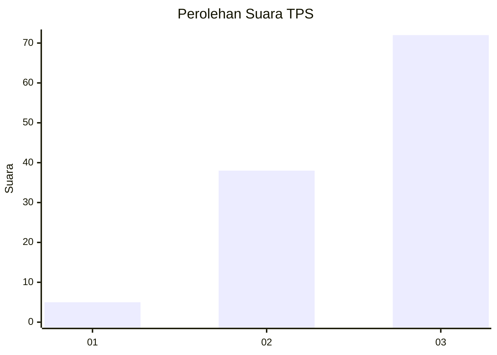
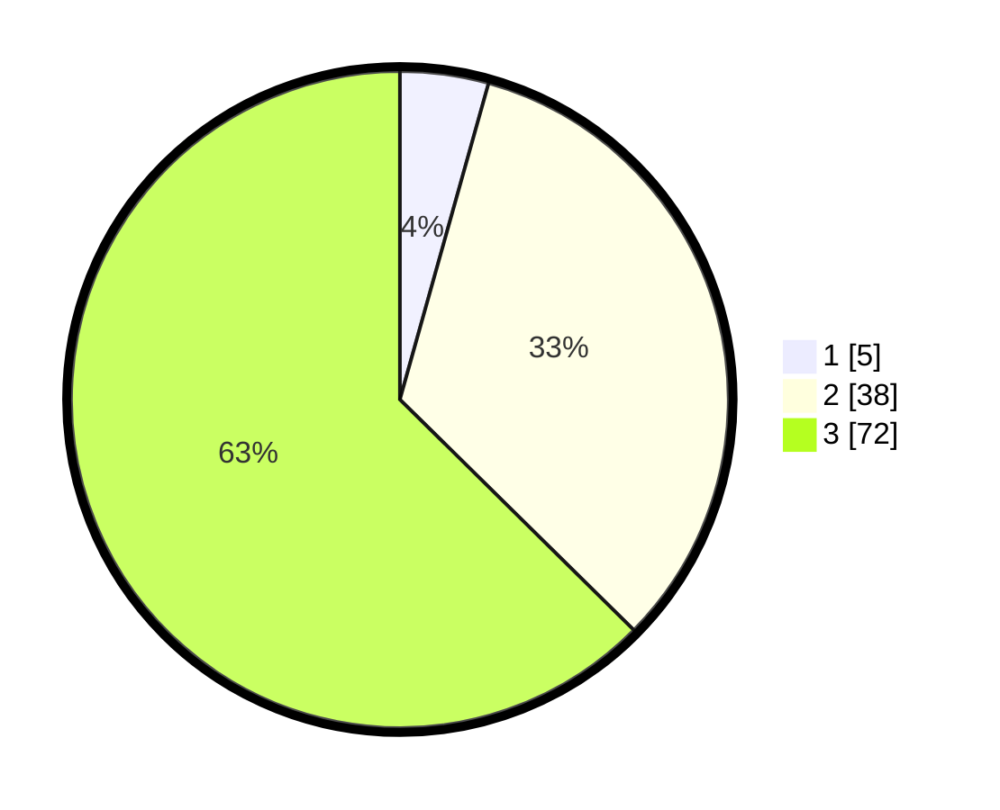

# Hasil

## Grafik

## Tabel

| No. | Nama Paslon    | Suara | Suara (raw) | Persentase |
|:--- |:-------------- | -----:| -----------:| ----------:|
| 1   | ANIES MUHAIMIN | 5     | [5][p-1]    | 4,35       |
| 2   | PRABOWO GIBRAN | 38    | [38][p-2]   | 33,04      |
| 3   | GANJAR MAHFUD  | 72    | [72][p-3]   | 62,61      |

[p-1]: https://github.com/gigit-pemilu/pemilu-2024/blob/main/pilpres/hitung-suara/sub/33-jawa-tengah/sub/12-wonogiri/sub/12-wonogiri/sub/2011-wonoharjo/sub/013-tps/sub/paslon-1.txt
[p-2]: https://github.com/gigit-pemilu/pemilu-2024/blob/main/pilpres/hitung-suara/sub/33-jawa-tengah/sub/12-wonogiri/sub/12-wonogiri/sub/2011-wonoharjo/sub/013-tps/sub/paslon-2.txt
[p-3]: https://github.com/gigit-pemilu/pemilu-2024/blob/main/pilpres/hitung-suara/sub/33-jawa-tengah/sub/12-wonogiri/sub/12-wonogiri/sub/2011-wonoharjo/sub/013-tps/sub/paslon-3.txt

## Foto C Plano

https://sirekap-obj-formc.kpu.go.id/15b0/pemilu/ppwp/33/12/12/20/11/3312122011013-20240214-201340--810236e5-e3eb-43d9-a41d-6492239d22c3.jpg

https://sirekap-obj-formc.kpu.go.id/15b0/pemilu/ppwp/33/12/12/20/11/3312122011013-20240214-201442--4a17e7c3-85ff-49df-a309-5aab66e1473c.jpg

https://sirekap-obj-formc.kpu.go.id/15b0/pemilu/ppwp/33/12/12/20/11/3312122011013-20240215-010221--367d7745-ffb1-4a9a-a1f1-6cebb03d6f22.jpg

## Metadata

| Key        | Value               |
| ---------- | ------------------- |
| Time Stamp | 2024-02-19 06:16:00 |

