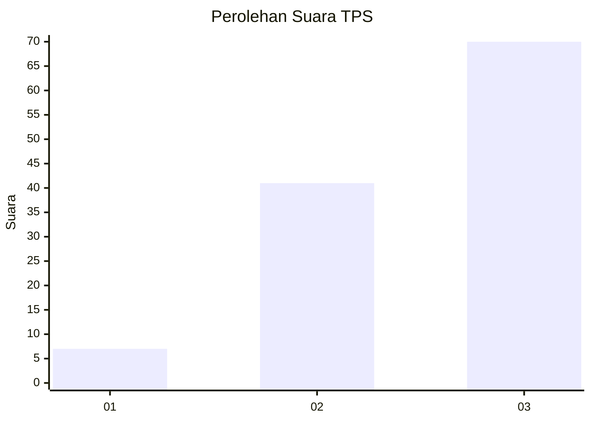
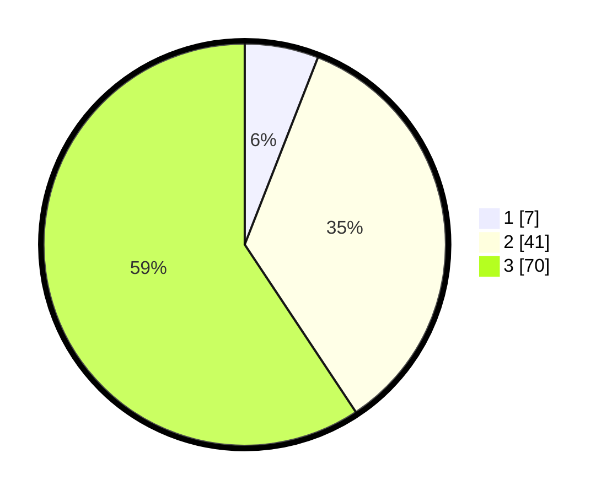

# Hasil

## Grafik

## Tabel

| No. | Nama Paslon    | Suara | Suara (raw) | Persentase |
|:--- |:-------------- | -----:| -----------:| ----------:|
| 1   | ANIES MUHAIMIN | 7     | [7][p-1]    | 5,93       |
| 2   | PRABOWO GIBRAN | 41    | [41][p-2]   | 34,75      |
| 3   | GANJAR MAHFUD  | 70    | [70][p-3]   | 59,32      |

[p-1]: https://github.com/gigit-pemilu/pemilu-2024-33-jawa-tengah/blob/main/pilpres/hitung-suara/sub/33-jawa-tengah/sub/12-wonogiri/sub/12-wonogiri/sub/2012-manjung/sub/004-tps/sub/paslon-1.txt
[p-2]: https://github.com/gigit-pemilu/pemilu-2024-33-jawa-tengah/blob/main/pilpres/hitung-suara/sub/33-jawa-tengah/sub/12-wonogiri/sub/12-wonogiri/sub/2012-manjung/sub/004-tps/sub/paslon-2.txt
[p-3]: https://github.com/gigit-pemilu/pemilu-2024-33-jawa-tengah/blob/main/pilpres/hitung-suara/sub/33-jawa-tengah/sub/12-wonogiri/sub/12-wonogiri/sub/2012-manjung/sub/004-tps/sub/paslon-3.txt

## Foto C Plano

https://sirekap-obj-formc.kpu.go.id/b176/pemilu/ppwp/33/12/12/20/12/3312122012004-20240214-205326--78a2dcbe-513c-48a0-9104-591027cf8b4a.jpg

https://sirekap-obj-formc.kpu.go.id/b176/pemilu/ppwp/33/12/12/20/12/3312122012004-20240214-205609--c966e3f8-2de6-4e35-abe0-31df0e96dcc2.jpg

https://sirekap-obj-formc.kpu.go.id/b176/pemilu/ppwp/33/12/12/20/12/3312122012004-20240214-205433--c8910c73-542c-450e-824e-c225d430b505.jpg

## Metadata

| Key        | Value               |
| ---------- | ------------------- |
| Time Stamp | 2024-02-19 06:16:00 |

