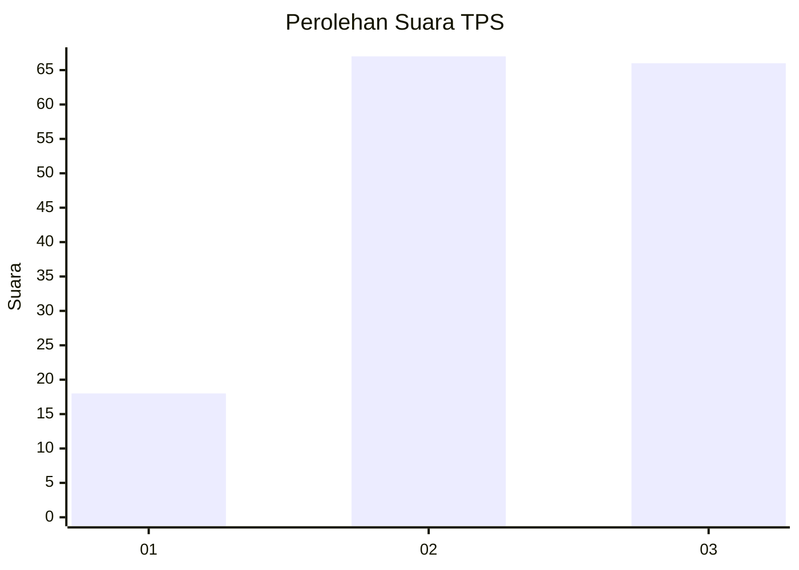
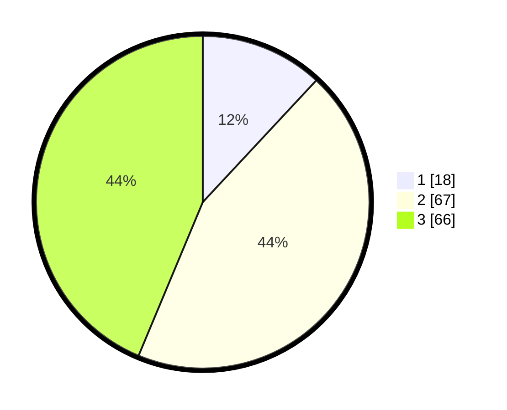

# Hasil

## Grafik

## Tabel

| No. | Nama Paslon    | Suara | Suara (raw) | Persentase |
|:--- |:-------------- | -----:| -----------:| ----------:|
| 1   | ANIES MUHAIMIN | 18    | [18][p-1]   | 11,92      |
| 2   | PRABOWO GIBRAN | 67    | [67][p-2]   | 44,37      |
| 3   | GANJAR MAHFUD  | 66    | [66][p-3]   | 43,71      |

[p-1]: https://github.com/gigit-pemilu/pemilu-2024/blob/main/pilpres/hitung-suara/sub/33-jawa-tengah/sub/12-wonogiri/sub/12-wonogiri/sub/2012-manjung/sub/013-tps/sub/paslon-1.txt
[p-2]: https://github.com/gigit-pemilu/pemilu-2024/blob/main/pilpres/hitung-suara/sub/33-jawa-tengah/sub/12-wonogiri/sub/12-wonogiri/sub/2012-manjung/sub/013-tps/sub/paslon-2.txt
[p-3]: https://github.com/gigit-pemilu/pemilu-2024/blob/main/pilpres/hitung-suara/sub/33-jawa-tengah/sub/12-wonogiri/sub/12-wonogiri/sub/2012-manjung/sub/013-tps/sub/paslon-3.txt

## Foto C Plano

https://sirekap-obj-formc.kpu.go.id/8d3b/pemilu/ppwp/33/12/12/20/12/3312122012013-20240214-215202--278ebef4-1dc5-4d95-9d27-2dbe7ce31c67.jpg

https://sirekap-obj-formc.kpu.go.id/8d3b/pemilu/ppwp/33/12/12/20/12/3312122012013-20240214-215121--1828aadc-2eab-4b1c-b696-cdb2584b1f42.jpg

https://sirekap-obj-formc.kpu.go.id/8d3b/pemilu/ppwp/33/12/12/20/12/3312122012013-20240214-214958--9a512f23-6c1d-40e8-9f7a-7cf4bb80a612.jpg

## Metadata

| Key        | Value               |
| ---------- | ------------------- |
| Time Stamp | 2024-02-19 06:16:00 |

