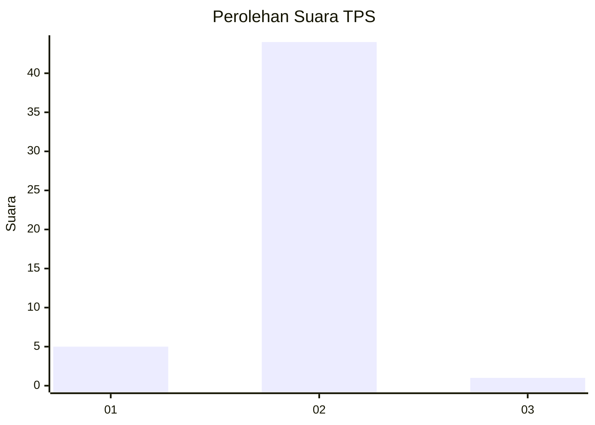
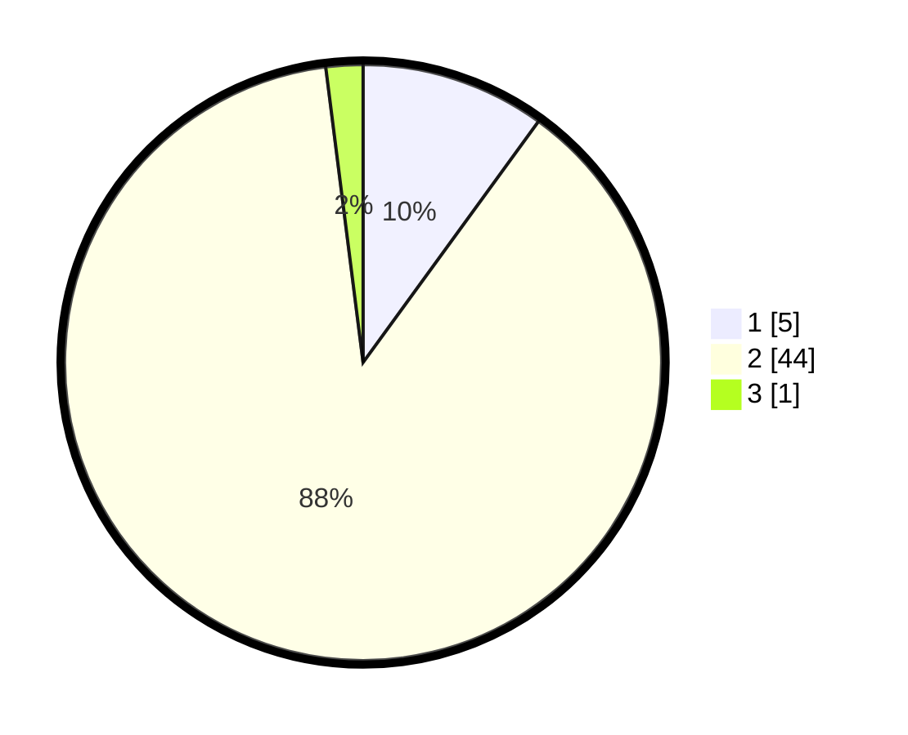

# Hasil

## Grafik

## Tabel

| No. | Nama Paslon    | Suara | Suara (raw) | Persentase |
|:--- |:-------------- | -----:| -----------:| ----------:|
| 1   | ANIES MUHAIMIN | 5     | [5][p-1]    | 10,00      |
| 2   | PRABOWO GIBRAN | 44    | [44][p-2]   | 88,00      |
| 3   | GANJAR MAHFUD  | 1     | [1][p-3]    | 2,00       |

[p-1]: https://github.com/gigit-pemilu/pemilu-2024/blob/main/pilpres/hitung-suara/sub/33-jawa-tengah/sub/12-wonogiri/sub/12-wonogiri/sub/2013-wonokerto/sub/006-tps/sub/paslon-1.txt
[p-2]: https://github.com/gigit-pemilu/pemilu-2024/blob/main/pilpres/hitung-suara/sub/33-jawa-tengah/sub/12-wonogiri/sub/12-wonogiri/sub/2013-wonokerto/sub/006-tps/sub/paslon-2.txt
[p-3]: https://github.com/gigit-pemilu/pemilu-2024/blob/main/pilpres/hitung-suara/sub/33-jawa-tengah/sub/12-wonogiri/sub/12-wonogiri/sub/2013-wonokerto/sub/006-tps/sub/paslon-3.txt

## Foto C Plano

https://sirekap-obj-formc.kpu.go.id/ea02/pemilu/ppwp/33/12/12/20/13/3312122013006-20240214-195456--bb7a8660-9c98-45bb-be80-5ab7f816a591.jpg

https://sirekap-obj-formc.kpu.go.id/ea02/pemilu/ppwp/33/12/12/20/13/3312122013006-20240214-195459--c8ccb13c-dbf4-4f94-9eb2-d16f86fd9735.jpg

https://sirekap-obj-formc.kpu.go.id/ea02/pemilu/ppwp/33/12/12/20/13/3312122013006-20240214-195453--731a09fa-8698-49ed-8aa6-ec452fc20124.jpg

## Metadata

| Key        | Value               |
| ---------- | ------------------- |
| Time Stamp | 2024-02-14 21:46:01 |

