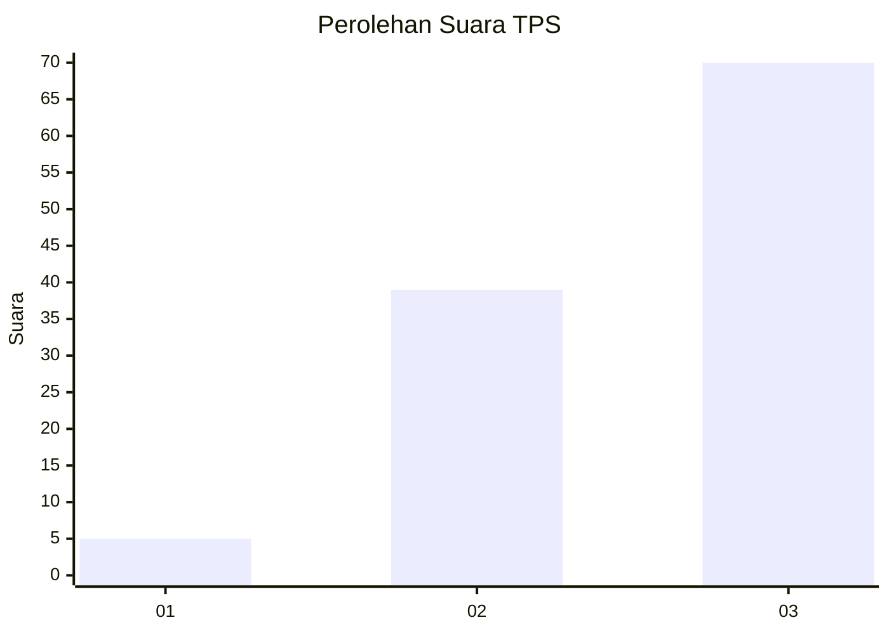
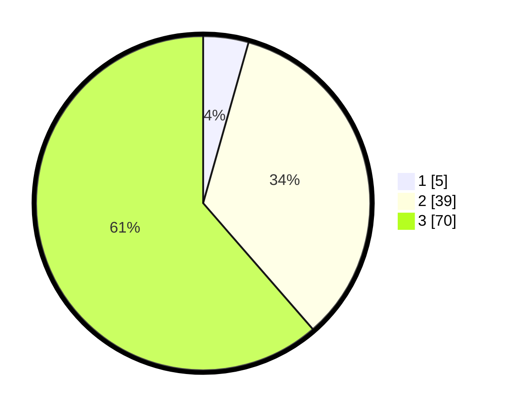

# Hasil

## Grafik

## Tabel

| No. | Nama Paslon    | Suara | Suara (raw) | Persentase |
|:--- |:-------------- | -----:| -----------:| ----------:|
| 1   | ANIES MUHAIMIN | 5     | [5][p-1]    | 4,39       |
| 2   | PRABOWO GIBRAN | 39    | [39][p-2]   | 34,21      |
| 3   | GANJAR MAHFUD  | 70    | [70][p-3]   | 61,40      |

[p-1]: https://github.com/gigit-pemilu/pemilu-2024-33-jawa-tengah/blob/main/pilpres/hitung-suara/sub/33-jawa-tengah/sub/12-wonogiri/sub/12-wonogiri/sub/2013-wonokerto/sub/012-tps/sub/paslon-1.txt
[p-2]: https://github.com/gigit-pemilu/pemilu-2024-33-jawa-tengah/blob/main/pilpres/hitung-suara/sub/33-jawa-tengah/sub/12-wonogiri/sub/12-wonogiri/sub/2013-wonokerto/sub/012-tps/sub/paslon-2.txt
[p-3]: https://github.com/gigit-pemilu/pemilu-2024-33-jawa-tengah/blob/main/pilpres/hitung-suara/sub/33-jawa-tengah/sub/12-wonogiri/sub/12-wonogiri/sub/2013-wonokerto/sub/012-tps/sub/paslon-3.txt

## Foto C Plano

https://sirekap-obj-formc.kpu.go.id/ae27/pemilu/ppwp/33/12/12/20/13/3312122013012-20240214-191605--3f1ce559-3cb0-4de7-acb9-cda29ea8ef91.jpg

https://sirekap-obj-formc.kpu.go.id/ae27/pemilu/ppwp/33/12/12/20/13/3312122013012-20240214-201631--736eb738-b2db-4fe9-a3d6-2daab07b5bff.jpg

https://sirekap-obj-formc.kpu.go.id/ae27/pemilu/ppwp/33/12/12/20/13/3312122013012-20240214-201904--39b7b29d-6239-4828-9a9b-f77fe05e853a.jpg

## Metadata

| Key        | Value               |
| ---------- | ------------------- |
| Time Stamp | 2024-02-15 00:41:44 |

