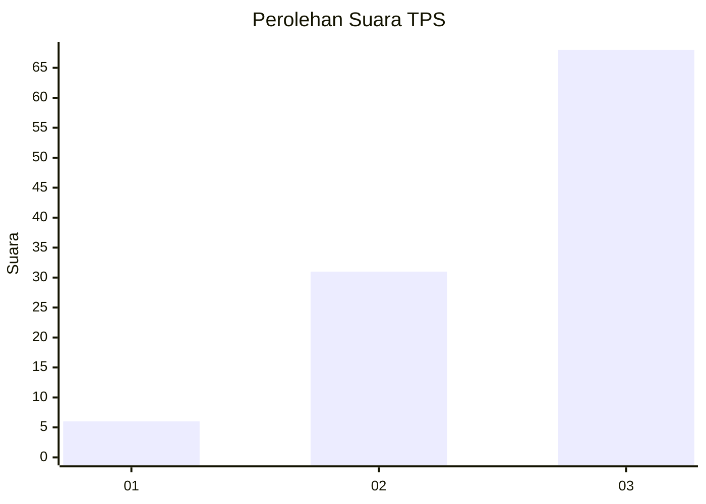
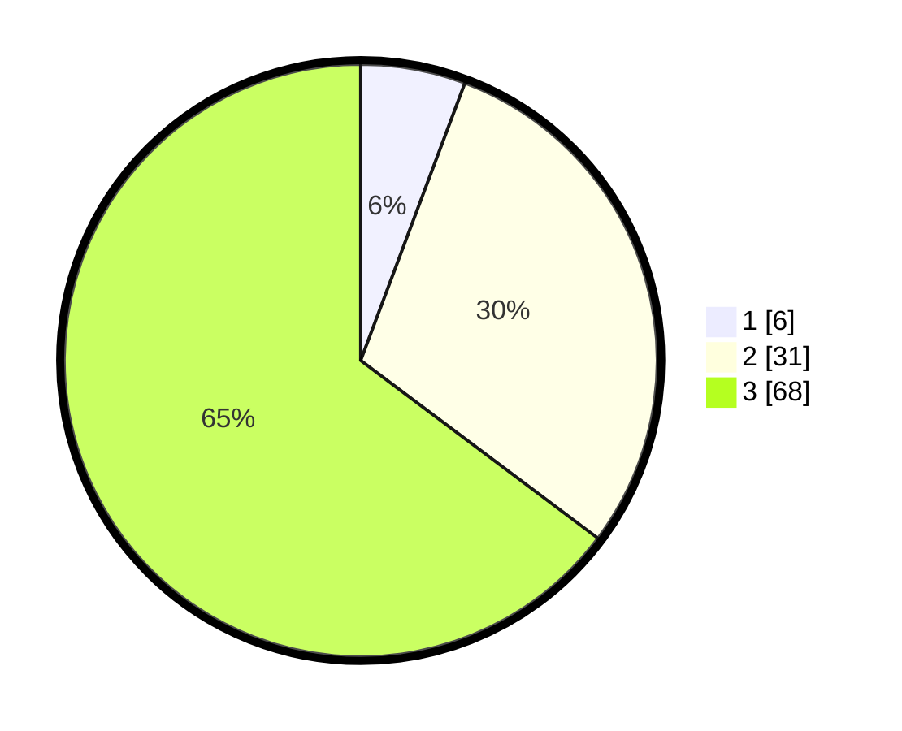

# Hasil

## Grafik

## Tabel

| No. | Nama Paslon    | Suara | Suara (raw) | Persentase |
|:--- |:-------------- | -----:| -----------:| ----------:|
| 1   | ANIES MUHAIMIN | 6     | [6][p-1]    | 5,71       |
| 2   | PRABOWO GIBRAN | 31    | [31][p-2]   | 29,52      |
| 3   | GANJAR MAHFUD  | 68    | [68][p-3]   | 64,76      |

[p-1]: https://github.com/gigit-pemilu/pemilu-2024-33-jawa-tengah/blob/main/pilpres/hitung-suara/sub/33-jawa-tengah/sub/12-wonogiri/sub/12-wonogiri/sub/2013-wonokerto/sub/014-tps/sub/paslon-1.txt
[p-2]: https://github.com/gigit-pemilu/pemilu-2024-33-jawa-tengah/blob/main/pilpres/hitung-suara/sub/33-jawa-tengah/sub/12-wonogiri/sub/12-wonogiri/sub/2013-wonokerto/sub/014-tps/sub/paslon-2.txt
[p-3]: https://github.com/gigit-pemilu/pemilu-2024-33-jawa-tengah/blob/main/pilpres/hitung-suara/sub/33-jawa-tengah/sub/12-wonogiri/sub/12-wonogiri/sub/2013-wonokerto/sub/014-tps/sub/paslon-3.txt

## Foto C Plano

https://sirekap-obj-formc.kpu.go.id/6c66/pemilu/ppwp/33/12/12/20/13/3312122013014-20240214-141854--845b45a3-cc17-4efe-b953-ee190a054f50.jpg

https://sirekap-obj-formc.kpu.go.id/6c66/pemilu/ppwp/33/12/12/20/13/3312122013014-20240221-100332--3679519e-37b5-46bc-9496-47a5719d3436.jpg

https://sirekap-obj-formc.kpu.go.id/6c66/pemilu/ppwp/33/12/12/20/13/3312122013014-20240214-141759--7532e269-fed0-4aa3-8e84-2345f448569c.jpg

## Metadata

| Key        | Value               |
| ---------- | ------------------- |
| Time Stamp | 2024-02-24 22:31:28 |

