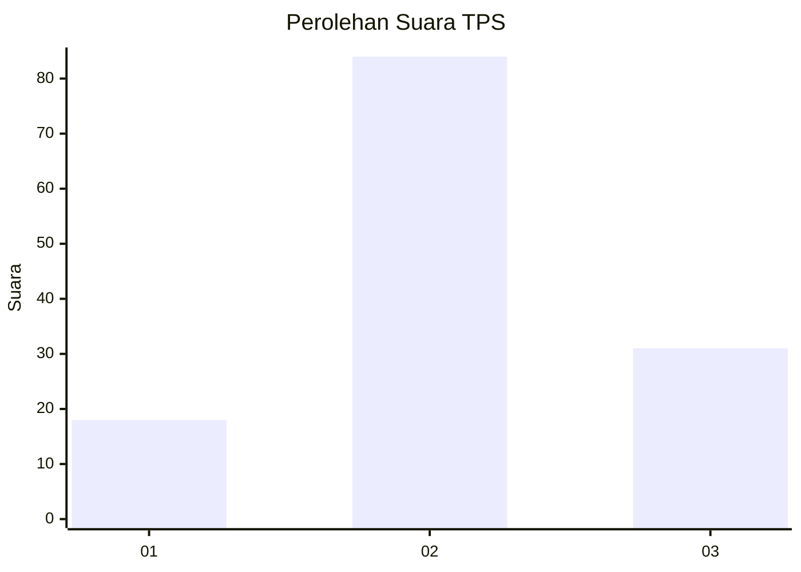
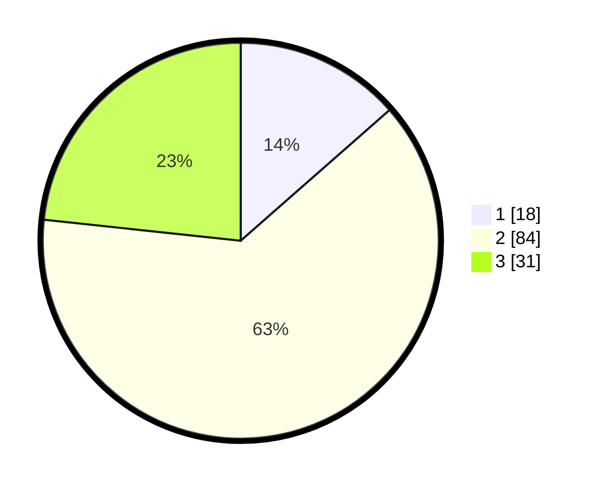

# Hasil

## Grafik

## Tabel

| No. | Nama Paslon    | Suara | Suara (raw) | Persentase |
|:--- |:-------------- | -----:| -----------:| ----------:|
| 1   | ANIES MUHAIMIN | 18    | [18][p-1]   | 13,53      |
| 2   | PRABOWO GIBRAN | 84    | [84][p-2]   | 63,16      |
| 3   | GANJAR MAHFUD  | 31    | [31][p-3]   | 23,31      |

[p-1]: https://github.com/gigit-pemilu/pemilu-2024-33-jawa-tengah/blob/main/pilpres/hitung-suara/sub/33-jawa-tengah/sub/12-wonogiri/sub/12-wonogiri/sub/2014-sonoharjo/sub/003-tps/sub/paslon-1.txt
[p-2]: https://github.com/gigit-pemilu/pemilu-2024-33-jawa-tengah/blob/main/pilpres/hitung-suara/sub/33-jawa-tengah/sub/12-wonogiri/sub/12-wonogiri/sub/2014-sonoharjo/sub/003-tps/sub/paslon-2.txt
[p-3]: https://github.com/gigit-pemilu/pemilu-2024-33-jawa-tengah/blob/main/pilpres/hitung-suara/sub/33-jawa-tengah/sub/12-wonogiri/sub/12-wonogiri/sub/2014-sonoharjo/sub/003-tps/sub/paslon-3.txt

## Foto C Plano

https://sirekap-obj-formc.kpu.go.id/c9ac/pemilu/ppwp/33/12/12/20/14/3312122014003-20240219-131703--a04a90e9-2344-4ab7-8253-d4c77a6d2031.jpg

https://sirekap-obj-formc.kpu.go.id/c9ac/pemilu/ppwp/33/12/12/20/14/3312122014003-20240219-131851--3f96720f-58a7-4c91-a613-9b373d30f251.jpg

https://sirekap-obj-formc.kpu.go.id/c9ac/pemilu/ppwp/33/12/12/20/14/3312122014003-20240219-132243--14c63903-e789-43e3-9979-1185fe41bcf3.jpg

## Metadata

| Key        | Value               |
| ---------- | ------------------- |
| Time Stamp | 2024-02-25 13:00:00 |

