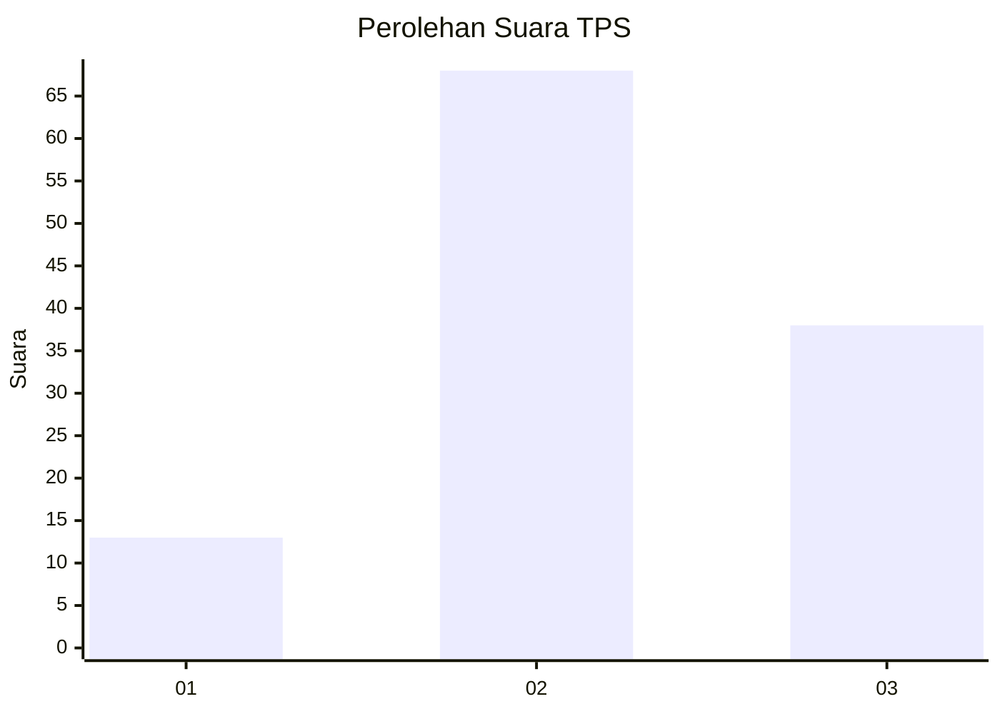
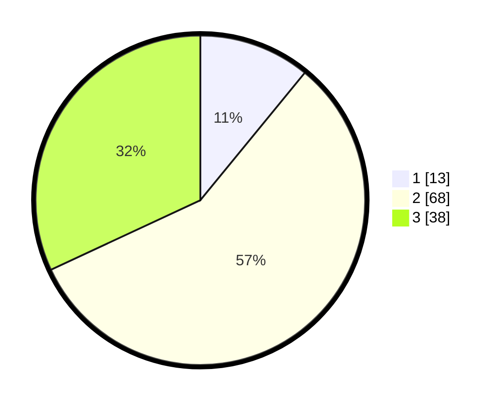

# Hasil

## Grafik

## Tabel

| No. | Nama Paslon    | Suara | Suara (raw) | Persentase |
|:--- |:-------------- | -----:| -----------:| ----------:|
| 1   | ANIES MUHAIMIN | 13    | [13][p-1]   | 10,92      |
| 2   | PRABOWO GIBRAN | 68    | [68][p-2]   | 57,14      |
| 3   | GANJAR MAHFUD  | 38    | [38][p-3]   | 31,93      |

[p-1]: https://github.com/gigit-pemilu/pemilu-2024-33-jawa-tengah/blob/main/pilpres/hitung-suara/sub/33-jawa-tengah/sub/12-wonogiri/sub/12-wonogiri/sub/2014-sonoharjo/sub/004-tps/sub/paslon-1.txt
[p-2]: https://github.com/gigit-pemilu/pemilu-2024-33-jawa-tengah/blob/main/pilpres/hitung-suara/sub/33-jawa-tengah/sub/12-wonogiri/sub/12-wonogiri/sub/2014-sonoharjo/sub/004-tps/sub/paslon-2.txt
[p-3]: https://github.com/gigit-pemilu/pemilu-2024-33-jawa-tengah/blob/main/pilpres/hitung-suara/sub/33-jawa-tengah/sub/12-wonogiri/sub/12-wonogiri/sub/2014-sonoharjo/sub/004-tps/sub/paslon-3.txt

## Foto C Plano

https://sirekap-obj-formc.kpu.go.id/fb6f/pemilu/ppwp/33/12/12/20/14/3312122014004-20240219-132240--fb566049-33a9-4ca1-9e18-217c7c20b7ea.jpg

https://sirekap-obj-formc.kpu.go.id/fb6f/pemilu/ppwp/33/12/12/20/14/3312122014004-20240219-132420--f4a0e145-eb3c-4f8d-9681-3e9d4e1d82d8.jpg

https://sirekap-obj-formc.kpu.go.id/fb6f/pemilu/ppwp/33/12/12/20/14/3312122014004-20240219-132552--830b408d-ce3d-46e7-84ff-8f82ae7be6cc.jpg

## Metadata

| Key        | Value               |
| ---------- | ------------------- |
| Time Stamp | 2024-02-19 15:00:00 |

