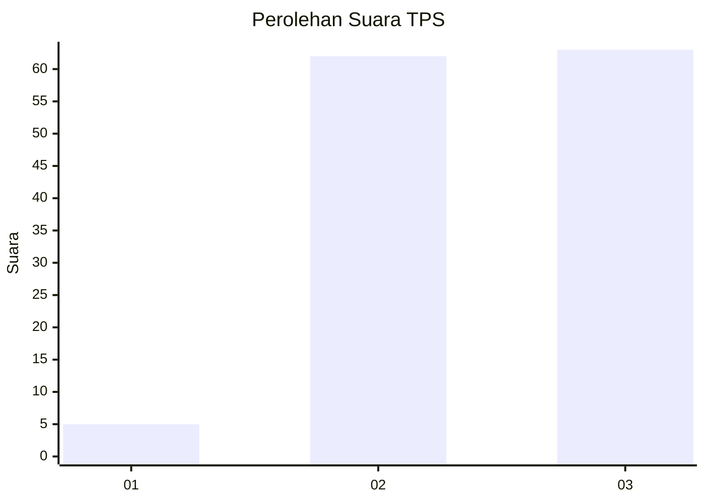
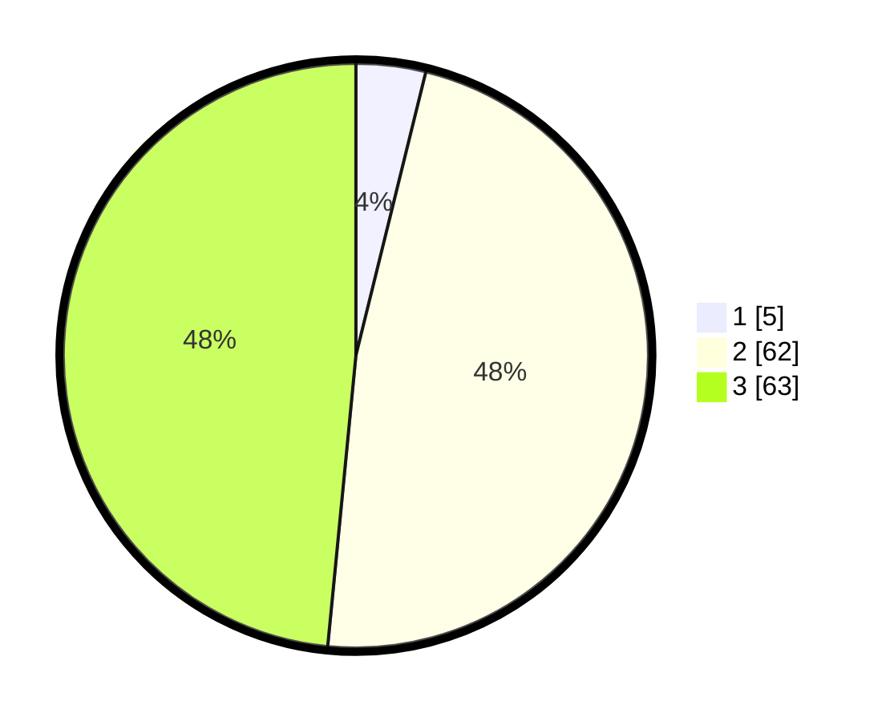

# Hasil

## Grafik

## Tabel

| No. | Nama Paslon    | Suara | Suara (raw) | Persentase |
|:--- |:-------------- | -----:| -----------:| ----------:|
| 1   | ANIES MUHAIMIN | 5     | [5][p-1]    | 3,85       |
| 2   | PRABOWO GIBRAN | 62    | [62][p-2]   | 47,69      |
| 3   | GANJAR MAHFUD  | 63    | [63][p-3]   | 48,46      |

[p-1]: https://github.com/gigit-pemilu/pemilu-2024/blob/main/pilpres/hitung-suara/sub/33-jawa-tengah/sub/12-wonogiri/sub/12-wonogiri/sub/2014-sonoharjo/sub/015-tps/sub/paslon-1.txt
[p-2]: https://github.com/gigit-pemilu/pemilu-2024/blob/main/pilpres/hitung-suara/sub/33-jawa-tengah/sub/12-wonogiri/sub/12-wonogiri/sub/2014-sonoharjo/sub/015-tps/sub/paslon-2.txt
[p-3]: https://github.com/gigit-pemilu/pemilu-2024/blob/main/pilpres/hitung-suara/sub/33-jawa-tengah/sub/12-wonogiri/sub/12-wonogiri/sub/2014-sonoharjo/sub/015-tps/sub/paslon-3.txt

## Foto C Plano

https://sirekap-obj-formc.kpu.go.id/61b3/pemilu/ppwp/33/12/12/20/14/3312122014015-20240219-122123--c7c2aa6a-ebcf-4c98-b605-d8dc1d5b8f60.jpg

https://sirekap-obj-formc.kpu.go.id/61b3/pemilu/ppwp/33/12/12/20/14/3312122014015-20240215-002806--dd40d551-cb0e-47a4-a724-d890b13b60b1.jpg

https://sirekap-obj-formc.kpu.go.id/61b3/pemilu/ppwp/33/12/12/20/14/3312122014015-20240215-003105--3c447571-43f6-4f48-9406-300b21d8e99d.jpg

## Metadata

| Key        | Value               |
| ---------- | ------------------- |
| Time Stamp | 2024-02-19 13:00:00 |

