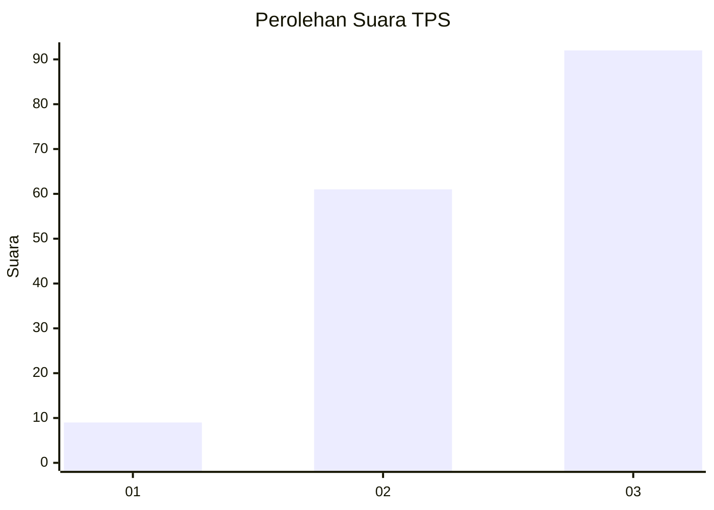
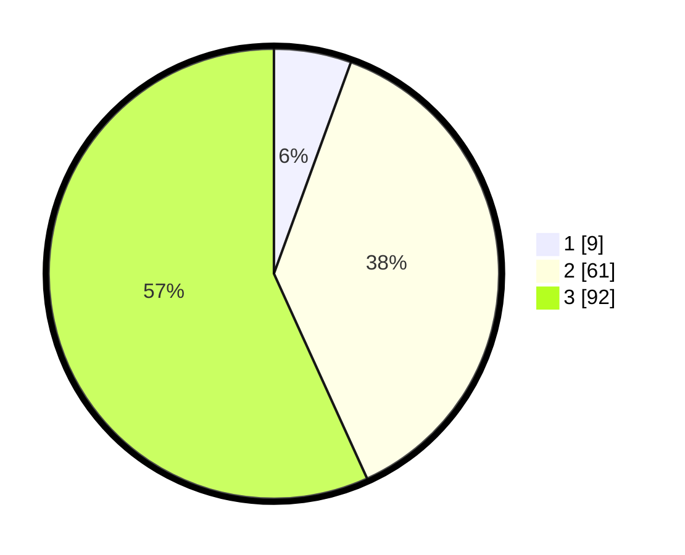

# Hasil

## Grafik

## Tabel

| No. | Nama Paslon    | Suara | Suara (raw) | Persentase |
|:--- |:-------------- | -----:| -----------:| ----------:|
| 1   | ANIES MUHAIMIN | 9     | [9][p-1]    | 5,56       |
| 2   | PRABOWO GIBRAN | 61    | [61][p-2]   | 37,65      |
| 3   | GANJAR MAHFUD  | 92    | [92][p-3]   | 56,79      |

[p-1]: https://github.com/gigit-pemilu/pemilu-2024/blob/main/pilpres/hitung-suara/sub/33-jawa-tengah/sub/12-wonogiri/sub/12-wonogiri/sub/2014-sonoharjo/sub/021-tps/sub/paslon-1.txt
[p-2]: https://github.com/gigit-pemilu/pemilu-2024/blob/main/pilpres/hitung-suara/sub/33-jawa-tengah/sub/12-wonogiri/sub/12-wonogiri/sub/2014-sonoharjo/sub/021-tps/sub/paslon-2.txt
[p-3]: https://github.com/gigit-pemilu/pemilu-2024/blob/main/pilpres/hitung-suara/sub/33-jawa-tengah/sub/12-wonogiri/sub/12-wonogiri/sub/2014-sonoharjo/sub/021-tps/sub/paslon-3.txt

## Foto C Plano

https://sirekap-obj-formc.kpu.go.id/d15f/pemilu/ppwp/33/12/12/20/14/3312122014021-20240214-141817--3216de2f-d372-4782-9a03-03a3258f463d.jpg

https://sirekap-obj-formc.kpu.go.id/d15f/pemilu/ppwp/33/12/12/20/14/3312122014021-20240214-141714--859dfcb6-e5c4-43e3-ba54-5b90bd036c58.jpg

https://sirekap-obj-formc.kpu.go.id/d15f/pemilu/ppwp/33/12/12/20/14/3312122014021-20240214-141400--61d9b8f5-2a09-4ec7-a40c-5e59e76cc366.jpg

## Metadata

| Key        | Value               |
| ---------- | ------------------- |
| Time Stamp | 2024-02-25 11:00:00 |

