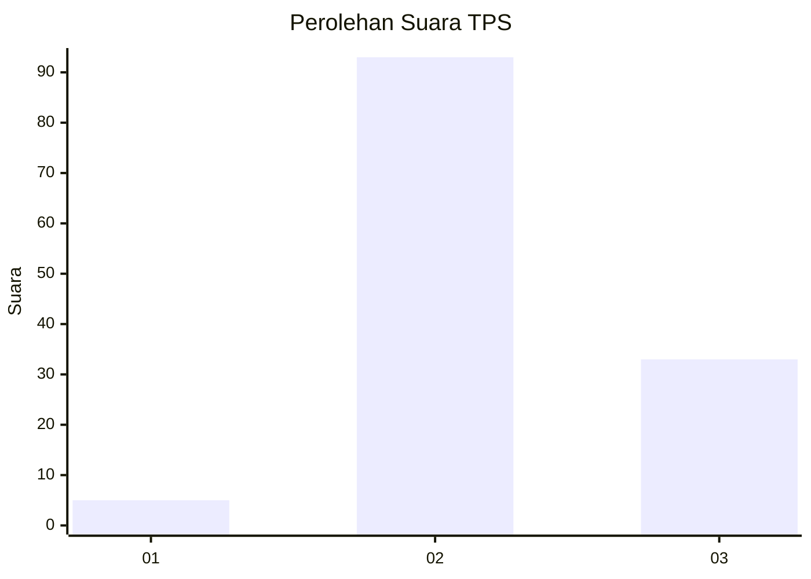
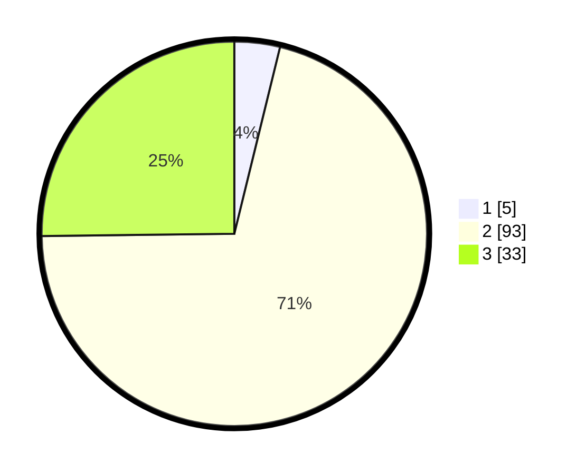

# Hasil

## Grafik

## Tabel

| No. | Nama Paslon    | Suara | Suara (raw) | Persentase |
|:--- |:-------------- | -----:| -----------:| ----------:|
| 1   | ANIES MUHAIMIN | 5     | [5][p-1]    | 3,82       |
| 2   | PRABOWO GIBRAN | 93    | [93][p-2]   | 70,99      |
| 3   | GANJAR MAHFUD  | 33    | [33][p-3]   | 25,19      |

[p-1]: https://github.com/gigit-pemilu/pemilu-2024-33-jawa-tengah/blob/main/pilpres/hitung-suara/sub/33-jawa-tengah/sub/12-wonogiri/sub/13-ngadirojo/sub/1010-kasihan/sub/006-tps/sub/paslon-1.txt
[p-2]: https://github.com/gigit-pemilu/pemilu-2024-33-jawa-tengah/blob/main/pilpres/hitung-suara/sub/33-jawa-tengah/sub/12-wonogiri/sub/13-ngadirojo/sub/1010-kasihan/sub/006-tps/sub/paslon-2.txt
[p-3]: https://github.com/gigit-pemilu/pemilu-2024-33-jawa-tengah/blob/main/pilpres/hitung-suara/sub/33-jawa-tengah/sub/12-wonogiri/sub/13-ngadirojo/sub/1010-kasihan/sub/006-tps/sub/paslon-3.txt

## Foto C Plano

https://sirekap-obj-formc.kpu.go.id/3134/pemilu/ppwp/33/12/13/10/10/3312131010006-20240214-140940--7aa4b219-b5f5-4d46-ba12-7a252673e404.jpg

https://sirekap-obj-formc.kpu.go.id/3134/pemilu/ppwp/33/12/13/10/10/3312131010006-20240214-141142--3f2d03cb-7dba-48d7-ad62-dca4a899473e.jpg

https://sirekap-obj-formc.kpu.go.id/3134/pemilu/ppwp/33/12/13/10/10/3312131010006-20240214-141415--1f28ae51-10c4-4995-9ad3-b177ab2f8493.jpg

## Metadata

| Key        | Value               |
| ---------- | ------------------- |
| Time Stamp | 2024-02-14 21:46:01 |

