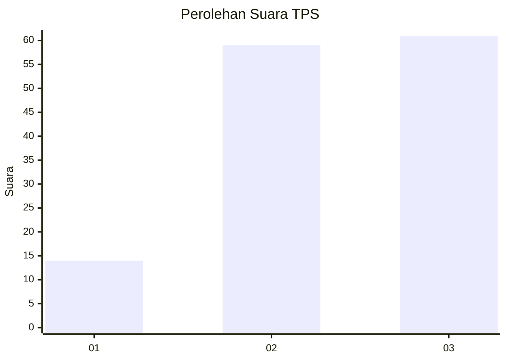
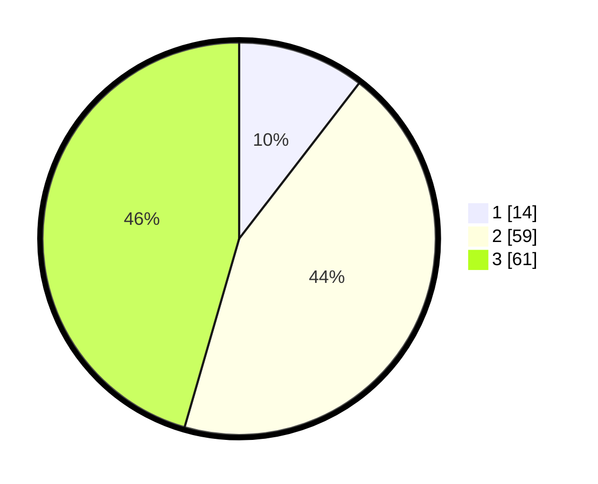

# Hasil

## Grafik

## Tabel

| No. | Nama Paslon    | Suara | Suara (raw) | Persentase |
|:--- |:-------------- | -----:| -----------:| ----------:|
| 1   | ANIES MUHAIMIN | 14    | [14][p-1]   | 10,45      |
| 2   | PRABOWO GIBRAN | 59    | [59][p-2]   | 44,03      |
| 3   | GANJAR MAHFUD  | 61    | [61][p-3]   | 45,52      |

[p-1]: https://github.com/gigit-pemilu/pemilu-2024/blob/main/pilpres/hitung-suara/sub/33-jawa-tengah/sub/12-wonogiri/sub/13-ngadirojo/sub/1010-kasihan/sub/013-tps/sub/paslon-1.txt
[p-2]: https://github.com/gigit-pemilu/pemilu-2024/blob/main/pilpres/hitung-suara/sub/33-jawa-tengah/sub/12-wonogiri/sub/13-ngadirojo/sub/1010-kasihan/sub/013-tps/sub/paslon-2.txt
[p-3]: https://github.com/gigit-pemilu/pemilu-2024/blob/main/pilpres/hitung-suara/sub/33-jawa-tengah/sub/12-wonogiri/sub/13-ngadirojo/sub/1010-kasihan/sub/013-tps/sub/paslon-3.txt

## Foto C Plano

https://sirekap-obj-formc.kpu.go.id/7fde/pemilu/ppwp/33/12/13/10/10/3312131010013-20240215-022647--eb77df8f-c391-48a8-b57d-8718552f02a6.jpg

https://sirekap-obj-formc.kpu.go.id/7fde/pemilu/ppwp/33/12/13/10/10/3312131010013-20240215-022954--1487ca05-bf06-4fb5-b96e-41721ac81112.jpg

https://sirekap-obj-formc.kpu.go.id/7fde/pemilu/ppwp/33/12/13/10/10/3312131010013-20240215-023148--2c431867-9870-4713-b918-9462332d0f6c.jpg

## Metadata

| Key        | Value               |
| ---------- | ------------------- |
| Time Stamp | 2024-02-24 22:31:28 |

