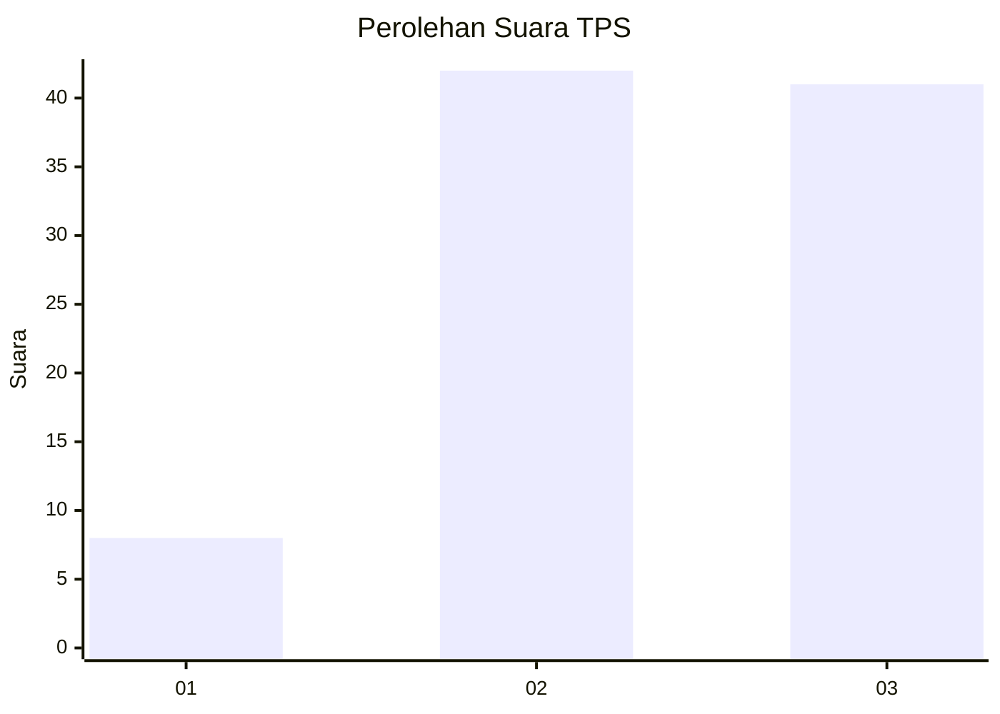
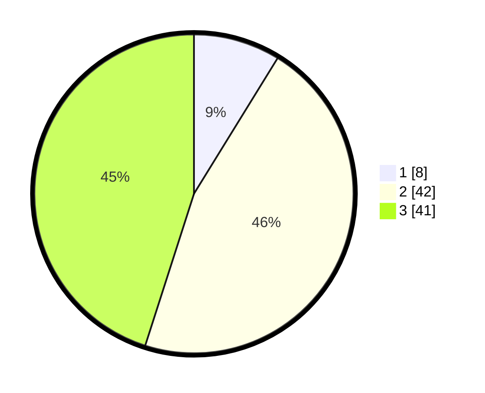

# Hasil

## Grafik

## Tabel

| No. | Nama Paslon    | Suara | Suara (raw) | Persentase |
|:--- |:-------------- | -----:| -----------:| ----------:|
| 1   | ANIES MUHAIMIN | 8     | [8][p-1]    | 8,79       |
| 2   | PRABOWO GIBRAN | 42    | [42][p-2]   | 46,15      |
| 3   | GANJAR MAHFUD  | 41    | [41][p-3]   | 45,05      |

[p-1]: https://github.com/gigit-pemilu/pemilu-2024/blob/main/pilpres/hitung-suara/sub/33-jawa-tengah/sub/12-wonogiri/sub/13-ngadirojo/sub/1010-kasihan/sub/014-tps/sub/paslon-1.txt
[p-2]: https://github.com/gigit-pemilu/pemilu-2024/blob/main/pilpres/hitung-suara/sub/33-jawa-tengah/sub/12-wonogiri/sub/13-ngadirojo/sub/1010-kasihan/sub/014-tps/sub/paslon-2.txt
[p-3]: https://github.com/gigit-pemilu/pemilu-2024/blob/main/pilpres/hitung-suara/sub/33-jawa-tengah/sub/12-wonogiri/sub/13-ngadirojo/sub/1010-kasihan/sub/014-tps/sub/paslon-3.txt

## Foto C Plano

https://sirekap-obj-formc.kpu.go.id/49e3/pemilu/ppwp/33/12/13/10/10/3312131010014-20240218-175653--097e7db6-cd48-48cf-a0c5-8475e5e12caa.jpg

https://sirekap-obj-formc.kpu.go.id/49e3/pemilu/ppwp/33/12/13/10/10/3312131010014-20240218-175019--8df5ab80-61c1-402e-9656-b912b5948f7e.jpg

https://sirekap-obj-formc.kpu.go.id/49e3/pemilu/ppwp/33/12/13/10/10/3312131010014-20240214-155213--43222787-a748-4cf4-9b9d-8e101d9a990e.jpg

## Metadata

| Key        | Value               |
| ---------- | ------------------- |
| Time Stamp | 2024-02-26 13:00:00 |

