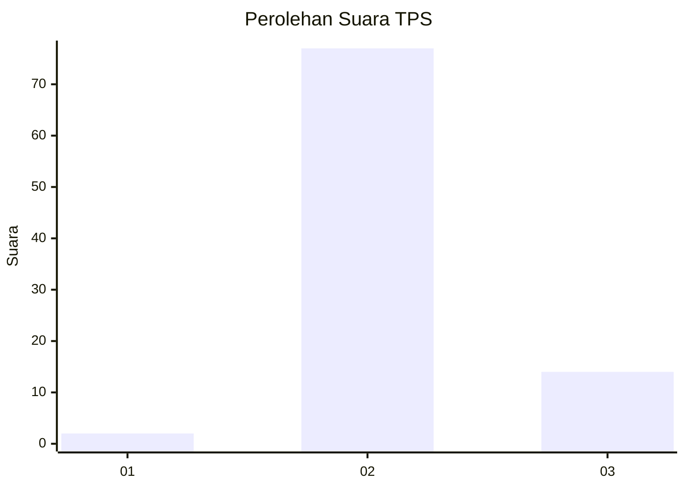
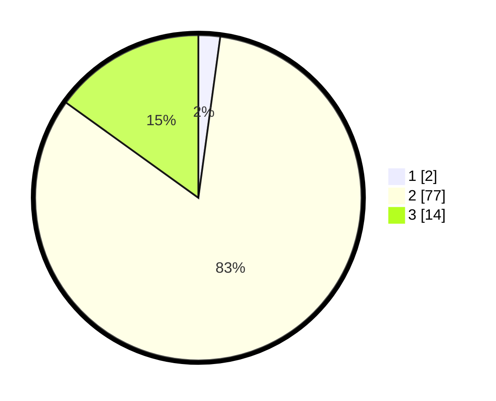

# Hasil

## Grafik

## Tabel

| No. | Nama Paslon    | Suara | Suara (raw) | Persentase |
|:--- |:-------------- | -----:| -----------:| ----------:|
| 1   | ANIES MUHAIMIN | 2     | [2][p-1]    | 2,15       |
| 2   | PRABOWO GIBRAN | 77    | [77][p-2]   | 82,80      |
| 3   | GANJAR MAHFUD  | 14    | [14][p-3]   | 15,05      |

[p-1]: https://github.com/gigit-pemilu/pemilu-2024/blob/main/pilpres/hitung-suara/sub/33-jawa-tengah/sub/12-wonogiri/sub/13-ngadirojo/sub/2001-gemawang/sub/011-tps/sub/paslon-1.txt
[p-2]: https://github.com/gigit-pemilu/pemilu-2024/blob/main/pilpres/hitung-suara/sub/33-jawa-tengah/sub/12-wonogiri/sub/13-ngadirojo/sub/2001-gemawang/sub/011-tps/sub/paslon-2.txt
[p-3]: https://github.com/gigit-pemilu/pemilu-2024/blob/main/pilpres/hitung-suara/sub/33-jawa-tengah/sub/12-wonogiri/sub/13-ngadirojo/sub/2001-gemawang/sub/011-tps/sub/paslon-3.txt

## Foto C Plano

https://sirekap-obj-formc.kpu.go.id/b77e/pemilu/ppwp/33/12/13/20/01/3312132001011-20240219-103334--6a9b7bad-aea5-4da3-ad34-a5e1ad5cf84b.jpg

https://sirekap-obj-formc.kpu.go.id/b77e/pemilu/ppwp/33/12/13/20/01/3312132001011-20240219-103431--4637be34-c643-4b8e-a963-bdbe9d8eeb69.jpg

https://sirekap-obj-formc.kpu.go.id/b77e/pemilu/ppwp/33/12/13/20/01/3312132001011-20240219-103841--75b729de-3a82-427b-8e0a-2794f963f85d.jpg

## Metadata

| Key        | Value               |
| ---------- | ------------------- |
| Time Stamp | 2024-02-19 12:00:00 |

