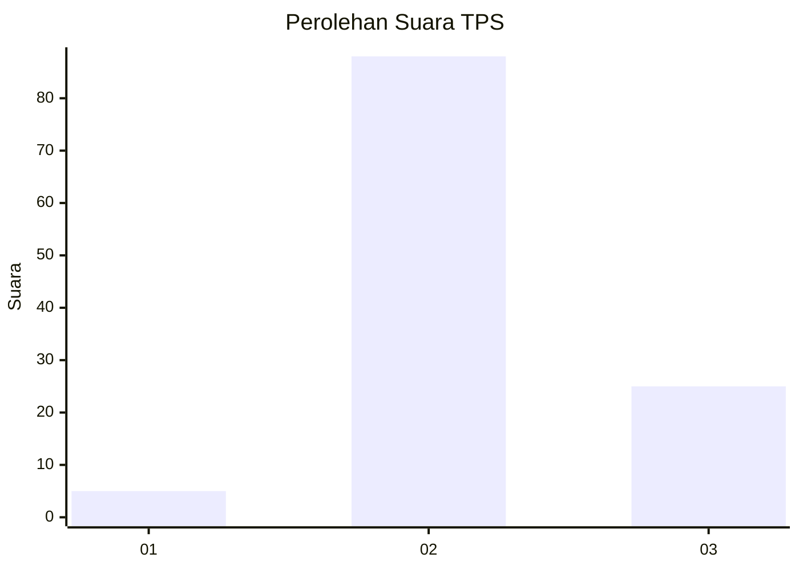

# Hasil

## Grafik

## Tabel

| No. | Nama Paslon    | Suara | Suara (raw) | Persentase |
|:--- |:-------------- | -----:| -----------:| ----------:|
| 1   | ANIES MUHAIMIN | 5     | [5][p-1]    | 4,24       |
| 2   | PRABOWO GIBRAN | 88    | [88][p-2]   | 74,58      |
| 3   | GANJAR MAHFUD  | 25    | [25][p-3]   | 21,19      |

[p-1]: https://github.com/gigit-pemilu/pemilu-2024-33-jawa-tengah/blob/main/pilpres/hitung-suara/sub/33-jawa-tengah/sub/12-wonogiri/sub/13-ngadirojo/sub/2001-gemawang/sub/014-tps/sub/paslon-1.txt
[p-2]: https://github.com/gigit-pemilu/pemilu-2024-33-jawa-tengah/blob/main/pilpres/hitung-suara/sub/33-jawa-tengah/sub/12-wonogiri/sub/13-ngadirojo/sub/2001-gemawang/sub/014-tps/sub/paslon-2.txt
[p-3]: https://github.com/gigit-pemilu/pemilu-2024-33-jawa-tengah/blob/main/pilpres/hitung-suara/sub/33-jawa-tengah/sub/12-wonogiri/sub/13-ngadirojo/sub/2001-gemawang/sub/014-tps/sub/paslon-3.txt

## Foto C Plano

https://sirekap-obj-formc.kpu.go.id/aa5d/pemilu/ppwp/33/12/13/20/01/3312132001014-20240214-205147--b8eeb599-ca66-4ceb-acae-568dd00ca977.jpg

https://sirekap-obj-formc.kpu.go.id/aa5d/pemilu/ppwp/33/12/13/20/01/3312132001014-20240214-205204--04db886d-5f98-48f4-9fe6-24c1f192f696.jpg

https://sirekap-obj-formc.kpu.go.id/aa5d/pemilu/ppwp/33/12/13/20/01/3312132001014-20240214-205218--9b3e4c85-5136-4895-bc9f-8e5b25c857a2.jpg

## Metadata

| Key        | Value               |
| ---------- | ------------------- |
| Time Stamp | 2024-02-15 22:00:27 |

