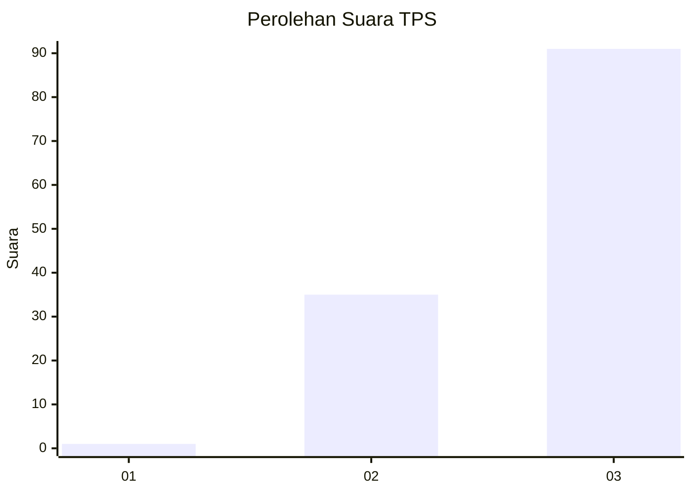
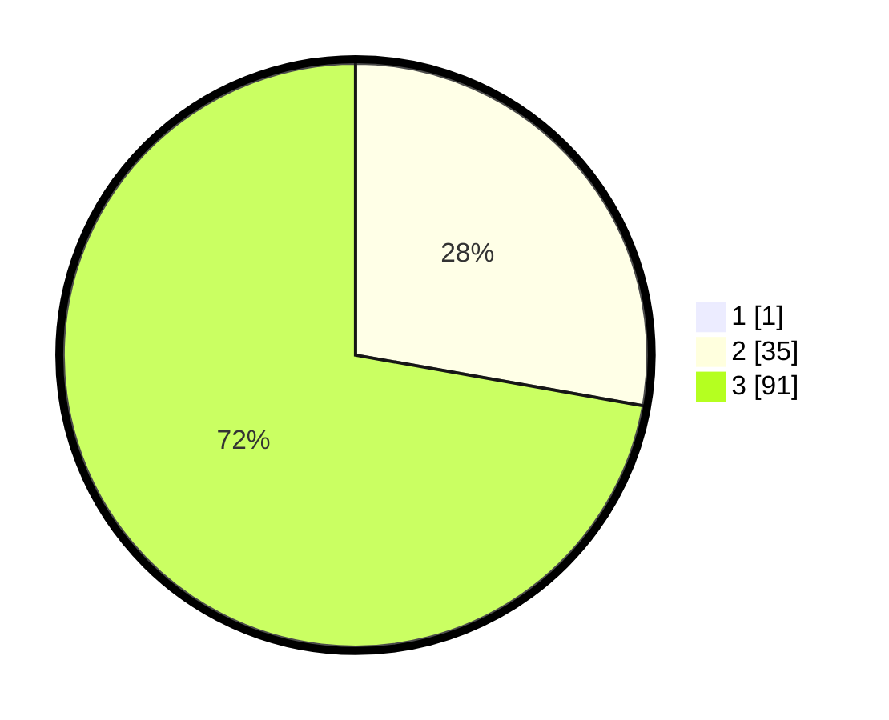

# Hasil

## Grafik

## Tabel

| No. | Nama Paslon    | Suara | Suara (raw) | Persentase |
|:--- |:-------------- | -----:| -----------:| ----------:|
| 1   | ANIES MUHAIMIN | 1     | [1][p-1]    | 0,79       |
| 2   | PRABOWO GIBRAN | 35    | [35][p-2]   | 27,56      |
| 3   | GANJAR MAHFUD  | 91    | [91][p-3]   | 71,65      |

[p-1]: https://github.com/gigit-pemilu/pemilu-2024-33-jawa-tengah/blob/main/pilpres/hitung-suara/sub/33-jawa-tengah/sub/12-wonogiri/sub/13-ngadirojo/sub/2002-kerjo-kidul/sub/012-tps/sub/paslon-1.txt
[p-2]: https://github.com/gigit-pemilu/pemilu-2024-33-jawa-tengah/blob/main/pilpres/hitung-suara/sub/33-jawa-tengah/sub/12-wonogiri/sub/13-ngadirojo/sub/2002-kerjo-kidul/sub/012-tps/sub/paslon-2.txt
[p-3]: https://github.com/gigit-pemilu/pemilu-2024-33-jawa-tengah/blob/main/pilpres/hitung-suara/sub/33-jawa-tengah/sub/12-wonogiri/sub/13-ngadirojo/sub/2002-kerjo-kidul/sub/012-tps/sub/paslon-3.txt

## Foto C Plano

https://sirekap-obj-formc.kpu.go.id/6106/pemilu/ppwp/33/12/13/20/02/3312132002012-20240215-221553--d5da65e4-d2c6-4768-be96-6fdaea903817.jpg

https://sirekap-obj-formc.kpu.go.id/6106/pemilu/ppwp/33/12/13/20/02/3312132002012-20240216-101916--f4093fc7-ee32-46fe-850d-6939445e17a0.jpg

https://sirekap-obj-formc.kpu.go.id/6106/pemilu/ppwp/33/12/13/20/02/3312132002012-20240215-221705--7ca50a05-4840-4441-8476-9336c5c5b435.jpg

## Metadata

| Key        | Value               |
| ---------- | ------------------- |
| Time Stamp | 2024-02-16 10:30:29 |

