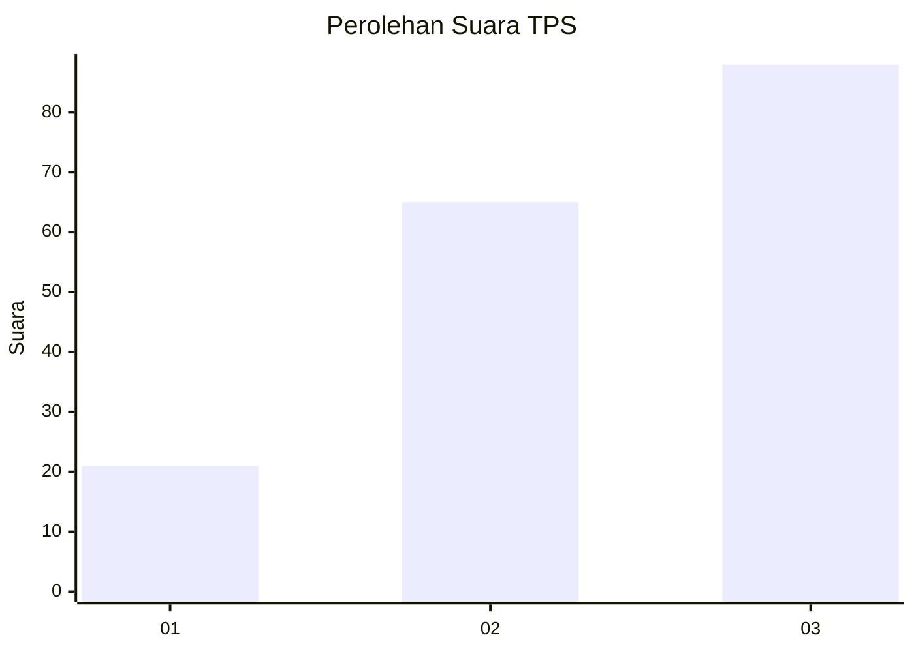
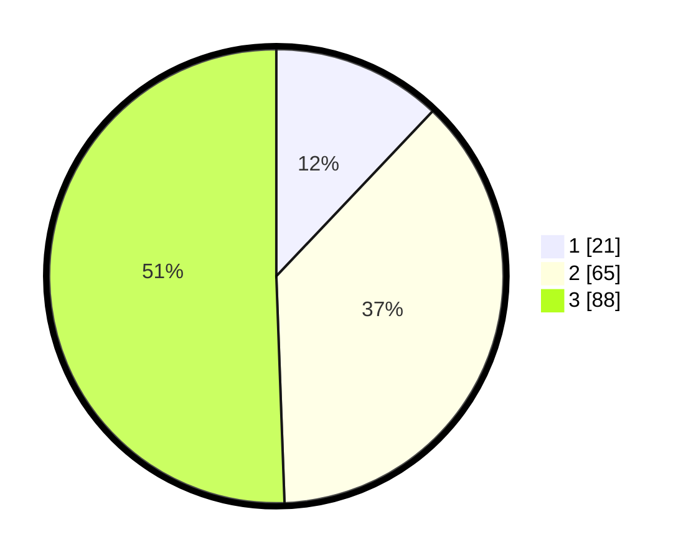

# Hasil

## Grafik

## Tabel

| No. | Nama Paslon    | Suara | Suara (raw) | Persentase |
|:--- |:-------------- | -----:| -----------:| ----------:|
| 1   | ANIES MUHAIMIN | 21    | [21][p-1]   | 12,07      |
| 2   | PRABOWO GIBRAN | 65    | [65][p-2]   | 37,36      |
| 3   | GANJAR MAHFUD  | 88    | [88][p-3]   | 50,57      |

[p-1]: https://github.com/gigit-pemilu/pemilu-2024-33-jawa-tengah/blob/main/pilpres/hitung-suara/sub/33-jawa-tengah/sub/12-wonogiri/sub/13-ngadirojo/sub/2005-kerjo-lor/sub/008-tps/sub/paslon-1.txt
[p-2]: https://github.com/gigit-pemilu/pemilu-2024-33-jawa-tengah/blob/main/pilpres/hitung-suara/sub/33-jawa-tengah/sub/12-wonogiri/sub/13-ngadirojo/sub/2005-kerjo-lor/sub/008-tps/sub/paslon-2.txt
[p-3]: https://github.com/gigit-pemilu/pemilu-2024-33-jawa-tengah/blob/main/pilpres/hitung-suara/sub/33-jawa-tengah/sub/12-wonogiri/sub/13-ngadirojo/sub/2005-kerjo-lor/sub/008-tps/sub/paslon-3.txt

## Foto C Plano

https://sirekap-obj-formc.kpu.go.id/0a9a/pemilu/ppwp/33/12/13/20/05/3312132005008-20240214-220052--bd4ce39d-fb5e-46cb-954c-5cd6eb5f4621.jpg

https://sirekap-obj-formc.kpu.go.id/0a9a/pemilu/ppwp/33/12/13/20/05/3312132005008-20240214-220309--dd0298ae-9516-4ecd-b7f1-16a670731a71.jpg

https://sirekap-obj-formc.kpu.go.id/0a9a/pemilu/ppwp/33/12/13/20/05/3312132005008-20240214-220610--4d13d5c2-6a18-435b-9a72-5d7fa1665a5f.jpg

## Metadata

| Key        | Value               |
| ---------- | ------------------- |
| Time Stamp | 2024-02-25 11:00:00 |

