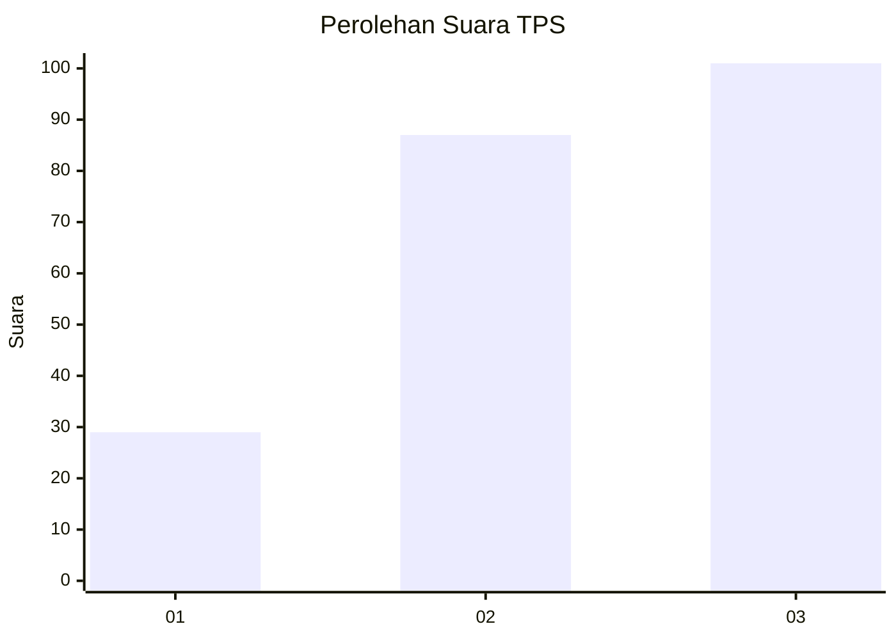
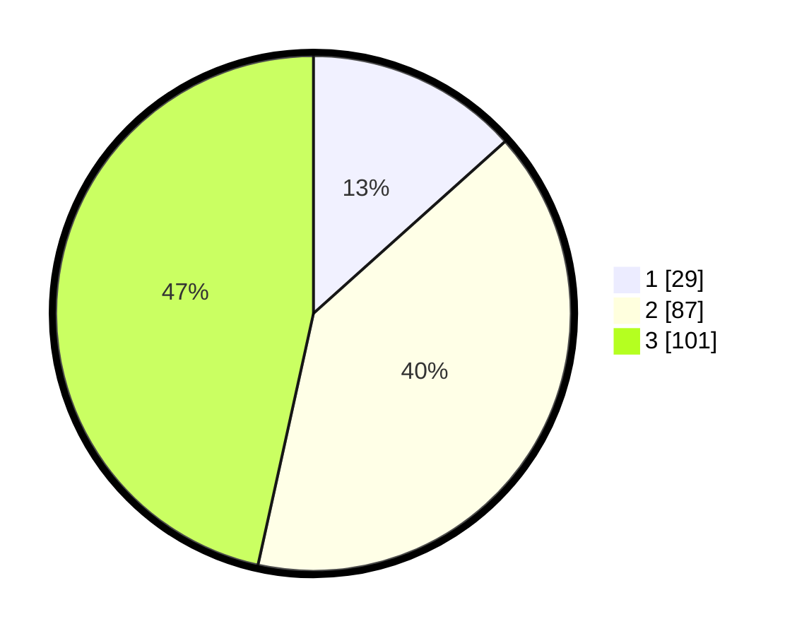

# Hasil

## Grafik

## Tabel

| No. | Nama Paslon    | Suara | Suara (raw) | Persentase |
|:--- |:-------------- | -----:| -----------:| ----------:|
| 1   | ANIES MUHAIMIN | 29    | [29][p-1]   | 13,36      |
| 2   | PRABOWO GIBRAN | 87    | [87][p-2]   | 40,09      |
| 3   | GANJAR MAHFUD  | 101   | [101][p-3]  | 46,54      |

[p-1]: https://github.com/gigit-pemilu/pemilu-2024/blob/main/pilpres/hitung-suara/sub/33-jawa-tengah/sub/12-wonogiri/sub/13-ngadirojo/sub/2005-kerjo-lor/sub/020-tps/sub/paslon-1.txt
[p-2]: https://github.com/gigit-pemilu/pemilu-2024/blob/main/pilpres/hitung-suara/sub/33-jawa-tengah/sub/12-wonogiri/sub/13-ngadirojo/sub/2005-kerjo-lor/sub/020-tps/sub/paslon-2.txt
[p-3]: https://github.com/gigit-pemilu/pemilu-2024/blob/main/pilpres/hitung-suara/sub/33-jawa-tengah/sub/12-wonogiri/sub/13-ngadirojo/sub/2005-kerjo-lor/sub/020-tps/sub/paslon-3.txt

## Foto C Plano

https://sirekap-obj-formc.kpu.go.id/eb17/pemilu/ppwp/33/12/13/20/05/3312132005020-20240215-032437--73b207d2-d6d8-4640-b37e-f4c163713161.jpg

https://sirekap-obj-formc.kpu.go.id/eb17/pemilu/ppwp/33/12/13/20/05/3312132005020-20240215-032617--22c969d0-c9e5-4de7-a4e8-55403d0088cd.jpg

https://sirekap-obj-formc.kpu.go.id/eb17/pemilu/ppwp/33/12/13/20/05/3312132005020-20240215-005204--a42a4d2b-fcf9-4f7d-acb3-89354c6ff30d.jpg

## Metadata

| Key        | Value               |
| ---------- | ------------------- |
| Time Stamp | 2024-02-25 12:00:00 |

