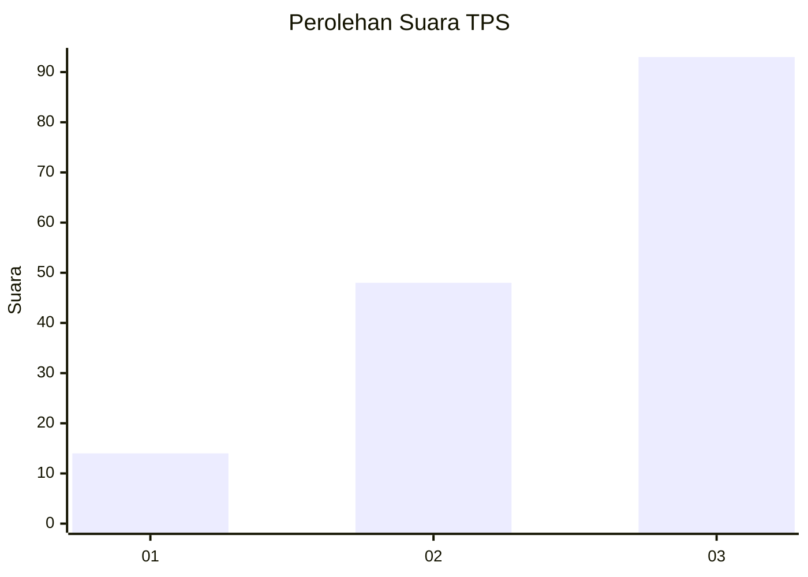
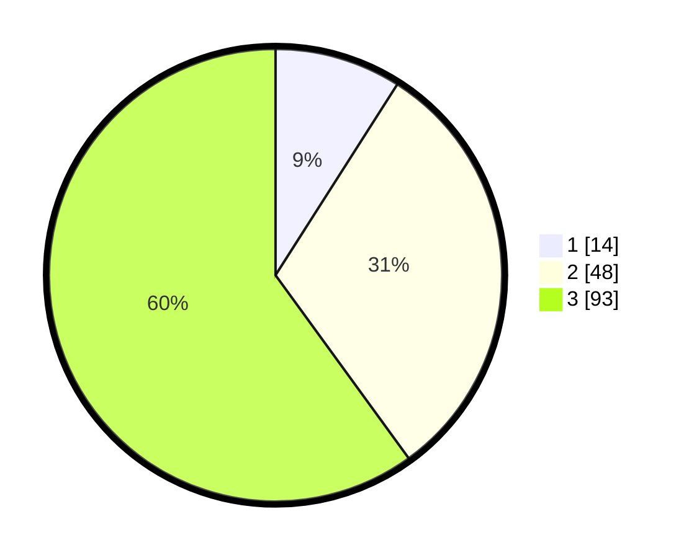

# Hasil

## Grafik

## Tabel

| No. | Nama Paslon    | Suara | Suara (raw) | Persentase |
|:--- |:-------------- | -----:| -----------:| ----------:|
| 1   | ANIES MUHAIMIN | 14    | [14][p-1]   | 9,03       |
| 2   | PRABOWO GIBRAN | 48    | [48][p-2]   | 30,97      |
| 3   | GANJAR MAHFUD  | 93    | [93][p-3]   | 60,00      |

[p-1]: https://github.com/gigit-pemilu/pemilu-2024/blob/main/pilpres/hitung-suara/sub/33-jawa-tengah/sub/12-wonogiri/sub/13-ngadirojo/sub/2005-kerjo-lor/sub/022-tps/sub/paslon-1.txt
[p-2]: https://github.com/gigit-pemilu/pemilu-2024/blob/main/pilpres/hitung-suara/sub/33-jawa-tengah/sub/12-wonogiri/sub/13-ngadirojo/sub/2005-kerjo-lor/sub/022-tps/sub/paslon-2.txt
[p-3]: https://github.com/gigit-pemilu/pemilu-2024/blob/main/pilpres/hitung-suara/sub/33-jawa-tengah/sub/12-wonogiri/sub/13-ngadirojo/sub/2005-kerjo-lor/sub/022-tps/sub/paslon-3.txt

## Foto C Plano

https://sirekap-obj-formc.kpu.go.id/18ce/pemilu/ppwp/33/12/13/20/05/3312132005022-20240214-230500--0208202a-c59a-4478-88cb-0ba91245180b.jpg

https://sirekap-obj-formc.kpu.go.id/18ce/pemilu/ppwp/33/12/13/20/05/3312132005022-20240214-230552--bf488f86-2af9-4ae1-9c87-914cd8c7b375.jpg

https://sirekap-obj-formc.kpu.go.id/18ce/pemilu/ppwp/33/12/13/20/05/3312132005022-20240214-230830--403ec524-4969-468e-94f7-6e0fe2643e1b.jpg

## Metadata

| Key        | Value               |
| ---------- | ------------------- |
| Time Stamp | 2024-02-16 00:00:26 |

